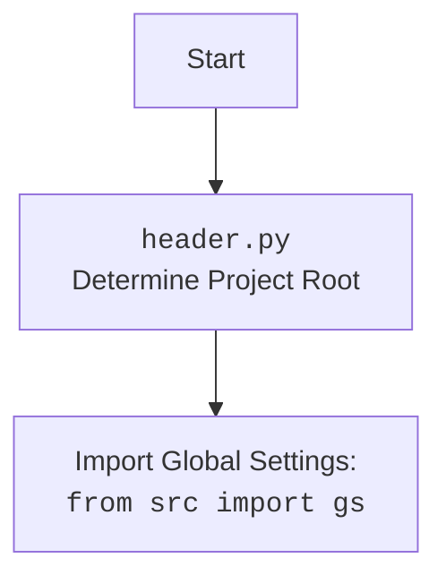

## Анализ кода `prepare_all_camapaigns.py`

### 1. <алгоритм>

**Блок-схема:**

```mermaid
graph LR
    A[Начало] --> B(Импорт модуля header);
    B --> C(Импорт функции process_all_campaigns из src.suppliers.aliexpress.campaign);
    C --> D(Вызов функции process_all_campaigns());
    D --> E[Конец];
```

**Пример:**

1.  **Начало**: Скрипт начинает выполнение.
2.  **Импорт модуля header**: Импортируется модуль `header`, который, как правило, устанавливает корень проекта и может содержать общие настройки.
3.  **Импорт функции process_all_campaigns**:  Импортируется функция `process_all_campaigns` из модуля `src.suppliers.aliexpress.campaign`. Эта функция, предположительно, содержит основную логику обработки рекламных кампаний.
4.  **Вызов функции process_all_campaigns**: Вызывается функция `process_all_campaigns()`, которая запускает процесс проверки или создания рекламных кампаний.
5.  **Конец**: Скрипт завершает выполнение.

### 2. <mermaid>

```mermaid
flowchart TD
    Start(Начало) --> ImportHeader[Импорт модуля header];
    ImportHeader --> ImportProcessAllCampaigns[Импорт функции process_all_campaigns из src.suppliers.aliexpress.campaign];
    ImportProcessAllCampaigns --> CallProcessAllCampaigns[Вызов функции process_all_campaigns()];
    CallProcessAllCampaigns --> End(Конец);
   
   
    style Start fill:#f9f,stroke:#333,stroke-width:2px
    style End fill:#f9f,stroke:#333,stroke-width:2px
```

**Объяснение зависимостей:**

*   `ImportHeader`: Импортирует модуль `header`. Этот модуль обычно отвечает за определение корневой директории проекта и импорт глобальных настроек.
*   `ImportProcessAllCampaigns`: Импортирует функцию `process_all_campaigns` из модуля `src.suppliers.aliexpress.campaign`, которая является основной функцией для обработки кампаний.

**Дополнительно: `header.py`**



**Объяснение `header.py`:**

*   `Header`: Модуль `header.py` определяет корень проекта.
*   `import`: Модуль `header.py` импортирует глобальные настройки из `src` используя `from src import gs`.

### 3. <объяснение>

**Импорты:**

*   `import header`:  Импортирует модуль `header`. Этот модуль, вероятно, содержит код для определения корня проекта и загрузки общих настроек. Это позволяет скрипту знать, где находятся другие части проекта и как они настроены. Обычно,  `header.py`  устанавливает путь проекта для правильной работы импортов.
*   `from src.suppliers.aliexpress.campaign import process_all_campaigns`: Импортирует функцию `process_all_campaigns` из модуля `src.suppliers.aliexpress.campaign`. Эта функция предположительно содержит основную бизнес-логику для проверки и/или создания рекламных кампаний на AliExpress.

**Функции:**

*   `process_all_campaigns()`: Это функция, которая вызывается в скрипте. Ее точное поведение зависит от ее реализации в файле `src/suppliers/aliexpress/campaign/process_all_campaigns.py`. Предположительно, она:
    *   Проверяет наличие необходимых рекламных кампаний.
    *   Если кампания не найдена, она ее создает.
    *   Может обрабатывать различные параметры кампании, которые могут быть настроены через `src.gs`.

**Переменные:**

*   В скрипте явно нет переменных, кроме вызова функции. Все необходимые данные, вероятно, передаются внутри функции `process_all_campaigns()` или  используются внутри этой функции.

**Потенциальные ошибки и области для улучшения:**

1.  **Обработка исключений:** В данном коде нет обработки исключений. Было бы полезно добавить блоки `try...except` для обработки ошибок, которые могут возникнуть во время импорта модулей, вызова функций или работы с API.
2.  **Логирование:** Отсутствует логирование. Добавление логгирования поможет отслеживать работу скрипта, выявлять ошибки и анализировать производительность.
3.  **Конфигурация:** Параметры для `process_all_campaigns`, такие как параметры подключения к AliExpress API или настройки рекламных кампаний, не определены в явном виде. Эти параметры, вероятно,  хранятся в `src/gs` или передаются  внутри функции `process_all_campaigns`. Было бы хорошо иметь четкую документацию по тому, как эти параметры настраиваются.

**Взаимосвязи с другими частями проекта:**

*   **`header.py`**: Этот модуль определяет окружение проекта, что необходимо для правильного импорта других модулей.
*   **`src.suppliers.aliexpress.campaign`**:  Этот модуль является частью подсистемы, которая отвечает за работу с поставщиком AliExpress и его рекламными кампаниями.
*   **`src.gs`**: Глобальные настройки, которые вероятно, используются для конфигурации работы скрипта.

**Цепочка взаимосвязей:**

1.  `prepare_all_camapaigns.py` импортирует `header.py` для настройки окружения.
2.  `header.py`  импортирует общие настройки из `src.gs`.
3.  `prepare_all_camapaigns.py` импортирует и вызывает `process_all_campaigns()` из `src.suppliers.aliexpress.campaign`.
4.  `process_all_campaigns()`, вероятно, использует настройки из `src.gs` для взаимодействия с AliExpress API.

В целом, скрипт является отправной точкой для запуска обработки рекламных кампаний AliExpress. Для более точной картины работы, необходимо исследовать содержимое `process_all_campaigns` и `src.gs`.