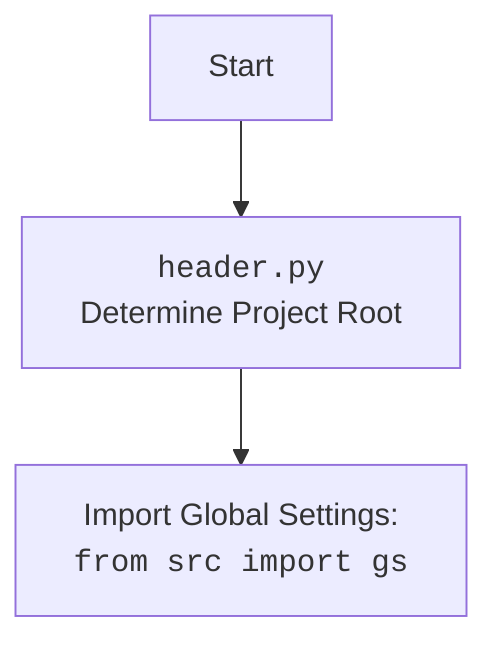

## АЛГОРИТМ:

1.  **Начало**: Скрипт запускается из командной строки.
    *   Пример: `python src/suppliers/aliexpress/campaign/prepare_campaigns.py summer_sale -c electronics -l EN -cu USD`
2.  **Аргументы командной строки**:
    *   Используется `argparse` для обработки аргументов командной строки:
        *   `campaign_name` (обязательный): имя кампании.
        *   `-c` или `--categories` (необязательный): список категорий.
        *   `-l` или `--language` (необязательный): язык кампании (по умолчанию `None`).
        *   `-cu` или `--currency` (необязательный): валюта кампании (по умолчанию `None`).
        *   `--all` (флаг): если указан, обрабатываются все кампании.
    *   Пример: `args = parser.parse_args()`  
3.  **Определение режима работы**:
    *   Проверяется, был ли передан аргумент `--all`.
    *   **Если `--all` установлен**: вызывается функция `process_all_campaigns`.
    *   **Иначе**: вызывается функция `main_process`.
4.  **`process_all_campaigns`**:
    *   Если не переданы `language` и `currency`  - обрабатывает все локали.
    *   Если переданы `language` и `currency` - обрабатывает только указанные локали.
    *   Получает список директорий (имен кампаний) из `campaigns_directory` с помощью `get_directory_names`.
    *   Для каждой кампании вызывает `AliCampaignEditor` и  `editor.process_campaign()`.
    *   Пример: `process_all_campaigns(language="EN", currency="USD")`
5.  **`main_process`**:
    *   Определяет список локалей для обработки:
        *   Если указаны `language` и `currency` , то список состоит только из них.
        *   В противном случае список формируется из всех возможных локалей (`locales`).
    *   Для каждой локали:
        *   Если указаны `categories`:
            *   Для каждой категории вызывает `process_campaign_category`.
            *   Пример: `process_campaign_category(campaign_name, category, lang, curr)`
        *   Иначе:
            *   Вызывает `process_campaign` для обработки всей кампании.
            *   Пример: `process_campaign(campaign_name, lang, curr)`
6.  **`process_campaign`**:
    *   Если переданы `language` и `currency` - обрабатывает только указанные локали.
    *   Если не переданы `language` и `currency` - обрабатывает все локали.
    *   Создает экземпляр `AliCampaignEditor`.
    *   Вызывает `editor.process_campaign()` для обработки.
    *   Пример: `process_campaign(campaign_name, "EN", "USD")`
7.  **`process_campaign_category`**:
    *   Создает экземпляр `AliCampaignEditor`.
    *   Вызывает `editor.process_campaign_category(category_name)` для обработки категории.
    *   Возвращает список названий продуктов.
    *   Пример: `process_campaign_category(campaign_name, category, "EN", "USD")`
8.  **`AliCampaignEditor`**:
    *   Класс, отвечающий за обработку кампании. Его методы (`process_campaign` и `process_campaign_category`) выполняют конкретные действия по подготовке данных.
9.  **Завершение**: Скрипт завершает свою работу.

## MERMAID:

```mermaid
flowchart TD
    Start(Start Script Execution) --> ParseArgs[Parse Command-Line Arguments]
    ParseArgs -- --all --> ProcessAllCampaigns(process_all_campaigns)
    ParseArgs -- NOT --all --> MainProcess(main_process)

    ProcessAllCampaigns --> GetCampaignDirs(get_directory_names from `campaigns_directory`)
     GetCampaignDirs --> LoopCampaigns{Loop for Each Campaign}

    LoopCampaigns -- For each campaign --> CreateEditorAll[Create AliCampaignEditor]
    CreateEditorAll --> ProcessCampaignAll(editor.process_campaign())
    ProcessCampaignAll --> LoopCampaigns
    LoopCampaigns -- End Loop --> EndAllCampaigns(End process_all_campaigns)


    MainProcess --> DetermineLocales{Determine Locales to Process}
    DetermineLocales --> LoopLocalesMain{Loop for Each Locale}
    LoopLocalesMain -- For each locale --> CheckCategories{Check if Categories are provided}
    CheckCategories -- Categories --> LoopCategories{Loop for Each Category}
    LoopCategories -- For each category --> ProcessCategory(process_campaign_category)
    ProcessCategory --> LoopCategories
    LoopCategories -- End Loop --> LoopLocalesMain
    CheckCategories -- No Categories --> ProcessCampaign(process_campaign)
    ProcessCampaign --> LoopLocalesMain
    LoopLocalesMain -- End Loop --> EndMainProcess(End main_process)
    
    
    ProcessCategory --> CreateEditorCategory[Create AliCampaignEditor]
    CreateEditorCategory --> ProcessCategoryEditor(editor.process_campaign_category)
    ProcessCategoryEditor --> EndProcessCategory(Return product titles)

    ProcessCampaign -->  CreateEditorCampaign[Create AliCampaignEditor]
    CreateEditorCampaign --> ProcessCampaignEditor(editor.process_campaign())
    ProcessCampaignEditor --> EndProcessCampaign(Return True)
    
    
    EndMainProcess --> End(End Script)
    EndAllCampaigns --> End
```



## ОБЪЯСНЕНИЕ:

### Импорты:
*   `import header`: Импортирует модуль `header.py`, который, как можно предположить, определяет корень проекта и необходимые глобальные настройки.  
*   `import argparse`: Используется для создания парсера аргументов командной строки.
*   `import copy`: Обеспечивает операции глубокого и поверхностного копирования объектов (в коде не используется, но импортируется).
*   `from pathlib import Path`: Используется для работы с путями в файловой системе в объектно-ориентированном стиле.
*   `from typing import List, Optional`: Используется для определения типов данных, включая списки и необязательные параметры.
*   `from src import gs`: Импортирует глобальные настройки проекта из модуля `gs` пакета `src`. Предположительно, `gs` содержит общие конфигурации и пути.
*   `from src.suppliers.aliexpress.campaign import AliCampaignEditor`: Импортирует класс `AliCampaignEditor`, который отвечает за обработку кампаний AliExpress.
*   `from src.suppliers.aliexpress.utils import locales`: Импортирует `locales` - это, вероятно, список словарей, содержащих языковые и валютные настройки, для разных регионов.
*   `from src.utils.printer import pprint`: Импортирует функцию `pprint` для удобного вывода данных.
*   `from src.utils.file import get_directory_names`: Импортирует функцию `get_directory_names` для получения списка имен каталогов.
*   `from src.utils.jjson import j_loads_ns`: Импортирует функцию `j_loads_ns` для загрузки JSON данных.
*   `from src.logger.logger import logger`: Импортирует объект `logger` для ведения журнала событий.

**Взаимосвязь с другими пакетами `src`**:
*   `src.gs`: Глобальные настройки проекта.
*   `src.suppliers.aliexpress.campaign`: Модуль, содержащий классы и функции для работы с кампаниями AliExpress.
*   `src.suppliers.aliexpress.utils`: Модуль с утилитами, включая настройки локализации.
*   `src.utils`: Общие утилиты для проекта, такие как вывод и файловые операции.
*   `src.logger`: Модуль для логирования событий.

### Классы:
*   **`AliCampaignEditor`**:
    *   Роль: Класс для редактирования и обработки кампаний AliExpress.
    *   Атрибуты: При создании принимает `campaign_name`, `language`, `currency`.
    *   Методы:
        *   `process_campaign()`: Метод для обработки всей кампании.
        *   `process_campaign_category(category_name)`: Метод для обработки конкретной категории.

    *   Взаимодействие: Используется в функциях `process_campaign` и `process_campaign_category` для выполнения операций над кампаниями.
        
### Функции:
*   **`process_campaign_category(campaign_name, category_name, language, currency)`**:
    *   Аргументы: `campaign_name` (str), `category_name` (str), `language` (str), `currency` (str).
    *   Возвращает: `List[str]` - список названий продуктов.
    *   Назначение: Обрабатывает конкретную категорию кампании для заданных языка и валюты. Создает `AliCampaignEditor` и вызывает метод `process_campaign_category` для выполнения работы.
    *   Пример: `process_campaign_category("summer_sale", "electronics", "EN", "USD")`
*   **`process_campaign(campaign_name, language=None, currency=None, campaign_file=None)`**:
    *   Аргументы: `campaign_name` (str), `language` (Optional[str]), `currency` (Optional[str]), `campaign_file` (Optional[str]).
    *   Возвращает: `bool` - всегда `True`.
    *   Назначение: Обрабатывает кампанию целиком, либо для всех локалей, либо для конкретной локали. Создает `AliCampaignEditor` и вызывает метод `process_campaign` для выполнения работы.
    *   Пример: `process_campaign("summer_sale", "EN", "USD")` или `process_campaign("summer_sale")`
*   **`process_all_campaigns(language=None, currency=None)`**:
    *   Аргументы: `language` (Optional[str]), `currency` (Optional[str]).
    *   Возвращает: `None`.
    *   Назначение: Обрабатывает все кампании в директории `campaigns_directory` для всех локалей, либо для указанной локали.
    *   Пример: `process_all_campaigns("EN", "USD")` или `process_all_campaigns()`
*   **`main_process(campaign_name, categories, language=None, currency=None)`**:
    *   Аргументы: `campaign_name` (str), `categories` (List[str] | str), `language` (Optional[str]), `currency` (Optional[str]).
    *   Возвращает: `None`.
    *   Назначение: Главная функция для обработки кампании с учетом категорий. Вызывает `process_campaign_category` для каждой категории, или `process_campaign`, если категории не указаны.
    *   Пример: `main_process("summer_sale", ["electronics"], "EN", "USD")` или `main_process("summer_sale", [], "EN", "USD")`
*   **`main()`**:
    *   Аргументы: Нет.
    *   Возвращает: `None`.
    *   Назначение: Главная функция для парсинга аргументов командной строки и запуска обработки кампаний. Запускает `process_all_campaigns` если указан аргумент `--all`, иначе запускает `main_process`.
    *   Пример: Запускается при запуске скрипта из командной строки.

### Переменные:
*   `campaigns_directory`: Глобальная переменная типа `Path` определяющая путь к директории с кампаниями.
*   `locales`: Список словарей, содержащих языковые и валютные настройки.

### Потенциальные ошибки и области для улучшения:
*   **Обработка ошибок**: Код предполагает, что все операции по обработке кампаний всегда успешны, возвращая `True` в функции `process_campaign`. Необходимо добавить обработку исключений и логирование ошибок.
*   **Логика выбора локалей**: Логика выбора локалей кажется избыточной и запутанной. Можно упростить логику выбора локалей для обработки.
*   **Зависимости**: Класс `AliCampaignEditor` зависит от глобальных настроек, что может затруднить тестирование.
*   **Модульность**: Некоторые функции (`process_campaign` и `process_all_campaigns`) могут быть разделены на более мелкие, что повысит читаемость и переиспользуемость кода.
*   **Обработка `campaign_file`**: Функция `process_campaign` принимает параметр `campaign_file`, но не использует его. Можно рассмотреть удаление или реализацию этого параметра.
*   **Отсутствие возвращаемого значения**: `process_all_campaigns` не возвращает никакого значения. Было бы полезно возвращать, например, словарь с результатами обработки для каждой кампании.

### Цепочка взаимосвязей с другими частями проекта:
1.  Скрипт `prepare_campaigns.py` является частью модуля `src.suppliers.aliexpress.campaign`, который отвечает за обработку кампаний AliExpress.
2.  Использует общие настройки проекта, находящиеся в пакете `src` (например, `gs` - глобальные настройки).
3.  Использует утилиты для вывода информации и работы с файловой системой из пакета `src.utils`.
4.  Использует логгер для отслеживания событий из пакета `src.logger`.
5.  Импортирует данные локализации из `src.suppliers.aliexpress.utils.locales`.
6.  Зависит от класса `AliCampaignEditor`, который выполняет основную работу по обработке кампаний.

В целом, код выполняет свою задачу подготовки кампаний AliExpress, но имеет ряд потенциальных улучшений в части обработки ошибок, читаемости и модульности.