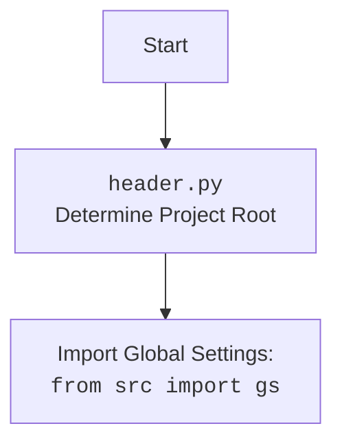

## <алгоритм>

1. **Начало**: Скрипт запускается из командной строки.

2. **Импорт модулей**: Импортируются необходимые модули, включая `header`, `argparse`, `copy`, `pathlib`, `typing`, `src.gs`, `AliCampaignEditor`, `locales`, `pprint`, `get_directory_names`, `j_loads_ns`, `logger`.

3. **Определение путей**: Определяется путь к директории с кампаниями (`campaigns_directory`) с помощью `gs.path.google_drive / 'aliexpress' / 'campaigns'`.

4. **Функция `process_campaign_category`**:
   - Принимает `campaign_name`, `category_name`, `language`, `currency`.
   - Создает экземпляр `AliCampaignEditor` с заданными параметрами.
   - Вызывает метод `process_campaign_category` у созданного экземпляра, передавая `category_name`, и возвращает список заголовков продуктов.
   - *Пример*:
     - Входные данные: `campaign_name="summer_sale"`, `category_name="electronics"`, `language="EN"`, `currency="USD"`
     - Выходные данные: `['Product 1', 'Product 2']` (список заголовков).

5. **Функция `process_campaign`**:
   - Принимает `campaign_name`, `language` (опционально), `currency` (опционально), `campaign_file` (опционально).
   - Генерирует список пар (язык, валюта) на основе `locales`. Если переданы `language` и `currency`, то список пар будет состоять только из них.
   - Итерируется по каждой паре (язык, валюта):
     - Логирует начало обработки кампании с указанием параметров.
     - Создает экземпляр `AliCampaignEditor` с текущими параметрами.
     - Вызывает метод `process_campaign` у созданного экземпляра для обработки кампании.
   - Возвращает `True`.

6. **Функция `process_all_campaigns`**:
    - Принимает `language` (опционально), `currency` (опционально).
    - Определяет список пар (язык, валюта), если не заданы `language` и `currency`, то на основе `locales`, иначе берет заданные параметры.
    - Получает список директорий кампаний (`campaigns_dir`) из `campaigns_directory`.
    - Итерируется по каждой кампании:
      - Логирует начало обработки кампании.
      - Создает экземпляр `AliCampaignEditor` для каждой кампании и вызывает `process_campaign()`.

7.  **Функция `main_process`**:
    - Принимает `campaign_name`, `categories`, `language` (опционально), `currency` (опционально).
    - Определяет `locales_to_process`, аналогично `process_campaign`.
    - Итерируется по каждой паре (язык, валюта):
      - Если `categories` не пустой, то итерируется по каждой категории и вызывает `process_campaign_category` с параметрами.
      - Иначе вызывает `process_campaign` для обработки всей кампании.

8. **Функция `main`**:
    - Создает `ArgumentParser` для обработки аргументов командной строки.
    - Добавляет аргументы: `campaign_name`, `--categories`, `--language`, `--currency`, `--all`.
    - Разбирает аргументы с помощью `parse_args()`.
    - Если указан `--all`, то вызывает `process_all_campaigns`.
    - Иначе вызывает `main_process` с параметрами из аргументов.

9. **Запуск**: Если скрипт запущен как основная программа (`if __name__ == "__main__":`), то вызывается функция `main()`.

## <mermaid>

```mermaid
flowchart TD
    Start[Start] --> ParseArguments[Parse Command Line Arguments]
    ParseArguments --> CheckAllFlag{Is --all flag present?}
    CheckAllFlag -- Yes --> ProcessAllCampaignsFunc[process_all_campaigns(language, currency)]
    CheckAllFlag -- No --> ProcessSpecificCampaign[main_process(campaign_name, categories, language, currency)]
    
    ProcessAllCampaignsFunc --> GetCampaignDirectories[Get campaign directories]
    GetCampaignDirectories --> LoopThroughCampaigns[Loop through each campaign directory]
    LoopThroughCampaigns --> CreateAliCampaignEditorAll[Create AliCampaignEditor with language and currency]
    CreateAliCampaignEditorAll --> CallProcessCampaign[editor.process_campaign()]
    CallProcessCampaign --> LoopThroughCampaigns
    LoopThroughCampaigns -- End of loop --> EndAllCampaigns[End process_all_campaigns]
    
    
    ProcessSpecificCampaign --> DetermineLocales[Determine locales to process]
    DetermineLocales --> CheckCategories{Are categories provided?}
    CheckCategories -- Yes --> LoopThroughCategories[Loop through categories]
    LoopThroughCategories --> ProcessCategory[process_campaign_category(campaign_name, category, language, currency)]
    ProcessCategory --> LoopThroughCategories
    LoopThroughCategories -- End of loop --> EndSpecificCampaigns[End main_process]
    CheckCategories -- No --> ProcessEntireCampaign[process_campaign(campaign_name, language, currency)]
    ProcessEntireCampaign --> EndSpecificCampaigns
    EndSpecificCampaigns --> End

    EndAllCampaigns --> End[End]

    
    
    style Start fill:#f9f,stroke:#333,stroke-width:2px
    style End fill:#ccf,stroke:#333,stroke-width:2px
    
    
    
```



**Объяснение зависимостей `mermaid`:**

*   **`flowchart TD`**: Определяет тип диаграммы как блок-схему (flowchart) и направление сверху вниз (TD - top down).
*   **`Start[Start]`**: Начальный узел, обозначающий точку входа в программу.
*   **`ParseArguments[Parse Command Line Arguments]`**: Узел, представляющий процесс разбора аргументов командной строки.
*   **`CheckAllFlag{Is --all flag present?}`**: Условный узел, проверяющий, был ли передан аргумент `--all`.
*   **`ProcessAllCampaignsFunc[process_all_campaigns(language, currency)]`**: Узел, представляющий вызов функции для обработки всех кампаний.
*   **`ProcessSpecificCampaign[main_process(campaign_name, categories, language, currency)]`**: Узел, представляющий вызов функции для обработки конкретной кампании.
*   **`GetCampaignDirectories[Get campaign directories]`**: Узел, представляющий получение списка директорий кампаний.
*  **`LoopThroughCampaigns[Loop through each campaign directory]`**: Узел, представляющий цикл по каждой директории кампании.
*   **`CreateAliCampaignEditorAll[Create AliCampaignEditor with language and currency]`**: Узел, представляющий создание объекта `AliCampaignEditor`.
*   **`CallProcessCampaign[editor.process_campaign()]`**: Узел, представляющий вызов метода `process_campaign`.
*   **`EndAllCampaigns[End process_all_campaigns]`**: Узел, обозначающий конец обработки всех кампаний.
*   **`DetermineLocales[Determine locales to process]`**: Узел, представляющий процесс определения языков и валют для обработки.
*   **`CheckCategories{Are categories provided?}`**: Условный узел, проверяющий, были ли предоставлены категории для обработки.
*   **`LoopThroughCategories[Loop through categories]`**: Узел, представляющий цикл по каждой категории.
*   **`ProcessCategory[process_campaign_category(campaign_name, category, language, currency)]`**: Узел, представляющий вызов функции для обработки конкретной категории.
*   **`EndSpecificCampaigns[End main_process]`**: Узел, обозначающий конец обработки конкретной кампании.
*   **`ProcessEntireCampaign[process_campaign(campaign_name, language, currency)]`**: Узел, представляющий вызов функции для обработки всей кампании без категорий.
*   **`End[End]`**: Конечный узел, обозначающий завершение работы программы.
*   **Стрелки `-->`**:  Отображают поток выполнения программы.
*  **`style Start fill:#f9f,stroke:#333,stroke-width:2px`**: Стиль для узла Start.
*  **`style End fill:#ccf,stroke:#333,stroke-width:2px`**: Стиль для узла End.

## <объяснение>

**Импорты:**

*   `import header`: Импортирует модуль `header.py`, который, предположительно, отвечает за определение корневого каталога проекта и загрузку общих настроек.
*   `import argparse`: Используется для обработки аргументов командной строки.
*   `import copy`: Предоставляет операции копирования объектов.
*   `from pathlib import Path`: Используется для работы с путями к файлам и директориям.
*   `from typing import List, Optional`: Используется для аннотации типов, что повышает читаемость кода.
*   `from src import gs`: Импортирует глобальные настройки проекта, включая пути к каталогам и другие параметры.
*   `from src.suppliers.aliexpress.campaign import AliCampaignEditor`: Импортирует класс `AliCampaignEditor`, который, вероятно, отвечает за редактирование кампаний AliExpress.
*   `from src.suppliers.aliexpress.utils import locales`: Импортирует список `locales`, представляющий доступные языки и валюты.
*   `from src.utils.printer import pprint`: Импортирует функцию `pprint` для красивого вывода данных.
*  `from src.utils.file import get_directory_names`: Импортирует функцию `get_directory_names` для получения списка директорий.
*  `from src.utils.jjson import j_loads_ns`: Импортирует функцию `j_loads_ns` для загрузки данных из json.
*   `from src.logger.logger import logger`: Импортирует объект `logger` для логирования событий.

**Классы:**

*   `AliCampaignEditor`: Класс, отвечающий за обработку и подготовку данных для кампаний AliExpress.
    -   В конструктор передаются `campaign_name`, `language`, `currency`.
    -   Содержит методы:
        -   `process_campaign_category(category_name)`: Обрабатывает категорию товаров для кампании, возвращая список заголовков товаров.
        -   `process_campaign()`: Обрабатывает всю кампанию.

**Функции:**

*   `process_campaign_category(campaign_name, category_name, language, currency)`:
    -   **Аргументы**:
        -   `campaign_name` (str): Имя кампании.
        -   `category_name` (str): Имя категории.
        -   `language` (str): Язык кампании.
        -   `currency` (str): Валюта кампании.
    -   **Возвращает**: `List[str]` - список заголовков товаров.
    -   **Назначение**: Обрабатывает конкретную категорию товаров в рамках кампании. Создает экземпляр `AliCampaignEditor` и вызывает соответствующий метод.

*   `process_campaign(campaign_name, language=None, currency=None, campaign_file=None)`:
    -   **Аргументы**:
        -   `campaign_name` (str): Имя кампании.
        -   `language` (Optional[str]): Язык кампании (необязательный).
        -   `currency` (Optional[str]): Валюта кампании (необязательный).
        -   `campaign_file` (Optional[str]): Путь к файлу кампании (необязательный).
    -   **Возвращает**: `bool` - `True`, если обработка успешна.
    -   **Назначение**: Обрабатывает всю кампанию для заданных языков и валют, вызывая метод `process_campaign()` у `AliCampaignEditor`.

*   `process_all_campaigns(language=None, currency=None)`:
    -   **Аргументы**:
        -   `language` (Optional[str]): Язык кампании (необязательный).
        -   `currency` (Optional[str]): Валюта кампании (необязательный).
    -   **Возвращает**: `None`.
    -   **Назначение**: Обрабатывает все кампании, находящиеся в директории `campaigns`, для заданных языков и валют.

*  `main_process(campaign_name, categories, language=None, currency=None)`:
    -   **Аргументы**:
        - `campaign_name` (str): Имя кампании.
        - `categories` (List[str] | str): Список категорий для обработки.
        - `language` (Optional[str]): Язык кампании (необязательный).
        - `currency` (Optional[str]): Валюта кампании (необязательный).
    -  **Возвращает**: `None`.
    -   **Назначение**: Главная функция для обработки конкретной кампании или категорий внутри нее.

*   `main()`:
    -   **Аргументы**: Нет.
    -   **Возвращает**: `None`.
    -   **Назначение**: Основная функция, которая разбирает аргументы командной строки и запускает соответствующую обработку.

**Переменные:**

*   `campaigns_directory`: Путь к директории с кампаниями, полученный из глобальных настроек.
*   `_l`: Временная переменная, хранящая список пар (язык, валюта) для обработки.

**Потенциальные ошибки и улучшения:**

*   **Обработка ошибок**: В коде отсутствует явная обработка исключений, что может привести к сбоям при ошибках. Следует добавить `try-except` блоки для обработки исключений.
*   **Логирование**: Логирование ведется только на уровне информации. Можно добавить логирование ошибок и отладочную информацию.
*   **Улучшение читаемости**: Можно добавить больше комментариев и разбить функции на более мелкие, чтобы повысить читаемость кода.
*   **Зависимости**: Скрипт сильно зависит от структуры каталогов и глобальных настроек `src.gs`.
*   **Гибкость**: Код можно сделать более гибким, позволяя пользователю указывать пути к файлам с кампаниями.
*   **Обработка отсутствующих кампаний**: В функции `process_all_campaigns` при отсутствии директории кампании код не выдаст предупреждения. Стоит добавить проверку на существование директории кампании и обрабатывать данную ситуацию.
*   **Обработка категорий**: В `main_process` если передать строку в `categories` будет ошибка, нужно обрабатывать как список.

**Взаимосвязь с другими частями проекта:**

*   Скрипт использует глобальные настройки из `src.gs`, что обеспечивает доступ к общим параметрам проекта.
*   `AliCampaignEditor` из `src.suppliers.aliexpress.campaign` является ключевой частью обработки кампаний AliExpress.
*   Использует `logger` из `src.logger.logger` для логирования событий.
*   Использует `locales` из `src.suppliers.aliexpress.utils` для получения доступных языков и валют.
*   Использует `pprint` из `src.utils.printer` для красивого вывода.
*   Использует `get_directory_names` из `src.utils.file` для получения списка директорий.
*   Использует `j_loads_ns` из `src.utils.jjson` для работы с json.

В целом, код представляет собой скрипт для обработки кампаний AliExpress, который взаимодействует с другими частями проекта для получения настроек, обработки данных и логирования.