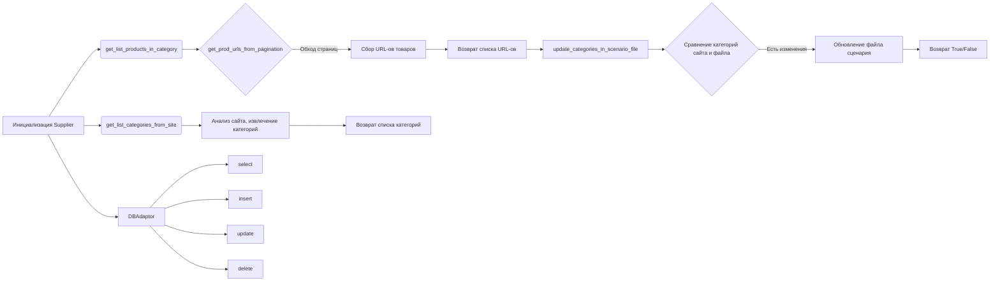
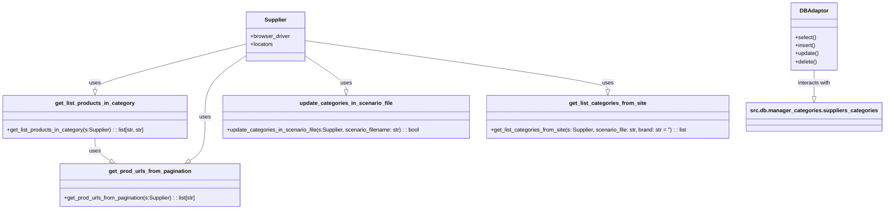

# Анализ модуля управления категориями AliExpress

## 1. <алгоритм>

**Общий рабочий процесс:**

1.  **Инициализация:** Начинается с инициализации экземпляра `Supplier`, который содержит браузерный драйвер и локаторы элементов. Это необходимый шаг для взаимодействия с сайтом AliExpress.
2.  **Получение списка товаров из категории:**
    *   Функция `get_list_products_in_category` вызывается с экземпляром `Supplier`.
    *   Внутри этой функции вызывается `get_prod_urls_from_pagination`, которая ищет URL-адреса товаров на страницах категории, обрабатывая пагинацию.
        *   Пример: Если есть 3 страницы товаров, то она последовательно переходит по ним, собирая ссылки.
    *   Возвращается список URL-адресов товаров.
3.  **Обновление категорий в файле сценария:**
    *   Функция `update_categories_in_scenario_file` вызывается с экземпляром `Supplier` и именем файла сценария (`scenario_filename`).
    *   Эта функция сравнивает категории на сайте с теми, что в файле сценария.
        *   Например, если на сайте появилась новая категория, ее нужно добавить в файл.
    *   Возвращает `True`, если обновление прошло успешно, `False` в противном случае.
4.  **Получение списка категорий с сайта:**
    *   Функция `get_list_categories_from_site` вызывается с экземпляром `Supplier`, именем файла сценария и, опционально, брендом.
    *   Функция анализирует сайт AliExpress и извлекает список категорий на основе информации в файле сценария.
        *   Например, ищет навигационные элементы сайта с категориями и вычленяет их.
    *   Возвращает список категорий.
5.  **Взаимодействие с базой данных:**
    *   Используется класс `DBAdaptor`, предоставляющий методы для CRUD операций с таблицей `AliexpressCategory`.
    *   Методы `select`, `insert`, `update` и `delete` позволяют выполнять стандартные операции с данными.
        *   Например, можно запросить все категории (`select`), добавить новую (`insert`), обновить существующую (`update`) или удалить ненужную (`delete`).

**Блок-схема:**



## 2. <mermaid>



**Анализ зависимостей:**

*   **`Supplier`**: Класс, представляющий поставщика, предоставляет доступ к браузерному драйверу и локаторам элементов на сайте. Он используется во всех функциях, взаимодействующих с сайтом AliExpress.
*   **`DBAdaptor`**: Класс, отвечающий за операции с базой данных. Он взаимодействует с модулем `src.db.manager_categories.suppliers_categories`, предоставляя доступ к операциям `SELECT`, `INSERT`, `UPDATE`, `DELETE` для таблицы `AliexpressCategory`.
*   **`get_list_products_in_category`**: Функция, которая принимает экземпляр `Supplier` и вызывает `get_prod_urls_from_pagination` для получения URL-адресов продуктов.
*   **`get_prod_urls_from_pagination`**: Функция, которая также принимает экземпляр `Supplier`, но непосредственно извлекает URL-адреса продуктов со страниц категории, обрабатывая пагинацию. Она вызывается функцией `get_list_products_in_category`.
*   **`update_categories_in_scenario_file`**: Функция, которая принимает экземпляр `Supplier` и имя файла сценария для обновления категорий.
*   **`get_list_categories_from_site`**: Функция, которая принимает экземпляр `Supplier`, файл сценария и опциональный бренд для извлечения списка категорий с сайта.
*   **`src.db.manager_categories.suppliers_categories`**: Модуль, отвечающий за управление категориями в базе данных. `DBAdaptor` взаимодействует с ним для выполнения операций с данными.

## 3. <объяснение>

### Импорты:

В данном коде прямые импорты не представлены. Однако в описании указаны зависимости от следующих модулей:

*   `src.db.manager_categories.suppliers_categories`: Этот модуль отвечает за взаимодействие с базой данных, конкретно с категориями поставщиков. Он предоставляет методы для чтения, записи, обновления и удаления данных, связанных с категориями.
*   `src.utils.jjson`: Этот модуль, вероятно, используется для работы с JSON файлами, например, при чтении или записи данных в файл сценария.
*   `src.logger`: Этот модуль используется для логирования, позволяя записывать сообщения об ошибках и других событиях во время работы модуля.
*   `requests`: Это библиотека Python, которая используется для выполнения HTTP запросов. Она, вероятно, нужна для извлечения данных со страниц AliExpress.

### Классы:

*   **`DBAdaptor`**:
    *   **Роль**: Адаптирует операции с базой данных для работы с таблицей `AliexpressCategory`.
    *   **Атрибуты**: Не имеет собственных атрибутов.
    *   **Методы**:
        *   `select()`: Выполняет выборку данных из таблицы `AliexpressCategory`.
        *   `insert()`: Вставляет новую запись в таблицу `AliexpressCategory`.
        *   `update()`: Обновляет существующую запись в таблице `AliexpressCategory`.
        *   `delete()`: Удаляет запись из таблицы `AliexpressCategory`.
    *   **Взаимодействие**: Взаимодействует с модулем `src.db.manager_categories.suppliers_categories`, предоставляя интерфейс для выполнения CRUD-операций.

### Функции:

*   **`get_list_products_in_category(s: Supplier) -> list[str, str]`**:
    *   **Аргументы**:
        *   `s` (`Supplier`): Экземпляр класса `Supplier`, содержащий драйвер браузера и локаторы.
    *   **Возвращаемое значение**: Список URL-адресов товаров (`list[str, str]`).
    *   **Назначение**: Получает список URL-адресов товаров из страницы категории.
    *   **Пример**:
        ```python
        supplier = Supplier()
        product_urls = get_list_products_in_category(supplier)
        print(product_urls)  # Вывод списка URL-адресов товаров
        ```
*   **`get_prod_urls_from_pagination(s: Supplier) -> list[str]`**:
    *   **Аргументы**:
        *   `s` (`Supplier`): Экземпляр класса `Supplier`.
    *   **Возвращаемое значение**: Список URL-адресов товаров (`list[str]`).
    *   **Назначение**: Получает URL-адреса товаров, обрабатывая пагинацию на странице категории.
    *   **Пример**:
        ```python
        supplier = Supplier()
        product_urls = get_prod_urls_from_pagination(supplier)
        print(product_urls)
        ```
*   **`update_categories_in_scenario_file(s: Supplier, scenario_filename: str) -> bool`**:
    *   **Аргументы**:
        *   `s` (`Supplier`): Экземпляр класса `Supplier`.
        *   `scenario_filename` (`str`): Имя файла сценария.
    *   **Возвращаемое значение**: `True`, если категории успешно обновлены, `False` в противном случае.
    *   **Назначение**: Сравнивает категории на сайте с категориями в файле сценария и обновляет файл при необходимости.
    *   **Пример**:
        ```python
        supplier = Supplier()
        updated = update_categories_in_scenario_file(supplier, 'categories.json')
        print(updated)  # Вывод True или False
        ```
*   **`get_list_categories_from_site(s: Supplier, scenario_file: str, brand: str = '') -> list`**:
    *   **Аргументы**:
        *   `s` (`Supplier`): Экземпляр класса `Supplier`.
        *   `scenario_file` (`str`): Файл сценария с информацией о категориях.
        *   `brand` (`str`, optional): Бренд для фильтрации категорий.
    *   **Возвращаемое значение**: Список категорий, полученных с сайта.
    *   **Назначение**: Извлекает список категорий с сайта AliExpress, основываясь на данных в файле сценария и фильтре по бренду.
    *   **Пример**:
        ```python
        supplier = Supplier()
        categories = get_list_categories_from_site(supplier, 'categories.json', brand='ExampleBrand')
        print(categories)
        ```

### Переменные:

В данном коде нет явных переменных, объявленных на уровне модуля. Но функции используют локальные переменные для своих операций.

### Потенциальные ошибки и области для улучшения:

1.  **Обработка ошибок:**
    *   В коде не указана явная обработка исключений, например, при ошибках загрузки страниц, поиске элементов или взаимодействии с базой данных.
2.  **Кэширование:**
    *   Для оптимизации производительности можно кэшировать данные, например, результаты запросов к сайту.
3.  **Параллелизм:**
    *   Загрузку данных с нескольких страниц можно ускорить, используя многопоточность или асинхронное программирование.
4.  **Логирование:**
    *   Более подробное логирование действий функций может помочь при отладке и мониторинге работы модуля.
5.  **Унификация данных:**
    *   Необходима унификация структуры данных категорий, чтобы упростить работу с ними в разных функциях.
6.  **Обработка динамического контента:**
     *   Для корректной работы с динамическим контентом на страницах AliExpress, необходимо использовать явные ожидания загрузки элементов.

### Взаимосвязь с другими частями проекта:

*   Модуль зависит от `src.db.manager_categories.suppliers_categories` для управления категориями в базе данных. Это связь с уровнем хранения данных.
*   Модуль использует `src.utils.jjson` для работы с JSON файлами. Это связь с утилитами, предназначенными для работы с данными.
*   Модуль использует `src.logger` для логирования. Это связь с подсистемой логирования проекта.
*   Модуль взаимодействует с сайтом AliExpress через браузерный драйвер, предоставляемый классом `Supplier`. Это связь с уровнем интеграции с внешними ресурсами.
*   Модуль может быть использован в других частях проекта, где требуется управление категориями AliExpress. Это связь с другими модулями бизнес-логики.