## АНАЛИЗ КОДА: `hypotez/src/suppliers/aliexpress/category.md`

### 1. <алгоритм>

**Общий рабочий процесс:**

1.  **Инициализация:** Создается экземпляр класса `Supplier`, который содержит необходимые драйверы браузера и локаторы для работы с AliExpress.
2.  **Получение URL продуктов:**
    *   Функция `get_list_products_in_category(s: Supplier)` вызывается для получения списка URL продуктов из категории.
    *   Внутри этой функции используется `get_prod_urls_from_pagination(s: Supplier)`, которая обрабатывает пагинацию на странице категории.

3.  **Обновление категорий в файле сценария:**
    *   Функция `update_categories_in_scenario_file(s: Supplier, scenario_filename: str)` сравнивает категории на сайте с категориями в файле сценария.
    *   Если есть расхождения, файл сценария обновляется.
    *   Эта функция использует `get_list_categories_from_site(s: Supplier, scenario_file: str, brand: str = '')` для получения категорий с сайта.
4.  **Взаимодействие с базой данных (через `DBAdaptor`):**
    *   `DBAdaptor` класс предоставляет методы для CRUD (Create, Read, Update, Delete) операций с записями `AliexpressCategory` в базе данных.
    *   Методы `select`, `insert`, `update`, `delete` используются для взаимодействия с БД.
    *   Эти операции могут быть использованы в других частях проекта для управления категориями.
    
**Примеры:**

*   **`get_list_products_in_category(s: Supplier)`**:
    1.  Вызывает `get_prod_urls_from_pagination(s)` для получения URL-адресов продуктов с текущей страницы.
    2.  Если есть пагинация, то происходит переход на следующую страницу и снова вызывается `get_prod_urls_from_pagination(s)`.
    3.  Объединяет все URL-адреса с разных страниц в один список.
    4.  Возвращает список URL-адресов.
*   **`get_prod_urls_from_pagination(s: Supplier)`**:
    1.  Использует `s.driver` для загрузки страницы.
    2.  Использует `s.locators` для поиска элементов с URL-адресами продуктов на странице.
    3.  Извлекает URL-адреса.
    4.  Возвращает список URL-адресов.
*   **`update_categories_in_scenario_file(s: Supplier, scenario_filename: str)`**:
    1.  Вызывает `get_list_categories_from_site(s, scenario_filename)` для получения списка категорий с сайта.
    2.  Считывает категории из `scenario_filename`.
    3.  Сравнивает категории с сайта и категории из файла.
    4.  Обновляет `scenario_filename` с новыми данными категорий.
    5.  Возвращает `True` при успешном обновлении, `False` если есть ошибки.
*   **`get_list_categories_from_site(s: Supplier, scenario_file: str, brand: str = '')`**:
    1.  Загружает страницу с категориями с сайта, используя `s.driver`.
    2.  Использует `s.locators` для поиска элементов с категориями.
    3.  Извлекает названия и URL-адреса категорий.
    4.  Возвращает список категорий.
*   **`DBAdaptor`**:
    1.  `select`: Получает данные из таблицы `AliexpressCategory` с возможностью фильтрации.
    2.  `insert`: Вставляет новые данные в таблицу `AliexpressCategory`.
    3.  `update`: Обновляет существующие записи в таблице `AliexpressCategory`.
    4.  `delete`: Удаляет записи из таблицы `AliexpressCategory`.

```mermaid
flowchart TD
    subgraph Aliexpress Category Management Module
    
        Start[Начало] --> GetProducts[get_list_products_in_category]
        GetProducts --> GetProductURLsFromPagination[get_prod_urls_from_pagination]
        GetProductURLsFromPagination --> ReturnProductURLs[Возврат списка URL-адресов продуктов]
        ReturnProductURLs --> UpdateCategories[update_categories_in_scenario_file]
        UpdateCategories --> GetCategoriesFromSite[get_list_categories_from_site]
        GetCategoriesFromSite --> ReturnCategories[Возврат списка категорий]
         ReturnCategories --> ScenarioFile[Обновление файла сценария]
        ScenarioFile --> End[Конец]
    
    
        GetProducts --> SupplierInstance[Supplier Instance: `s`]
        UpdateCategories --> SupplierInstance
         GetCategoriesFromSite --> SupplierInstance
      
    end
    
    subgraph Database Operations
        DBStart[Начало] --> DBAccess[DBAdaptor]
        DBAccess --> DBSelect[select]
        DBAccess --> DBInsert[insert]
        DBAccess --> DBUpdate[update]
        DBAccess --> DBDelete[delete]
        DBSelect --> DBEnd[Конец]
         DBInsert --> DBEnd
         DBUpdate --> DBEnd
          DBDelete --> DBEnd
    end
    
    linkStyle default stroke:#333,stroke-width:2px
    linkStyle 0,1,2,3,4,5,6,7,8 stroke:#0066CC,stroke-width:2px
     linkStyle 9,10,11,12,13,14 stroke:#548B54,stroke-width:2px

```

### 2. <mermaid>

**Разбор зависимостей `mermaid`:**

*   Диаграмма показывает основной поток управления в модуле `category.py`.
*   `Aliexpress Category Management Module` -  описывает основные функции и их взаимодействие.
*   `Database Operations` - описывает класс `DBAdaptor` и его методы, используемые для работы с базой данных.
*   **`get_list_products_in_category`** - главная функция, которая вызывает `get_prod_urls_from_pagination`.
*   **`get_prod_urls_from_pagination`** - функция для извлечения URL-адресов продуктов со страницы, включая пагинацию.
*   **`update_categories_in_scenario_file`** - функция для обновления категорий в файле сценария на основе данных с сайта. Она вызывает `get_list_categories_from_site`.
*   **`get_list_categories_from_site`** - функция для получения списка категорий с сайта.
*    **`DBAdaptor`** - представляет методы взаимодействия с БД.
*   **`Supplier Instance: s`** - используется как аргумент для функций, содержащий драйвер и локаторы.
*   Стрелки показывают поток данных и вызовы функций.

### 3. <объяснение>

**Импорты:**

*   `src.db.manager_categories.suppliers_categories`: Используется для взаимодействия с базой данных, предоставляет классы для работы с таблицами категорий (`AliexpressCategory`, вероятно). Взаимодействует с модулями `src.db` для управления данными.
*   `src.utils.jjson`: Предназначен для работы с JSON-данными, вероятно, используется для чтения и записи файлов сценариев.
*   `src.logger`: Модуль для логирования ошибок и сообщений. Взаимодействует с другими модулями, предоставляя общую систему логирования.
*   `requests`: Библиотека для выполнения HTTP-запросов, используется для запросов к сайту AliExpress.

**Классы:**

*   `DBAdaptor`:
    *   **Роль:** Предоставляет интерфейс для взаимодействия с базой данных, включая операции `SELECT`, `INSERT`, `UPDATE`, и `DELETE`.
    *   **Атрибуты:** Не указаны в описании. Скорее всего содержит атрибуты для подключения к базе данных.
    *   **Методы:**
        *   `select`: Возвращает записи из таблицы `AliexpressCategory` на основе переданных условий.
        *   `insert`: Добавляет новую запись в таблицу `AliexpressCategory`.
        *   `update`: Обновляет существующую запись в таблице `AliexpressCategory`.
        *   `delete`: Удаляет запись из таблицы `AliexpressCategory`.
    *   **Взаимодействие:** Используется для хранения и управления данными о категориях AliExpress в базе данных.

**Функции:**

*   `get_list_products_in_category(s: Supplier) -> list[str, str]`:
    *   **Аргументы:** `s` - Экземпляр класса `Supplier`, содержащий браузер и локаторы для работы с AliExpress.
    *   **Возвращает:** `list[str, str]` - Список URL-адресов продуктов из категории.
    *   **Назначение:** Извлекает все URL-адреса продуктов из текущей категории, включая обработку пагинации.
    *   **Пример:** `get_list_products_in_category(supplier_instance)` вернет список URL-адресов продуктов из текущей открытой категории.
*   `get_prod_urls_from_pagination(s: Supplier) -> list[str]`:
    *   **Аргументы:** `s` - Экземпляр класса `Supplier`.
    *   **Возвращает:** `list[str]` - Список URL-адресов продуктов.
    *   **Назначение:** Извлекает URL-адреса продуктов с текущей страницы, обрабатывая пагинацию.
    *   **Пример:** `get_prod_urls_from_pagination(supplier_instance)` вернет список URL-адресов с текущей страницы.
*   `update_categories_in_scenario_file(s: Supplier, scenario_filename: str) -> bool`:
    *   **Аргументы:** `s` - Экземпляр класса `Supplier`, `scenario_filename` - имя файла сценария.
    *   **Возвращает:** `bool` - `True`, если обновление прошло успешно, `False` в противном случае.
    *   **Назначение:** Сравнивает категории на сайте с категориями в файле сценария и обновляет файл, если есть изменения.
    *   **Пример:** `update_categories_in_scenario_file(supplier_instance, 'aliexpress_scenario.json')` обновит файл `aliexpress_scenario.json`.
*   `get_list_categories_from_site(s: Supplier, scenario_file: str, brand: str = '') -> list`:
    *   **Аргументы:** `s` - Экземпляр класса `Supplier`, `scenario_file` - файл сценария, `brand` - фильтр по бренду.
    *   **Возвращает:** `list` - Список категорий с сайта.
    *   **Назначение:** Получает список категорий с сайта AliExpress, используя локаторы и данные из файла сценария.
    *   **Пример:** `get_list_categories_from_site(supplier_instance, 'aliexpress_scenario.json', 'brand_name')` вернет список категорий для конкретного бренда.

**Переменные:**

*   `s` (в функциях) - экземпляр класса `Supplier`, содержит драйвер браузера и локаторы.
*   `scenario_filename` - строка, имя файла сценария для обновления.
*   `scenario_file` - строка, путь к файлу сценария.
*   `brand` - строка, фильтр для категорий по бренду.
*   `category_urls` - список URL-адресов, полученных из категории.

**Потенциальные ошибки и области для улучшения:**

*   Обработка ошибок при работе с браузером и сетью (например, timeout).
*   Возможность неверной обработки пагинации (динамические загрузки).
*   Необходимо добавить более подробное логирование.
*   Отсутствует обработка исключений.
*   Необходимо добавить проверку типов данных в функциях.
*   Улучшить именование переменных и функций (например, `s` заменить на `supplier`).
*   Добавить тесты для каждого метода.

**Взаимосвязи с другими частями проекта:**

*   Модуль взаимодействует с `src.db` для хранения данных категорий.
*   Использует `src.utils.jjson` для работы с файлами сценариев.
*   Зависит от модуля `src.logger` для ведения логов.
*   Использует `requests` для HTTP-запросов на сайт AliExpress.

Этот модуль является важной частью системы управления данными о товарах AliExpress и тесно взаимодействует с другими модулями для обеспечения функциональности.