```MD
# Анализ кода модуля управления категориями Aliexpress

## <input code>

```
# Модуль управления категориями Aliexpress

Этот модуль предоставляет функциональность для работы с категориями товаров на платформе Aliexpress. Он включает функции для получения ссылок на товары в категории, обновления категорий на основе данных с сайта и операций с базой данных.

## Описание модуля

Модуль предназначен для управления категориями товаров на Aliexpress. Он включает в себя следующие ключевые функции:

- Получение списка товаров из категории.
- Обновление категорий в сценарии на основе данных с сайта.
- Операции с базой данных для работы с категориями.


## Пример использования

### Получение списка товаров из категории

```python
# Пример использования функции get_list_products_in_category
products = get_list_products_in_category(supplier)
```

### Обновление категорий в файле сценария

```python
# Пример использования функции update_categories_in_scenario_file
updated = update_categories_in_scenario_file(supplier, "scenario_file.json")
```

### Операции с базой данных

```python
# Пример использования DBAdaptor для операций с базой данных
db = DBAdaptor()
db.select(cat_id=123)
db.insert()
db.update()
db.delete()
```

## Функции модуля

### `get_list_products_in_category(s)`
Считывает URL товаров со страницы категории. Если есть несколько страниц с товарами, функция будет перелистывать все страницы.

**Аргументы:**
- `s` (`Supplier`): Экземпляр поставщика.

**Возвращает:**
- Список URL продуктов в категории.

### `get_prod_urls_from_pagination(s)`
Собирает ссылки на товары с страницы категории с перелистыванием страниц.

**Аргументы:**
- `s` (`Supplier`): Экземпляр поставщика.

**Возвращает:**
- Список ссылок на товары.

### `update_categories_in_scenario_file(s, scenario_filename)`
Проверяет изменения категорий на сайте и обновляет файл сценария.

**Аргументы:**
- `s` (`Supplier`): Экземпляр поставщика.
- `scenario_filename` (str): Имя файла сценария для обновления.

**Возвращает:**
- `True`, если обновление прошло успешно.

### `get_list_categories_from_site(s, scenario_file, brand=\'\')`
Получает список категорий с сайта на основе файла сценария.

**Аргументы:**
- `s` (`Supplier`): Экземпляр поставщика.
- `scenario_file` (str): Имя файла сценария.
- `brand` (str, optional): Опциональное имя бренда.

**Возвращает:**
- Список категорий.

### Класс `DBAdaptor`
Предоставляет методы для выполнения операций с базой данных, таких как `SELECT`, `INSERT`, `UPDATE` и `DELETE`.

**Методы:**
- `select(cat_id, parent_id, project_cat_id)`: Выбирает записи из базы данных.
- `insert()`: Вставляет новые записи в базу данных.
- `update()`: Обновляет записи в базе данных.
- `delete()`: Удаляет записи из базы данных.


## <explanation>

**Импорты:**  Код демонстрирует использование импорта `requests` для работы с HTTP-запросами, `jjson` для работы с JSON (из `src.utils.jjson`), и `suppliers_categories` (из `src.db.manager_categories.suppliers_categories`) для взаимодействия с базой данных.  `src.logger` используется для логирования.  Непосредственное использование `gs.db_translations_credentials` предполагает, что эта переменная или функция доступна в текущем контексте и используется для настройки подключения к базе данных.

**Классы:** Класс `DBAdaptor` предназначен для абстрагирования взаимодействия с базой данных. Он предоставляет методы для выполнения основных операций: выборки, вставки, обновления и удаления данных. Это хорошая практика для поддержания чистого кода и уменьшения кода, который зависит от конкретной базы данных (например, PostgreSQL, MySQL).

**Функции:** Функции `get_list_products_in_category`, `get_prod_urls_from_pagination`, `update_categories_in_scenario_file`, `get_list_categories_from_site` — это основные функциональные блоки для работы с категориями Aliexpress.  Они принимают данные (экземпляр поставщика, имя файла сценария, и т.д.), выполняют соответствующие действия и возвращают результаты.

**Переменные:** Переменные, такие как `supplier`, `scenario_filename`, `products`, `updated`, `db`  являются типовыми переменными, используемыми в коде.  Их тип зависит от контекста, в котором они используются.

**Возможные ошибки и улучшения:**
* Нет обработки ошибок:  Код не содержит обработки возможных ошибок (например, проблем с подключением к базе данных, отсутствия файла сценария, ошибок API). Добавление обработки исключений значительно повысит надежность кода.
* Отсутствие описания `Supplier`:  Нет описания класса `Supplier`, что затрудняет понимание взаимодействия с модулем.  Необходимо добавить описание этого класса.
* Не хватает детализации:  В описании функций нет информации о структуре данных, которые передаются и возвращаются.  Описание должно быть более подробным (например, что представляют собой объекты в списках).
* Сложность логирования:  Не указано, как именно происходит логирование (например, какой уровень логирования используется).

**Взаимосвязь с другими частями проекта:**  Модуль зависит от `gs.db_translations_credentials` (для подключения к БД), `jjson` для обработки JSON-данных, `requests` для взаимодействия с сайтом Aliexpress,  `suppliers_categories` для взаимодействия с БД.  Модуль `logger` используется для записи сообщений. Все эти элементы, вероятно, находятся в других частях проекта (`src`).

```mermaid
graph LR
    A[Модуль категорий Aliexpress] --> B(Supplier);
    B --> C{get_list_products_in_category};
    C --> D[requests];
    D --> E[Обработка данных];
    E --> F(Список URL товаров);
    C --> G{get_prod_urls_from_pagination};
    G --> H[Обработка страниц];
    H --> F;
    C --> I{update_categories_in_scenario_file};
    I --> J[Сравнение данных];
    J --> K[Обновление файла сценария];
    K --> L{jjson};
    C --> M{get_list_categories_from_site};
    M --> N[Работа с файлом сценария];
    N --> O[Получение категорий];
    O --> P(Список категорий);
    A --> Q[DBAdaptor];
    Q --> R{select};
    Q --> S{insert};
    Q --> T{update};
    Q --> U{delete};
    R --> V[База данных];
    S --> V;
    T --> V;
    U --> V;
    A --> W(logger);
    W --> X[Запись сообщений];
    subgraph "Внешние зависимости"
        D
        L
        V
        X
    end
```

## <mermaid>



Диаграмма иллюстрирует взаимодействие модуля с `requests`, `jjson`, базой данных и системой логирования.


```
```