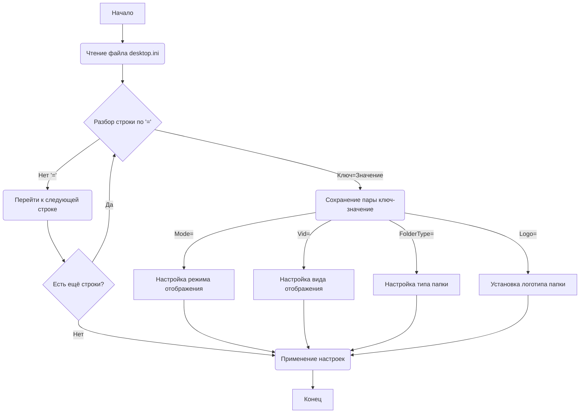

## Анализ кода `hypotez/src/suppliers/aliexpress/desktop.ini`

### <алгоритм>

1. **Чтение файла:** Файл `desktop.ini` читается как текстовый файл. 
2. **Разбор содержимого:** Содержимое файла разбирается построчно.
3. **Обработка строк:** Каждая строка обрабатывается в формате `ключ=значение`.
4. **Сохранение значений:** Ключи и значения сохраняются в виде пар.
5. **Применение значений:** Значения используются для настройки отображения папки в проводнике Windows.
    *   `Mode`: Определяет режим отображения папки (значение пустое, возможно, означает режим по умолчанию).
    *   `Vid`: Определяет вид отображения папки (значение пустое, возможно, означает вид по умолчанию).
    *   `FolderType`: Тип папки (значение `Generic`, обозначает обычную папку).
    *   `Logo`: Путь к файлу логотипа для данной папки (`E:\\Users\\user\\images\\LOGOS\\R.png`).

### <mermaid>

**Описание `mermaid`:**

Диаграмма `mermaid` представляет процесс разбора файла `desktop.ini`. 

1.  **`A[Начало]`**: Начало процесса.
2.  **`B(Чтение файла desktop.ini)`**: Чтение файла `desktop.ini`.
3.  **`C{Разбор строки по '='}`**: Разбор каждой строки на ключ и значение по разделителю `=`.
4.  **`D(Сохранение пары ключ-значение)`**: Сохранение пары `ключ-значение` для дальнейшего использования.
5.  **`E(Перейти к следующей строке)`**: Если в строке нет разделителя `=`, то она пропускается и происходит переход к следующей строке.
6.   **`F{Есть ещё строки?}`**: Проверка, есть ли ещё строки в файле.
7.  **`G(Применение настроек)`**: Применение сохраненных настроек к отображению папки.
8.  **`H[Конец]`**: Конец процесса.
9.  **`M[Настройка режима отображения]`**: Настройка режима отображения из `Mode=`.
10. **`N[Настройка вида отображения]`**: Настройка вида отображения из `Vid=`.
11. **`O[Настройка типа папки]`**: Настройка типа папки из `FolderType=`.
12. **`P[Установка логотипа папки]`**: Установка логотипа папки из `Logo=`.

### <объяснение>

**Импорты:**

В данном примере файла `desktop.ini` нет импортов, так как это конфигурационный файл, а не программный код.

**Классы:**

В данном файле нет классов. Это конфигурационный файл, предназначенный для настройки отображения папки в проводнике Windows.

**Функции:**

В данном файле нет функций. Он не является исполняемым кодом, а скорее набором настроек.

**Переменные:**

В данном файле, переменные фактически являются ключами (`Mode`, `Vid`, `FolderType`, `Logo`) и их значениями (`пусто`, `пусто`, `Generic`, `E:\\Users\\user\\images\\LOGOS\\R.png`).

*   `Mode`: Строка, определяет режим отображения папки.
*   `Vid`: Строка, определяет вид отображения папки.
*   `FolderType`: Строка, определяет тип папки. Здесь значение `Generic`, то есть обычная папка.
*   `Logo`: Строка, содержащая путь к файлу изображения, используемого в качестве логотипа для данной папки.

**Объяснение:**

Файл `desktop.ini` - это файл конфигурации Windows, который позволяет кастомизировать отображение папок в проводнике. Каждая строка в файле представляет собой пару `ключ=значение`, где:

*   `Mode`: Управляет режимом отображения (например, "Вид эскизов"). Пустое значение говорит о том, что используется режим по умолчанию.
*   `Vid`:  Управляет видом отображения (например, "Большие значки", "Список"). Пустое значение говорит о том, что используется вид по умолчанию.
*   `FolderType`: Определяет тип содержимого папки. `Generic` означает общую папку.
*   `Logo`:  Указывает путь к изображению, которое используется в качестве значка для папки.

В данном конкретном примере:

*   Режим и вид отображения не указаны и будут соответствовать системным настройкам по умолчанию.
*   Тип папки установлен в `Generic`, то есть папка является обычной.
*   Для папки будет использован логотип, расположенный по пути `E:\\Users\\user\\images\\LOGOS\\R.png`.

**Потенциальные ошибки и области для улучшения:**

*   **Обработка ошибок:** В данном файле не обрабатываются ошибки, так как это просто конфигурационный файл.
*   **Валидация путей:** Путь к логотипу `Logo` не валидируется, и при его некорректности логотип не будет отображаться.
*   **Обработка несуществующих ключей:**  Если в файле есть неизвестные ключи, они просто будут проигнорированы.
*   **Универсальность:**  Путь к логотипу является специфичным для пользователя (путь `E:\\Users\\user\\`), что может создать проблемы при использовании на других машинах.

**Взаимосвязь с другими частями проекта:**

Так как это файл конфигурации, он влияет на отображение папок в файловой системе Windows и не связан напрямую с кодом Python, который может использовать данную папку. Однако, если, например, код парсит содержимое папки, то знание того, какой логотип в ней отображается, может пригодиться для визуализации или отладки.