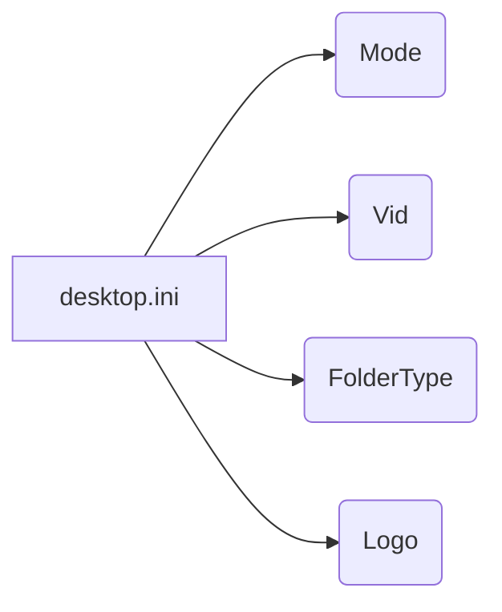

# Анализ файла desktop.ini

## <input code>

```
[ViewState]
Mode=
Vid=
FolderType=Generic
Logo=E:\\Users\\user\\images\\LOGOS\\R.png
```

## <algorithm>

Этот файл представляет собой файл Windows desktop.ini.  Он используется для хранения информации о внешнем виде и свойствах папки, например, для отображения логотипа.

Пошаговая блок-схема (в данном случае не применимо, поскольку это просто набор пар "ключ-значение"):

1. **Ключ "Mode":** хранит значение режима папки (пустое значение в данном случае).
2. **Ключ "Vid":** хранит значение идентификатора вида папки (пустое значение в данном случае).
3. **Ключ "FolderType":** хранит тип папки (в данном случае Generic).
4. **Ключ "Logo":** хранит путь к изображению логотипа (E:\\Users\\user\\images\\LOGOS\\R.png).


В данном случае нет перемещения данных между функциями, классами или методами. Файл просто содержит информацию о папке.


## <mermaid>



Диаграмма показывает прямую связь между файлом `desktop.ini` и его свойствами (Mode, Vid, FolderType, Logo).


## <explanation>

Файл `desktop.ini` - это специальный файл Windows, который используется для управления отображением папок в проводнике Windows. Он не содержит логики в традиционном смысле, а содержит только пары "ключ-значение".


**Импорты:**

Нет импортов в данном коде. Это не программный код, а метаданные для операционной системы Windows.


**Классы:**

Нет классов.


**Функции:**

Нет функций.


**Переменные:**

Нет переменных в традиционном смысле.  Файл содержит строки в формате "ключ=значение".


**Возможные ошибки или области для улучшений:**

* **Пути:** Путь к логотипу (`Logo`) может быть относительным (например, `R.png` вместо полного пути), что делает файл зависимым от контекста. Если папка, содержащая файл `desktop.ini`, перемещается, путь может стать недействительным.
* **Формат:** Файл `desktop.ini` чувствителен к регистру.
* **Зависимость от окружения:**  Пользовательские пути в `Logo` делают файл зависящим от окружения пользователя.


**Цепочка взаимосвязей с другими частями проекта:**

Этот файл используется операционной системой Windows для форматирования отображения папки. Приложение, которое использует папку, не взаимодействует с содержимым `desktop.ini` напрямую.  Файл `desktop.ini`  влияет на вид папки в проводнике, но сам не выполняет никаких действий.