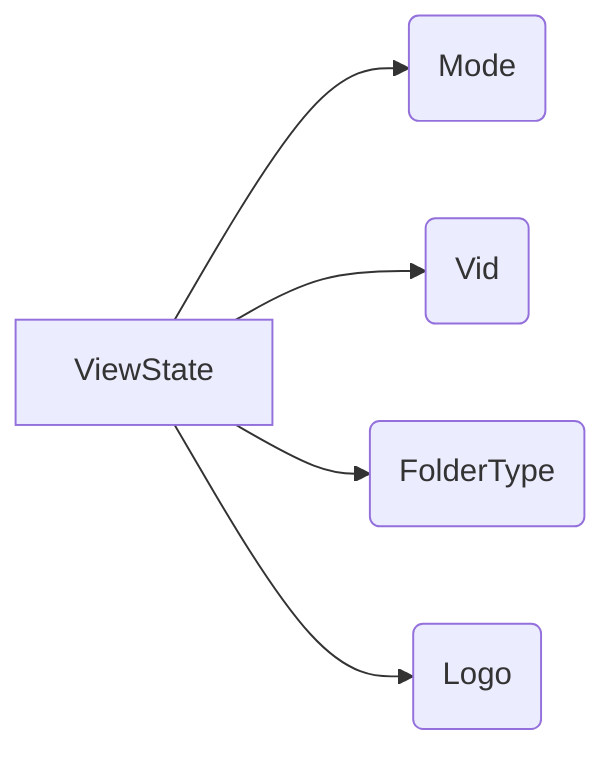

```MD
# Анализ кода

## <input code>

```
[ViewState]
Mode=
Vid=
FolderType=Generic
Logo=E:\\Users\\user\\images\\LOGOS\\R.png
```

## <algorithm>

Данный код представляет собой набор пар "ключ-значение", записанных в формате Windows Desktop INI файла.  Он не содержит алгоритмов в традиционном понимании.  Это скорее конфигурационный файл, описывающий определенные параметры.  Невозможно построить блок-схему, описывающую "алгоритм", так как нет вычислений или циклов.


## <mermaid>



## <explanation>

**Описание:**

Файл `desktop.ini` — это системный файл Windows, используемый для хранения информации о папке, например, для отображения иконки или других пользовательских настроек.

**Импорты:**

Нет импортов. Код представляет собой непосредственно данные конфигурации в формате INI.

**Классы:**

Нет классов.  Здесь нет структуры данных с методами.

**Функции:**

Нет функций.


**Переменные:**

"Mode", "Vid", "FolderType" и "Logo" – это имена переменных, в которых хранятся значения. Их типы зависят от типов значений, присвоенных этим переменным (в данном случае, строки).

**Возможные ошибки или улучшения:**

* **Недостаток структурированности:**  Если бы таких файлов было много, или свойства имели сложную структуру, то использование парсинг-библиотеки и класса для хранения и манипуляции настройками было бы более целесообразным.


**Взаимосвязи с другими частями проекта:**

Данный файл `desktop.ini` скорее всего используется для настройки визуального представления папки. Файл хранит конфигурацию, вероятно, для программы (или модуля)  в `src` , которая отвечает за отображение папок.  Без контекста кода, который использует этот файл, сложно точно указать взаимосвязи.  Например, в `src/suppliers/aliexpress` может быть код, который считывает этот файл, чтобы настроить визуальное отображение папки, отображаемой приложением.   Понимание логики приложения необходимо, чтобы более точно описать зависимость.