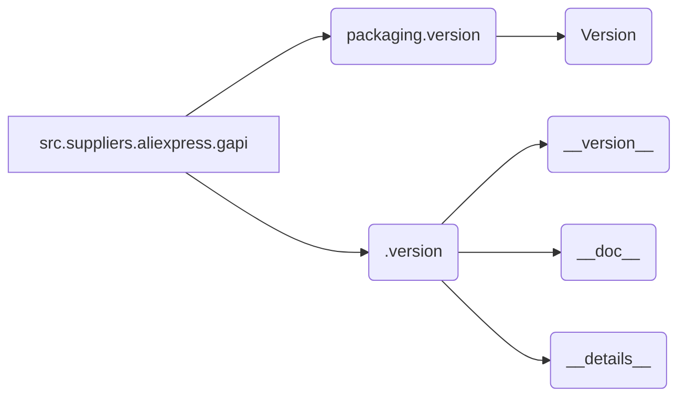

## <input code>

```python
## \file hypotez/src/suppliers/aliexpress/gapi/__init__.py
# -*- coding: utf-8 -*-\
#! venv/Scripts/python.exe
#! venv/bin/python/python3.12

"""
.. module: src.suppliers.aliexpress.gapi 
	:platform: Windows, Unix
	:synopsis:

"""
MODE = 'dev'

from packaging.version import Version
from .version import __version__, __doc__, __details__ 
```

## <algorithm>

Этот код представляет собой инициализацию модуля `src.suppliers.aliexpress.gapi`.  Алгортим работы состоит из импорта необходимых модулей.

**Шаг 1**: Импортируется модуль `Version` из библиотеки `packaging`.

**Шаг 2**: Импортируются переменные `__version__`, `__doc__`, `__details__` из подмодуля `.version` внутри `gapi`.


**Пример**:

В случае вызова кода из другого модуля, который импортирует `src.suppliers.aliexpress.gapi`, он получит доступ к переменным `__version__`, `__doc__`, `__details__`.


## <mermaid>



## <explanation>

**Импорты:**

- `from packaging.version import Version`: Импортирует класс `Version` из модуля `packaging.version`. Это, вероятно, используется для обработки версий пакетов или библиотек, необходимых для сравнения или проверки версий программного обеспечения.  Этот импорт связан с `src` через общий модульный путь.

- `from .version import __version__, __doc__, __details__`: Импортирует переменные `__version__`, `__doc__`, `__details__` из модуля `version.py` внутри текущего директории `gapi`.  Это позволяет использовать метаданные о модуле, например, версию, документацию и дополнительные сведения.  Связь между `__init__.py` и `version.py` – это внутренняя структура проекта.

**Классы:**

Код не содержит определений классов.  Он предоставляет только импорты и константу `MODE`.

**Функции:**

Код не содержит определений функций.

**Переменные:**

- `MODE = 'dev'`: Переменная, содержащая строку 'dev', скорее всего, используется для указания режима работы (например, режим разработки). Эта переменная является константой и не изменяется в рамках этого файла.

**Возможные ошибки или области для улучшений:**

- **Отсутствие явного использования переменных:** Переменные `__version__`, `__doc__`, `__details__` импортированы, но не использованы в текущем `__init__.py`.  Это могло бы быть полезно в дальнейшем, например, для отображения информации о модуле.

- **Неявная зависимость:** Без контекста кода, который использует `src.suppliers.aliexpress.gapi`, невозможно определить, зачем он необходим. Возможно, этот файл служит инициализатором для дальнейшей функциональности, связанной с взаимодействием с AliExpress.

**Цепочка взаимосвязей:**

Этот `__init__.py` файл, скорее всего, является частью более крупного проекта, связанного с взаимодействием с AliExpress API (AliExpress GAPI).  `version.py` внутри папки `gapi` содержит метаданные о модуле. Вероятно, существуют и другие модули, которые будут использовать функции и данные, предоставляемые этим модулем `gapi`.  Они будут импортировать необходимые элементы из `__init__.py` или связанных модулей.