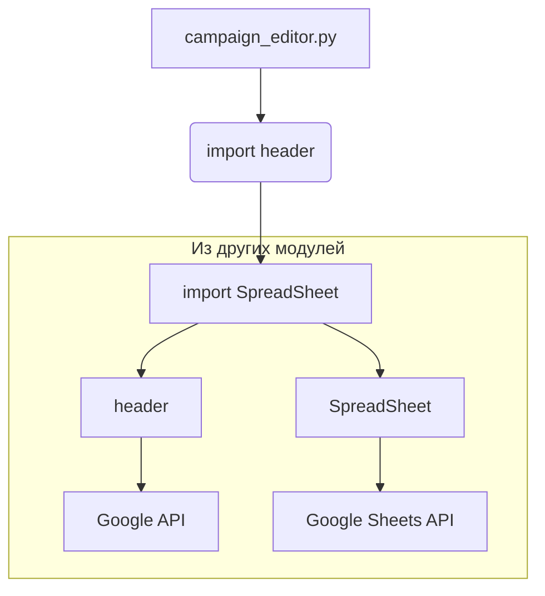

# <input code>

```python
## \file hypotez/src/suppliers/aliexpress/gapi/campaign_editor.py
# -*- coding: utf-8 -*-\
#! venv/Scripts/python.exe
#! venv/bin/python/python3.12

"""
.. module: src.suppliers.aliexpress.gapi 
	:platform: Windows, Unix
	:synopsis:

"""
MODE = 'dev'

"""
	:platform: Windows, Unix
	:synopsis:

"""


"""
	:platform: Windows, Unix
	:synopsis:

"""


"""
  :platform: Windows, Unix

"""
"""
  :platform: Windows, Unix
  :platform: Windows, Unix
  :synopsis:
"""MODE = 'dev'
  
""" module: src.suppliers.aliexpress.gapi """


""" Редактор рекламных кампаний, товаров, категорий через таблицы гугл """


import header
from src.google import SpreadSheet
```

# <algorithm>

Этот код представляет собой начало модуля Python, который, судя по комментариям, предназначен для редактирования рекламных кампаний, товаров и категорий через Google Таблицы. Алгоритм на этом этапе не определен, так как предоставленный фрагмент кода импортирует необходимые библиотеки и задает константу `MODE`.  

Никакого алгоритма работы, циклов или функций, пока нет.

Пример использования отсутствует.


# <mermaid>



**Объяснение диаграммы:**

* **campaign_editor.py:** Главный модуль, содержащий код.
* **import header:** Модуль `header` - это предположительно модуль, который выполняет общие задачи для проекта.  Пояснение необходимого модуля без его содержимого сложно.
* **import SpreadSheet:** Импортирует класс `SpreadSheet` из модуля `src.google`. Этот модуль, скорее всего, предоставляет методы для работы с Google Таблицами.
* **Google API:**  Это абстракция, обозначающая необходимые API Google (такие как Sheets API), необходимые для работы с Таблицами.
* **Google Sheets API:**  Это конкретный API, используемый для взаимодействия с Google Таблицами.

Взаимодействие происходит через импорты между файлами `campaign_editor.py`, `header`, и `SpreadSheet` из `src.google`.  Зависимости от внешних API (Google Sheets API) необходимы для работы с Таблицами.


# <explanation>

* **Импорты:**
    * `import header`: Этот импорт предполагает, что существует модуль `header`, который содержит общие функции или константы, используемые другими модулями проекта.  Без доступа к `header`  невозможно точно описать его роль.  Возможно, он содержит настройки, общие функции работы с файлами, логгирование, или другие утилиты.
    * `from src.google import SpreadSheet`: Импортирует класс `SpreadSheet` из модуля `src.google`.  Это указывает, что проект имеет иерархическую структуру и модуль `SpreadSheet` предоставляет интерфейс для взаимодействия с Google Таблицами.  Связь с другими модулями проекта очевидна.

* **Классы:**
    * `SpreadSheet`:  Этот класс (определённый в `src.google.SpreadSheet`) отвечает за взаимодействие с Google Таблицами.  Без определения класса невозможно точно сказать какие методы у него есть и как он используется.

* **Функции:**
    * Пока нет ни одной определённой функции.
* **Переменные:**
    * `MODE = 'dev'`: Строковая константа, вероятно, используемая для обозначения режима работы (например, разработки или производства).

* **Возможные ошибки и улучшения:**
    * Код слишком фрагментарный и не содержит реализации какой-либо логики.  Необходимо больше кода, чтобы определить, как происходит редактирование.
    * Не определены имена классов или функций `SpreadSheet`, что затрудняет понимание.
    * Комментарии не очень информативные; нужно больше деталей о том, *как* этот код будет использован в проекте.
    *  Нет указания на то, какова стратегия обработки ошибок (например, при проблемах с соединением с Google Таблицами).


**Цепочка взаимосвязей:**

Код `campaign_editor.py` зависит от модуля `header` и класса `SpreadSheet`, которые, в свою очередь, вероятно, зависят от библиотек Google API (например, для работы с Google Sheets). Это типичная иерархическая структура проекта, где отдельные модули выполняют специализированные задачи, общаясь друг с другом через импорты.