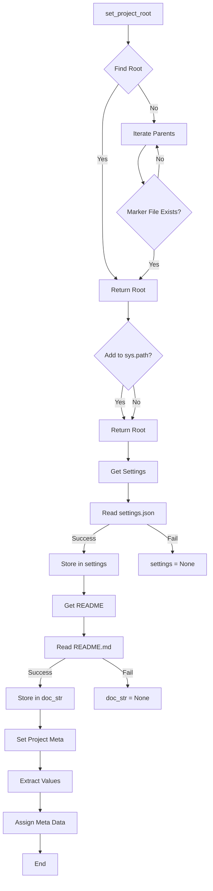

# <input code>

```python
## \file hypotez/src/suppliers/aliexpress/gapi/header.py
# -*- coding: utf-8 -*-\
#! venv/Scripts/python.exe
#! venv/bin/python/python3.12

"""
module: src.suppliers.aliexpress.gapi 
	:platform: Windows, Unix
	:synopsis: Модуль определяющий корневой путь к проекту. Все импорты строятся относительно этого пути.
    :TODO: В дальнейшем перенести в системную переменную"""
MODE = 'dev'

import sys
import json
from packaging.version import Version

from pathlib import Path
def set_project_root(marker_files=('pyproject.toml', 'requirements.txt', '.git')) -> Path:
    """!
    Finds the root directory of the project starting from the current file's directory,
    searching upwards and stopping at the first directory containing any of the marker files.

    Args:
        marker_files (tuple): Filenames or directory names to identify the project root.
    
    Returns:
        Path: Path to the root directory if found, otherwise the directory where the script is located.
    """
    __root__:Path
    current_path:Path = Path(__file__).resolve().parent
    __root__ = current_path
    for parent in [current_path] + list(current_path.parents):
        if any((parent / marker).exists() for marker in marker_files):
            __root__ = parent
            break
    if __root__ not in sys.path:
        sys.path.insert(0, str(__root__))
    return __root__


# Get the root directory of the project
__root__ = set_project_root()
"""__root__ (Path): Path to the root directory of the project"""

from src import gs

settings:dict = None
try:
    with open(gs.path.root / 'src' /  'settings.json', 'r') as settings_file:
        settings = json.load(settings_file)
except (FileNotFoundError, json.JSONDecodeError):
    ...

doc_str:str = None
try:
    with open(gs.path.root / 'src' /  'README.MD', 'r') as settings_file:
        doc_str = settings_file.read()
except (FileNotFoundError, json.JSONDecodeError):
    ...


__project_name__ = settings.get("project_name", 'hypotez') if settings  else 'hypotez'
__version__: str = settings.get("version", '')  if settings  else ''
__doc__: str = doc_str if doc_str else ''
__details__: str = ''
__author__: str = settings.get("author", '')  if settings  else ''
__copyright__: str = settings.get("copyrihgnt", '')  if settings  else ''
__cofee__: str = settings.get("cofee", "Treat the developer to a cup of coffee for boosting enthusiasm in development: https://boosty.to/hypo69")  if settings  else "Treat the developer to a cup of coffee for boosting enthusiasm in development: https://boosty.to/hypo69"
```

# <algorithm>

**Шаг 1:** Функция `set_project_root`.
   - Принимает кортеж `marker_files` с именами файлов или папок, по которым определяется корень проекта.
   - Начинает поиск с текущей директории файла.
   - Проверяет каждый родительский каталог, начиная с текущей директории.
   - Если в родительском каталоге есть любой из файлов или папок из `marker_files`, то функция возвращает путь к этому родительскому каталогу.
   - Если ни в одном из родительских каталогов не найдены указанные файлы/папки, возвращает путь к текущей директории.
   - Если корневой каталог не в `sys.path`, добавляет его в начало `sys.path`.
   - Пример: Если в папке `hypotez/src/suppliers/aliexpress/gapi` находится файл `header.py`, а корень проекта находится в `hypotez`, функция `set_project_root` вернет путь к папке `hypotez`.

**Шаг 2:** Получение корневого каталога.
   - Вызывается `set_project_root()`, для получения пути к корню проекта.
   - Результат присваивается переменной `__root__`.

**Шаг 3:** Чтение настроек.
   - Используется модуль `gs` для получения пути к файлу `settings.json`.
   - Попытка открыть файл `settings.json` в режиме чтения.
   - Если файл существует и корректен, загружает данные из файла в словарь `settings`.
   - Обрабатывает ошибки `FileNotFoundError` и `json.JSONDecodeError`, если файл не найден или некорректен.

**Шаг 4:** Чтение документации.
   - Аналогично предыдущему шагу, но считывает содержимое файла `README.MD` в переменную `doc_str`.

**Шаг 5:**  Получение и присвоение метаданных.
   - Используя `settings.get()`, извлекаются значения из словаря `settings` для различных метаданных (название проекта, версия, автор и т. д.).
   - Значения по умолчанию используются, если соответствующие ключи отсутствуют в `settings`.
   - В случае ошибок, значения устанавливаются по умолчанию.


# <mermaid>



# <explanation>

**Импорты:**

- `sys`: Для работы со стандартным вводом/выводом и переменными среды, в частности, для добавления путей в `sys.path`.
- `json`: Для работы с JSON-файлами.
- `packaging.version`: Для работы с версиями пакетов.
- `pathlib`: Для работы с путями файлов и каталогов, что обеспечивает платформонезависимую работу с файловой системой.  
- `src.gs`:  Влияние этого модуля на `header.py` подразумевает, что `gs` содержит какие-то методы или классы, необходимые для получения корневого пути проекта. Неясно, что представляет собой `gs.path.root`. Для полноценного анализа требуется код модуля `gs`.


**Классы:**

- Нет явных определений классов.


**Функции:**

- `set_project_root(marker_files=...)`: Ищет корневой каталог проекта.
    - `marker_files`: Кортеж, содержащий имена файлов/папок, которые должны присутствовать в корне проекта для его идентификации.
    - Возвращает `Path` объект, представляющий корневую директорию проекта.


**Переменные:**

- `MODE`: Строковая переменная, хранит режим работы (например, `dev` или `prod`).
- `__root__`: `Path` объект, содержащий путь к корневому каталогу проекта.
- `settings`: Словарь, содержащий настройки проекта (если успешно загружен).
- `doc_str`: Строка, содержащая содержимое `README.md` (если успешно загружен).
- `__project_name__`, `__version__`, `__doc__`, `__details__`, `__author__`, `__copyright__`, `__cofee__`:  Переменные, хранят метаданные проекта, полученные из `settings` с обработкой отсутствующих значений.


**Возможные ошибки и улучшения:**

- **Обработка ошибок:** Хороший пример обработки `FileNotFoundError` и `json.JSONDecodeError` для повышения надежности работы модуля.
- **Документация:** В строках документации (`"""..."""`) можно добавить больше деталей о предназначении каждой функции и аргументов.
- **Модуль `gs`:** Необходимо предоставить код модуля `gs` для полного понимания работы `header.py`.
- **`sys.path`:** Использование `sys.path` для добавления корневого пути — неплохая практика. Однако, в некоторых ситуациях, более предпочтительным может быть работа с `PYTHONPATH` или другое решение, обеспечивающее более гибкое управление путями.

**Взаимосвязи с другими частями проекта:**

- `gs`: Явно используется для получения корневого пути проекта, а, следовательно, является обязательным элементом инфраструктуры проекта.
- `settings.json`: Файл настроек проекта, который читается модулем.
- `README.MD`: Файл документации, чтение которого происходит в данном модуле.


В целом, код хорошо структурирован и понятен. Используется полезный шаблон для нахождения корневого каталога проекта. Однако, для более глубокого анализа требуется код других модулей (например, `gs`).