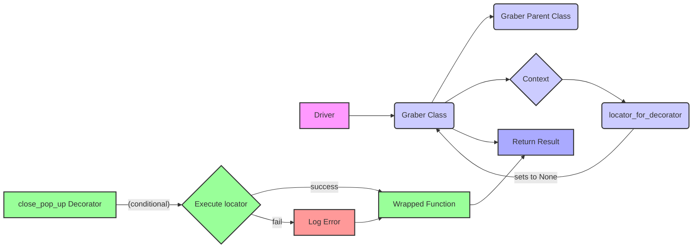

## <алгоритм>

**1. Инициализация класса `Graber`:**

   - При создании экземпляра класса `Graber` вызывается конструктор `__init__`, принимающий объект `Driver` в качестве аргумента.
   - В конструкторе устанавливается префикс поставщика `supplier_prefix` равным "aliexpress".
   - Затем вызывается конструктор родительского класса `Graber` (из `src.suppliers.graber`) с передачей префикса и экземпляра драйвера.
   - Устанавливается `Context.locator_for_decorator` в `None`.

**Пример:**
```python
driver_instance = Driver()  # Предположим, что Driver инициализирован
graber_instance = Graber(driver=driver_instance)
```

**2.  (Неактивный) Декоратор `close_pop_up` (закомментирован):**

   - Функция `close_pop_up` создает декоратор, который предназначен для закрытия всплывающих окон.
   - Декоратор `decorator` оборачивает функцию `func`.
   - Внутри `wrapper` проверяется, установлен ли локатор для закрытия всплывающего окна в `Context.locator_for_decorator` и имеет ли он атрибут `close_pop_up`.
   - Если локатор установлен и атрибут присутствует, то выполняется локатор с помощью `Context.driver.execute_locator`.
   - В случае ошибки выполнения локатора, она логируется.
   - После (потенциального) закрытия окна, выполняется основная функция `func`.

**Пример (если бы декоратор был активен):**
   Предположим, есть функция `get_product_data`, которую нужно обернуть декоратором:
   ```python
    #@close_pop_up()
    async def get_product_data():
       # logic to get product data
       ...
   ```
   Тогда, перед выполнением `get_product_data`, выполнился бы код декоратора `close_pop_up`.

**3. Наследование от `src.suppliers.graber.Graber`:**

   - Класс `Graber` наследует функциональность от класса `Graber` из модуля `src.suppliers.graber`.
   - Это позволяет переиспользовать и расширять методы родительского класса.

**4. Использование `Context.locator_for_decorator`:**

   - Значение `Context.locator_for_decorator` устанавливается в `None` в конструкторе.
   - Если бы декоратор `close_pop_up` был активен, то при наличии значения в `Context.locator_for_decorator` и атрибута `close_pop_up`, он бы выполнялся перед основной функцией.
   - Механизм `Context` служит для передачи контекстных данных между различными частями системы.

**5.  Обработка данных (не показана в коде):**

   - Класс `Graber` (хотя методы обработки и не показаны в этом коде) предполагает сбор и обработку данных о товарах с AliExpress.
   - Он предназначен для того, чтобы его методы могли быть переопределены для нестандартной обработки полей товара.

## <mermaid>


**Объяснение зависимостей `mermaid`:**

1.  **`A[Driver]`**: Представляет класс `Driver` из `src.webdriver.driver`, который отвечает за управление веб-драйвером (например, Chrome). Это основной инструмент для взаимодействия с веб-страницами.
2.  **`B(Graber Class)`**: Это класс `Graber` из текущего файла `graber.py`, который наследует от родительского класса `Graber` из `src.suppliers.graber`. Он отвечает за сбор данных с AliExpress.
3. **`C(Graber Parent Class)`**: Это родительский класс `Graber` из `src.suppliers.graber`, который предоставляет базовую функциональность для сборщиков данных.
4.  **`D{Context}`**: Это контекстный объект `Context`, который используется для хранения и передачи данных между различными частями приложения (например, локаторы).
5.  **`E(locator_for_decorator)`**: Это атрибут `locator_for_decorator` в объекте `Context`, который используется для хранения локатора для выполнения декоратором `close_pop_up`. В `__init__` устанавливается в `None`.
6.  **`F[close_pop_up Decorator]`**: Представляет декоратор `close_pop_up`, который является опциональным и в текущем коде закомментирован. Его назначение - закрывать всплывающие окна.
7.  **`G{Execute locator}`**:  Представляет операцию выполнения локатора для закрытия всплывающего окна, если декоратор активен и локатор установлен.
8.  **`H[Wrapped Function]`**: Представляет основную функцию, которая обернута декоратором `close_pop_up`, если он используется.
9.  **`I[Log Error]`**: Представляет операцию логирования ошибки, если выполнение локатора внутри декоратора завершилось с ошибкой.
10. **`J[Return Result]`**: Представляет возврат результата работы функции `Graber`.

**Связи:**

-   `Driver` используется для создания экземпляра класса `Graber`.
-   `Graber Class` наследует от `Graber Parent Class`, расширяя его функциональность.
-   `Graber Class` устанавливает `locator_for_decorator` в `Context`.
-   `close_pop_up Decorator`, если активен, может изменять поток выполнения основной функции через `Execute locator`.
-  `Execute locator` может привести к ошибке, которая будет залогирована, или к выполнению `Wrapped Function`.
-  `Wrapped Function` возвращает результат, который также будет возвращен `Graber Class`.

## <объяснение>

**Импорты:**

-   `typing.Any`, `typing.Callable`: Используются для аннотаций типов, позволяя делать код более читаемым и понятным. `Any` указывает, что переменная может быть любого типа, `Callable` - что переменная является функцией.
-   `functools.wraps`: Декоратор, сохраняющий метаданные оборачиваемой функции при использовании декораторов.
-   `src.suppliers.graber.Graber as Grbr`, `src.suppliers.graber.Context`, `src.suppliers.graber.close_pop_up`: Импортирует родительский класс `Graber`, класс контекста и функцию закрытия попапа из модуля `src.suppliers.graber`. Используется для наследования и работы с контекстом приложения.
-   `src.webdriver.driver.Driver`: Класс для управления веб-драйвером (например, Chrome).
-   `src.logger.logger.logger`: Логгер для записи сообщений (ошибок, предупреждений и т.д.) в процессе работы программы.
-   `src.logger.exceptions.ExecuteLocatorException`: Исключение, которое обрабатывается при неудачном выполнении локатора.

**Классы:**

-   `Graber(Grbr)`:
    -   **Роль:** Класс, отвечающий за сбор данных с сайта AliExpress. Наследуется от `src.suppliers.graber.Graber`, получая базовую функциональность.
    -   **Атрибуты:**
        -   `supplier_prefix: str`: Префикс поставщика, всегда равен `aliexpress` в данном классе.
    -   **Методы:**
        -   `__init__(self, driver: Driver)`: Конструктор класса, инициализирует `supplier_prefix`, вызывает конструктор родительского класса и устанавливает `Context.locator_for_decorator` в `None`.
    -   **Взаимодействие:**
        -   Использует `Driver` для взаимодействия с браузером.
        -   Наследует от класса `src.suppliers.graber.Graber`, что позволяет переиспользовать его методы.
        -   Использует `Context` для управления контекстом выполнения.

**Функции:**

-   `(Неактивная) close_pop_up(value: Any = None) -> Callable`:
    -   **Аргументы:**
        -   `value: Any`: Необязательный параметр, который может быть передан в декоратор.
    -   **Возвращает:**
        -   `Callable`: Декоратор, который можно применить к функции.
    -   **Назначение:**
        -   Создает декоратор для закрытия всплывающих окон перед выполнением основной логики функции.
        -   Использует `Context.locator_for_decorator` и `Context.driver.execute_locator` для выполнения локатора.
    -  **Примеры:**
        ```python
        #@close_pop_up()
        #async def get_product_data():
        #    # код функции...
        ```
    - **Примечание**: В текущей версии кода данная функция не активна (закомментирована).

**Переменные:**

-   ``: Переменная для хранения режима работы. В данном случае указывает на режим разработки.

**Потенциальные ошибки и области для улучшения:**

-   Декоратор `close_pop_up` сейчас закомментирован, что делает невозможным его использование, даже если будет установлен `Context.locator_for_decorator`.
-   В текущем коде не реализована логика сбора данных. Нужно добавить методы для получения данных со страниц AliExpress.
-   Нет обработки различных ошибок, которые могут возникнуть при работе с веб-драйвером (например, не найден элемент, сетевые ошибки).
-   Механизм `Context` должен быть более детально проработан, чтобы обеспечить гибкое управление контекстом.

**Взаимосвязь с другими частями проекта:**

-   Использует `src.suppliers.graber` как базовый класс, реализуя специфичную логику для AliExpress.
-   Использует `src.webdriver.driver` для взаимодействия с браузером, что позволяет автоматизировать сбор данных.
-   Использует `src.logger` для логирования событий и ошибок.
-   Взаимодействует с модулем `src.utils.jjson` (закомментирован), что говорит о потенциальном использовании для обработки JSON данных.

**Цепочка взаимосвязей:**

1.  `Driver` (из `src.webdriver.driver`) управляет браузером.
2.  `Graber` (из текущего модуля) использует `Driver` для взаимодействия с веб-страницами.
3.  `Graber` наследует функциональность от `Graber` (из `src.suppliers.graber`), добавляя специфичную логику для AliExpress.
4.  `Context` (из `src.suppliers.graber`) используется для управления контекстом выполнения.
5.  Логгер (из `src.logger.logger`) используется для записи сообщений.

Этот анализ предоставляет подробное понимание функциональности кода, его структуры, зависимостей и потенциальных областей для улучшения.