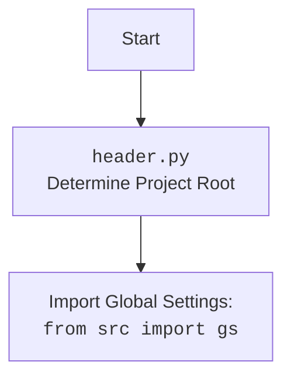

## ИНСТРУКЦИЯ:

Анализируй предоставленный код подробно и объясни его функциональность. Ответ должен включать три раздела:  

1. **<алгоритм>**: Опиши рабочий процесс в виде пошаговой блок-схемы, включая примеры для каждого логического блока, и проиллюстрируй поток данных между функциями, классами или методами.  
2. **<mermaid>**: Напиши код для диаграммы в формате `mermaid`, проанализируй и объясни все зависимости, 
    которые импортируются при создании диаграммы. 
    **ВАЖНО!** Убедитесь, что все имена переменных, используемые в диаграмме `mermaid`, 
    имеют осмысленные и описательные имена. Имена переменных вроде `A`, `B`, `C`, и т.д., не допускаются!  
    
    **Дополнительно**: Если в коде есть импорт `import header`, добавьте блок `mermaid` flowchart, объясняющий `header.py`:\
    ```mermaid
    flowchart TD
        Start --> Header[<code>header.py</code><br> Determine Project Root]
    
        Header --> import[Import Global Settings: <br><code>from src import gs</code>] 
    ```

3. **<объяснение>**: Предоставьте подробные объяснения:  
   - **Импорты**: Их назначение и взаимосвязь с другими пакетами `src.`.  
   - **Классы**: Их роль, атрибуты, методы и взаимодействие с другими компонентами проекта.  
   - **Функции**: Их аргументы, возвращаемые значения, назначение и примеры.  
   - **Переменные**: Их типы и использование.  
   - Выделите потенциальные ошибки или области для улучшения.  

Дополнительно, постройте цепочку взаимосвязей с другими частями проекта (если применимо).  

Это обеспечивает всесторонний и структурированный анализ кода.
## Формат ответа: `.md` (markdown)
**КОНЕЦ ИНСТРУКЦИИ**

## <алгоритм>

**Общая схема работы `graber.py`:**

1.  **Инициализация**:
    *   Создается экземпляр класса `Graber`, который принимает объект `Driver` в качестве аргумента.
    *   Устанавливается префикс поставщика `supplier_prefix` как `'aliexpress'`.
    *   Вызывается конструктор родительского класса `Grbr` (из `src.suppliers.graber`) для инициализации базовых свойств грабера.
    *   Устанавливается `Context.locator_for_decorator` в `None`, что отключает использование декоратора по умолчанию, который используется для закрытия всплывающих окон (если будет установлено значение, то оно выполнится в декораторе `@close_pop_up`).
2.  **Работа с декоратором (опционально)**:
    *   Если `Context.locator_for_decorator` установлено значение, то перед выполнением основной функции для захвата данных, будет выполнятся декоратор `@close_pop_up`.
    *  Декоратор `@close_pop_up` проверяет наличие локатора для закрытия всплывающего окна (`Context.locator_for_decorator.close_pop_up`).
    *   Если локатор есть, выполняется `Context.driver.execute_locator`, который взаимодействует с веб-драйвером для закрытия всплывающего окна.
    *   Логируется ошибка, если локатор не может быть выполнен (`ExecuteLocatorException`).
3.  **Сбор данных (основная логика, не показана в этом коде)**:
    *   Методы для сбора данных о товарах (не показаны в данном коде) могут использовать `self.driver` для взаимодействия с браузером и извлечения нужной информации.
    *   Методы для обработки полей товара (не показаны в данном коде) могут быть переопределены в классе `Graber` для специфичной логики.
4.  **Завершение**:
    *   После сбора данных экземпляр `Graber` может быть использован для других задач.

**Пример использования:**

```python
from src.webdriver.driver import Driver  # Предположим, что Driver импортирован корректно
from src.suppliers.aliexpress.graber import Graber
# Инициализация веб-драйвера
driver_instance = Driver()
# Создание экземпляра грабера
aliexpress_graber = Graber(driver=driver_instance)
# Получение данных о товаре (пример, метод не показан в коде)
# product_data = await aliexpress_graber.get_product_data()
# print(product_data)
```

**Поток данных:**

1.  `Driver` -> `Graber.__init__` (экземпляр драйвера передается в грабер).
2.  `Graber.__init__` -> `Grbr.__init__` (вызов конструктора родительского класса).
3.  `Context` -> `Context.locator_for_decorator` (установка локатора для декоратора).
4.  Если `Context.locator_for_decorator` установлен, то `Context.driver`  -> `close_pop_up` декоратору (выполнение локатора для закрытия попапа).
5. `Graber` instance-> методы сбора данных (вызов методов для сбора данных о товаре).

## <mermaid>

```mermaid
flowchart TD
    Start[Start] --> InitGraber[Инициализация Graber: <br><code>Graber(driver)</code>]
    InitGraber --> SetSupplierPrefix[Установка префикса поставщика: <br><code>self.supplier_prefix = 'aliexpress'</code>]
    SetSupplierPrefix --> InitParent[Инициализация родительского класса: <br><code>super().__init__(supplier_prefix, driver)</code>]
    InitParent --> SetLocatorNone[Установка locator_for_decorator в None: <br><code>Context.locator_for_decorator = None</code>]
    SetLocatorNone --> OptionalDecoratorCheck[Проверка наличия locator_for_decorator]
    OptionalDecoratorCheck -- Да, locator установлен -->  DecoratorExecution[Выполнение декоратора close_pop_up]
    OptionalDecoratorCheck -- Нет, locator не установлен --> ContinueGrabbing[Продолжить сбор данных (методы сбора)]
    DecoratorExecution --> ExecuteLocator[Выполнение локатора: <br><code>driver.execute_locator(locator_for_decorator.close_pop_up)</code>]
    ExecuteLocator --> ExceptionCheck[Проверка исключения ExecuteLocatorException]
    ExceptionCheck -- Да, ошибка --> LogError[Логирование ошибки]
     ExceptionCheck -- Нет, ошибки нет --> ContinueGrabbing
    LogError --> ContinueGrabbing
    ContinueGrabbing --> End[Конец]


    classDef classGreen fill:#90EE90,stroke:#333,stroke-width:2px
    class Start,End, InitGraber, SetSupplierPrefix,InitParent, SetLocatorNone, OptionalDecoratorCheck, ContinueGrabbing, DecoratorExecution,ExecuteLocator, ExceptionCheck, LogError  classGreen
```



**Анализ зависимостей `mermaid`:**

*   **`Start`**: Начало процесса инициализации грабера.
*   **`InitGraber`**: Инициализация класса `Graber` с передачей экземпляра `Driver`.
*   **`SetSupplierPrefix`**: Присвоение атрибуту `supplier_prefix` значения `'aliexpress'`.
*    **`InitParent`**:  Инициализация родительского класса `Grbr`.
*   **`SetLocatorNone`**: Установка `Context.locator_for_decorator` в `None`, что отключает выполнение декоратора по умолчанию.
*   **`OptionalDecoratorCheck`**: Проверка, установлено ли значение для  `Context.locator_for_decorator`.
*   **`DecoratorExecution`**: Выполняется декоратор `@close_pop_up`, если `Context.locator_for_decorator` имеет значение.
*   **`ExecuteLocator`**:  Выполнение локатора `driver.execute_locator` для взаимодействия с веб-драйвером.
*   **`ExceptionCheck`**: Проверка на наличие исключения `ExecuteLocatorException`.
*   **`LogError`**: Логирование ошибки, если она возникла при выполнении локатора.
*   **`ContinueGrabbing`**: Продолжение выполнения основной логики для сбора данных, если нет ошибок.
*   **`End`**: Завершение процесса.

**Зависимости (импорты):**

1.  `from typing import Any, Callable`: Импортирует типы `Any` и `Callable` для аннотации типов.
2.  `from functools import wraps`: Импортирует декоратор `wraps` для сохранения метаданных декорируемой функции.
3.  `from src.suppliers.graber import Graber as Grbr, Context, close_pop_up`:
    *   `Graber as Grbr`: Импортирует базовый класс `Graber` из модуля `src.suppliers.graber` и переименовывает его в `Grbr`.
    *   `Context`: Импортирует класс `Context` из модуля `src.suppliers.graber`, вероятно, для хранения контекста выполнения.
    *   `close_pop_up`: Импортирует функцию `close_pop_up` из модуля `src.suppliers.graber`, которая используется как декоратор.
4.  `from src.webdriver.driver import Driver`: Импортирует класс `Driver` из модуля `src.webdriver.driver` для управления веб-драйвером.
5.  `from src.logger.logger import logger`: Импортирует объект `logger` для логирования событий.
6.  `from src.logger.exceptions import ExecuteLocatorException`: Импортирует исключение `ExecuteLocatorException` для обработки ошибок при выполнении локаторов.

## <объяснение>

**Импорты:**

*   `typing.Any` и `typing.Callable`: Используются для статической типизации, помогая сделать код более читаемым и менее подверженным ошибкам. `Any` означает, что переменная может быть любого типа, а `Callable` — что переменная является вызываемой функцией.
*   `functools.wraps`: Декоратор, который сохраняет метаданные оборачиваемой функции (например, `__name__`, `__doc__`), что полезно при использовании декораторов, так как без него метаданные оборачиваемой функции будут заменены метаданными декоратора.
*   `src.suppliers.graber.Graber as Grbr`: Импортируется базовый класс `Graber` из модуля `src.suppliers.graber` и переименовывается в `Grbr`. Это позволяет избежать конфликта имен, так как в текущем файле также есть класс `Graber`. Этот класс предоставляет базовую функциональность для граберов, которую наследует класс `Graber` в текущем файле.
*   `src.suppliers.graber.Context`: Импортируется класс `Context` из модуля `src.suppliers.graber`, который, вероятно, используется для хранения глобального контекста (например, драйвера, локаторов) для текущей операции грабинга.
*   `src.suppliers.graber.close_pop_up`: Импортируется функция, которая используется для закрытия всплывающих окон. Этот функционал вынесен в отдельную функцию, скорее всего, для переиспользования и унификации кода.
*   `src.webdriver.driver.Driver`: Импортируется класс `Driver`, который предоставляет абстракцию над веб-драйвером (например, Selenium), позволяя взаимодействовать с браузером для сбора данных.
*   `src.logger.logger.logger`: Импортируется объект `logger` для логирования ошибок и других важных событий. `src.logger.logger` это модуль для логирования, это позволяет записывать в логи все важные события для дебага и мониторинга.
*   `src.logger.exceptions.ExecuteLocatorException`: Импортируется исключение `ExecuteLocatorException`, которое используется для обработки ошибок при выполнении локаторов.

**Классы:**

*   **`Graber(Grbr)`:**
    *   **Роль:** Класс для сбора данных с AliExpress, наследуется от базового класса `Graber` (`Grbr`). Предоставляет методы для специфической обработки полей товара на AliExpress.
    *   **Атрибуты:**
        *   `supplier_prefix (str)`: Префикс поставщика, устанавливается как `'aliexpress'`.
    *   **Методы:**
        *   `__init__(self, driver: Driver)`: Конструктор класса, принимает экземпляр `Driver` и инициализирует атрибуты `supplier_prefix` и вызывает конструктор родительского класса `Grbr`. Также устанавливает `Context.locator_for_decorator` в `None`, отключая декоратор для закрытия всплывающих окон по умолчанию.

**Функции:**

*   **`close_pop_up(value: Any = None)` (закомментирована):**
    *   **Аргументы:**
        *   `value (Any, optional)`: Дополнительное значение, которое может быть передано в декоратор.
    *   **Возвращаемое значение:**
        *   `Callable`: Возвращает декоратор, который оборачивает функцию.
    *   **Назначение:** Создает декоратор для закрытия всплывающих окон перед выполнением основной логики функции.
    *   **Пример:** Предположим, что `Context.locator_for_decorator.close_pop_up` содержит локатор для закрытия всплывающего окна. Тогда, когда функция, обернутая этим декоратором, будет вызвана, сначала будет выполнено закрытие всплывающего окна (если локатор установлен и выполняется без ошибок), а затем будет выполнена основная логика.
*   **`wrapper(*args, **kwargs)`** (внутри декоратора `close_pop_up`):
    *   **Аргументы:**
        *   `*args`: Позиционные аргументы, переданные в оборачиваемую функцию.
        *   `**kwargs`: Именованные аргументы, переданные в оборачиваемую функцию.
    *   **Возвращаемое значение:**
        *   `Any`: Результат выполнения обернутой функции.
    *   **Назначение:** Вспомогательная функция, обертывающая основную функцию для выполнения операций перед и после вызова функции.

**Переменные:**

*   `supplier_prefix (str)`:  Атрибут класса `Graber`, хранящий префикс поставщика `'aliexpress'`.
*   `Context.locator_for_decorator`: Переменная в классе `Context`, которая используется для хранения локатора для закрытия всплывающих окон. Если она установлена, то при вызове любой функции, обернутой декоратором `close_pop_up` будет вызван метод `execute_locator` для взаимодействия с браузером. Если значение `None`, то декоратор выполнятся не будет.

**Потенциальные ошибки и области для улучшения:**

*   **Обработка ошибок:**  В декораторе `@close_pop_up` есть блок `try-except` для обработки `ExecuteLocatorException`, но другие потенциальные ошибки не обрабатываются.  Следует добавить обработку других исключений для повышения надежности.
*   **Гибкость декоратора:** Декоратор `@close_pop_up`  зависит от `Context.locator_for_decorator`.  Можно сделать его более гибким, передавая локатор в качестве аргумента декоратора, или использовать множественные декораторы для разных задач.
*   **Отсутствие методов для сбора данных:**  Класс `Graber` является лишь заготовкой, не содержит методов для сбора и обработки данных.  Нужно добавить методы для взаимодействия с веб-драйвером и извлечения данных о товарах с AliExpress.
*  **Закомментированный код:** Декоратор `@close_pop_up` закомментирован, но код внутри него  потенциально рабочий.  Стоит либо убрать его, либо использовать (разкомментировать) по необходимости.
*  **Асинхронность:** Код использует `async` функции внутри декоратора, но неясно, используются ли асинхронные операции в других частях кода. Нужно проверить, используется ли асинхронность в других модулях, чтобы не было блокировки event loop.

**Взаимосвязи с другими частями проекта:**

*   **`src.suppliers.graber`**:  Модуль, предоставляющий базовый класс `Graber` и контекст `Context`, а также  декоратор `close_pop_up`.
*   **`src.webdriver.driver`**:  Модуль, предоставляющий класс `Driver` для управления веб-драйвером.
*   **`src.logger.logger`**:  Модуль для логирования ошибок и других событий.
*   **`src.logger.exceptions`**:  Модуль, предоставляющий пользовательские исключения, например, `ExecuteLocatorException`.

Этот код является частью более крупного проекта, вероятно, системы для сбора данных.