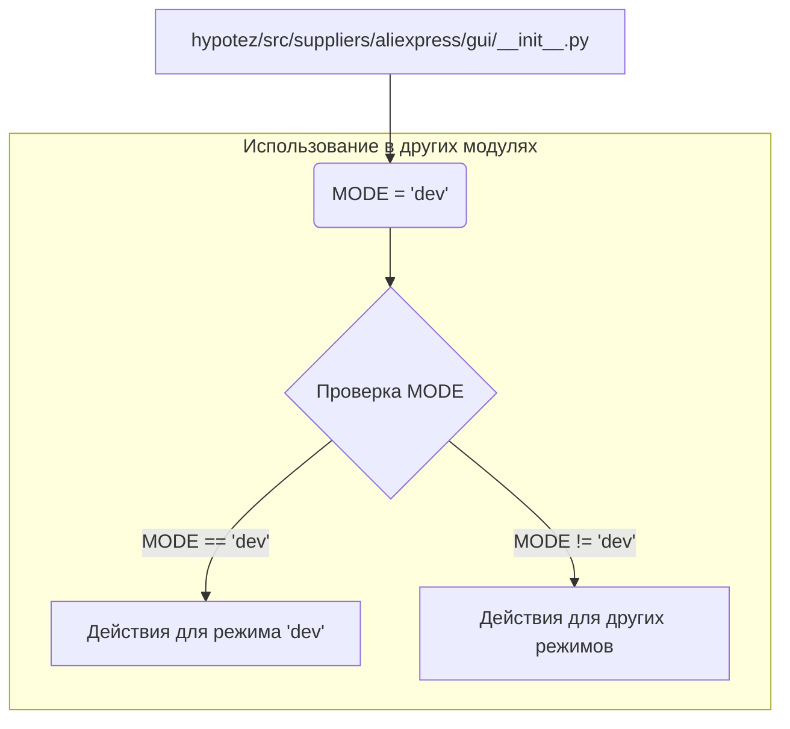

# <input code>

```python
## \file hypotez/src/suppliers/aliexpress/gui/__init__.py
# -*- coding: utf-8 -*-\
#! venv/Scripts/python.exe
#! venv/bin/python/python3.12

"""
.. module: src.suppliers.aliexpress.gui 
	:platform: Windows, Unix
	:synopsis:

"""
MODE = 'dev'
```

# <algorithm>

Этот файл, `hypotez/src/suppliers/aliexpress/gui/__init__.py`, является файлом инициализации для модуля `gui` внутри пакета `aliexpress`.  Он, по сути, служит контейнером для других модулей и классов, связанных с графическим интерфейсом для поставщика AliExpress.

Алгоритм работы в этом файле весьма тривиален - он устанавливает переменную `MODE` со значением 'dev'.  Данная переменная, скорее всего, будет использоваться в других частях проекта для определения режима работы (например, 'dev', 'prod') и переключения конфигурации.


В этом случае, пошаговая блок-схема будет очень простой:

1. **Установить переменную `MODE`:**  При импорте этого модуля в другой части проекта будет доступна переменная `MODE`, имеющая значение 'dev'.

# <mermaid>



# <explanation>

* **Импорты:** В данном файле нет импортов. Это файл инициализации, который содержит конфигурацию (значение переменной `MODE`).

* **Классы:** Нет. Файл не содержит определения классов.

* **Функции:** Нет. Файл не содержит определения функций.

* **Переменные:**
    * `MODE`:  Строковая переменная, содержащая строку 'dev'. Скорее всего, эта переменная будет использоваться в других частях проекта для настройки различных режимов.  Например, в других модулях проекта может быть код подобный:

```python
from hypotez.src.suppliers.aliexpress.gui import MODE

if MODE == 'dev':
    # выполнение действий в режиме разработки
    pass
elif MODE == 'prod':
    # выполнение действий в режиме производства
    pass

```

* **Возможные ошибки и улучшения:**

    * **Отсутствие документирования:**  Хоть и есть комментарий `"""`,  он неполный. Дополните информацию о значении `MODE` и его применении.
    * **Неявное использование:** Использование `MODE`  без явного описания и документации может приводить к трудностям в понимании и поддержке кода. Добавление документации и комментариев улучшит читаемость и понимание кода.
    * **Отсутствие логики:**  Сам по себе файл `__init__.py` просто определяет переменную.  В нём не выполняется никакой логики, за исключением задания значения MODE.

* **Взаимосвязи с другими частями проекта:**  Переменная `MODE` будет использоваться другими модулями в `src.suppliers.aliexpress`, возможно, влияя на:
    * **Конфигурацию:** Изменение настроек для различных режимов (например, пути к файлам данных, адреса API).
    * **Логику:** Разные части кода могут вести себя по-разному в зависимости от значения `MODE` (например, включение/выключение отладочных сообщений).
    * **Тестирование:** Позволяет выбрать режим тестирования.


В целом, этот файл `__init__.py`  не выполняет сложных операций.  Он просто определяет значение `MODE`, которое может быть использовано в других частях проекта для выбора режима работы.  Дополнительная информация о назначении и применении `MODE` будет полезна.