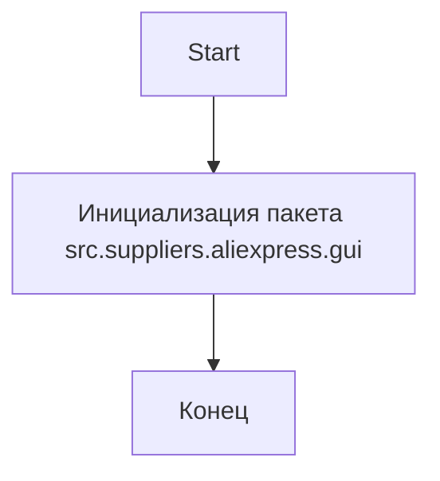

## АНАЛИЗ КОДА: `hypotez/src/suppliers/aliexpress/gui/__init__.py`

### 1. <алгоритм>

Файл `__init__.py` в Python является специальным файлом, который указывает, что директория должна рассматриваться как пакет. Сам по себе этот файл не содержит исполняемого кода, но он может содержать инициализирующий код для пакета.

В данном случае, файл `__init__.py` пуст. Это означает, что пакет `src.suppliers.aliexpress.gui` будет инициализирован без каких-либо дополнительных действий.

**Блок-схема:**

```
Start --> Init_Package[Инициализация пакета src.suppliers.aliexpress.gui]
Init_Package --> End[Конец]
```

**Пример:**
1.  При импорте модуля `src.suppliers.aliexpress.gui`, интерпретатор Python выполнит файл `__init__.py`.
2.  Так как файл пустой, пакет инициализируется без выполнения дополнительных действий.
3.  Импорт пакета может использоваться для доступа к модулям внутри пакета, например, `from src.suppliers.aliexpress.gui import some_module`.

### 2. <mermaid>


**Объяснение:**
Диаграмма `mermaid` показывает простой поток выполнения. Начинается с инициализации пакета `src.suppliers.aliexpress.gui`. Поскольку файл `__init__.py` пуст, процесс сводится только к тому, что данный каталог определяется как пакет.  После этого выполнение заканчивается. Импорты и зависимости внутри других модулей этого пакета обрабатываются отдельно и не входят в процесс инициализации.

### 3. <объяснение>

**Импорты:**

В данном файле нет импортов. Файл `__init__.py` используется для указания, что директория `gui` является пакетом, который может содержать модули Python.
*   **Назначение:** Отсутствие импортов в файле `__init__.py` означает, что пакет `src.suppliers.aliexpress.gui` не имеет никаких зависимостей от других частей проекта при его инициализации.

**Классы:**
В этом файле не определены классы.

**Функции:**
В этом файле не определены функции.

**Переменные:**
В этом файле не определены переменные.

**Объяснения:**

-   Файл `__init__.py` является ключевым для определения пакетов в Python. Его наличие говорит о том, что директория `gui`  внутри `src/suppliers/aliexpress/` должна рассматриваться как пакет.
-   В данном случае, файл пустой, что означает базовую инициализацию пакета без выполнения дополнительного кода.
-   Сам по себе, файл не имеет функциональности кроме определения пакета. Внутри этого пакета будут располагаться модули, содержащие классы, функции и переменные.
-   **Потенциальные улучшения:** Файл может быть расширен для инициализации некоторых общих объектов или настройки среды, если это потребуется в будущем.
-   **Взаимосвязи с другими частями проекта:** Пакет `src.suppliers.aliexpress.gui` будет частью структуры модулей проекта, ответственной за UI данного поставщика. Этот пакет используется для организации и структурирования кода, относящегося к графическому интерфейсу.