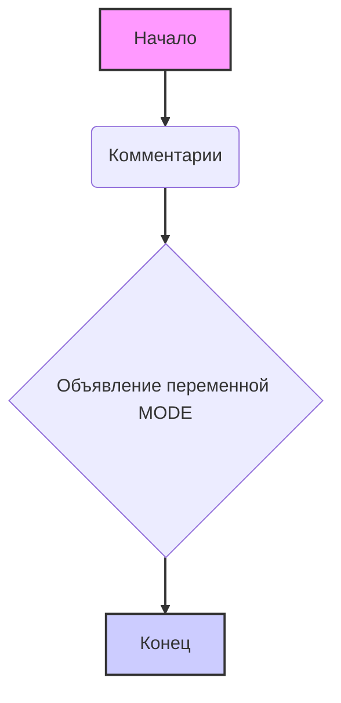

## Анализ кода `hypotez/src/suppliers/aliexpress/gui/__init__.py`

### 1. <алгоритм>

1.  **Начало**: Исполнение скрипта начинается с запуска интерпретатора Python.
2.  **Комментарии**: Первые несколько строк представляют собой комментарии, определяющие кодировку файла, пути к интерпретаторам python для разных сред и док-строку модуля. Они не влияют на логику выполнения программы.
3.  **Объявление переменной `MODE`**: Создается глобальная переменная `MODE` типа строка и ей присваивается значение `'dev'`. Эта переменная может использоваться для определения режима работы приложения (например, `dev` для разработки и `prod` для продакшена).

    **Пример**:
    ```python
    
    # В других модулях может быть проверка
    # if MODE == 'dev':
    #   print("Режим разработки")
    # elif MODE == 'prod':
    #   print("Продуктивный режим")
    ```

### 2. <mermaid>



**Объяснение зависимостей:**

*   **Начало**: Точка входа в скрипт.
*   **Комментарии**: Блок, содержащий метаданные и документацию, не влияющий на выполнение.
*   **Объявление переменной MODE**: Создание глобальной переменной `MODE`.
*   **Конец**: Конечная точка выполнения скрипта.

**Зависимости:**

Диаграмма показывает последовательность выполнения кода. После запуска скрипта, интерпретатор обрабатывает комментарии, затем объявляет переменную `MODE`, и завершает работу.

### 3. <объяснение>

**Импорты:**

В данном файле отсутствуют импорты. Это указывает на то, что данный модуль `__init__.py` не использует сторонние библиотеки или другие модули из пакета `src`. 

**Классы:**

В данном файле не определены классы.

**Функции:**

В данном файле не определены функции.

**Переменные:**

*   **`MODE`**:
    *   **Тип**: `str` (строка).
    *   **Назначение**: Глобальная переменная, определяющая режим работы модуля. В данном случае установлено значение `'dev'`, что указывает на режим разработки.
    *   **Использование**: Эта переменная может быть использована в других модулях пакета `aliexpress` для настройки поведения программы в зависимости от режима. Например, включение/выключение отладочной информации, использование различных конфигурационных файлов, и т.д.

**Потенциальные ошибки и области для улучшения:**

*   **Отсутствие комментариев:** В коде есть только общие комментарии, но нет пояснений конкретно для переменной `MODE`. Стоит добавить более подробные комментарии.
*   **Жестко заданный режим:** Переменная `MODE` жестко задана значением `'dev'`. Было бы лучше, если бы значение могло быть изменено извне (например, через переменные окружения).

**Взаимосвязи с другими частями проекта:**

Этот файл `__init__.py` определяет точку входа и может влиять на поведение других модулей в пакете `src.suppliers.aliexpress.gui`. Например, в других файлах внутри пакета `gui` может быть условный код, зависящий от значения переменной `MODE`.  Хотя, на текущий момент, нет других взаимодействий, кроме потенциальной проверки значения переменной.

**Заключение:**

Файл `__init__.py` в пакете `src.suppliers.aliexpress.gui` выполняет инициализацию пакета, задавая глобальную переменную `MODE`. Это минимальный код,  который указывает на  модуль GUI.