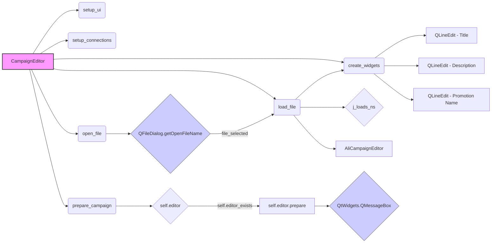

## Анализ кода `hypotez/src/suppliers/aliexpress/gui/campaign.py`

### <алгоритм>
1.  **Инициализация `CampaignEditor`**:
    *   Создается экземпляр `CampaignEditor`, который наследуется от `QtWidgets.QWidget`.
    *   Сохраняется ссылка на `main_app` (если передано).
    *   Вызываются методы `setup_ui` для создания интерфейса и `setup_connections` для установки связей сигналов.
    *   **Пример:** `editor = CampaignEditor(main_app=app)`
2.  **`setup_ui`**:
    *   Устанавливается заголовок окна, его размеры и создается прокручиваемая область `QScrollArea`.
    *   Создается виджет `QWidget` для содержимого прокручиваемой области.
    *   Создается `QGridLayout` для управления размещением виджетов в прокручиваемой области.
    *   Создаются кнопки "Open JSON File", "Prepare Campaign" и метка для имени файла.
        *   Кнопка "Open JSON File" подключается к слоту `open_file`.
        *   Кнопка "Prepare Campaign" подключается к слоту `prepare_campaign`.
    *   Виджеты добавляются в `layout`.
    *   Прокручиваемая область добавляется в основной `QVBoxLayout` виджета.
    *   **Пример:** Создается окно с кнопками "Open JSON File", "Prepare Campaign" и областью для вывода данных.
3.  **`setup_connections`**:
    *   В текущей реализации метод пуст, не устанавливает никаких связей.
4.  **`open_file`**:
    *   Открывается диалоговое окно `QFileDialog` для выбора JSON файла.
    *   Если файл не выбран, функция завершается.
    *   Если файл выбран, вызывается метод `load_file` для загрузки файла.
    *   **Пример:** Пользователь выбирает файл `data.json`.
5.  **`load_file`**:
    *   Загружает JSON-данные из выбранного файла с помощью `j_loads_ns`.
    *   Сохраняет путь к файлу в `self.current_campaign_file`.
    *   Устанавливает текст метки `file_name_label` с именем файла.
    *   Вызывает `create_widgets` для создания виджетов на основе загруженных данных.
    *   Создает экземпляр `AliCampaignEditor`.
    *   При возникновении ошибки отображает диалоговое окно `QMessageBox` с сообщением об ошибке.
    *   **Пример:** JSON-файл `data.json` загружается, и его данные используются для создания элементов UI.
6.  **`create_widgets`**:
    *   Получает `QGridLayout` из атрибута `self.layout`.
    *   Удаляет все существующие виджеты из `layout`, кроме кнопок `open_button`, `file_name_label`, `prepare_button`.
    *   Создает `QLineEdit` для `title`, `description` и `promotion_name`, используя данные из объекта `data`.
    *   Добавляет метки и поля ввода в `layout`.
    *   **Пример:** На интерфейсе появляются поля для ввода `title`, `description` и `promotion_name`.
7.  **`prepare_campaign` (асинхронный слот)**:
    *   Проверяет, был ли создан экземпляр `self.editor`.
    *   Вызывает асинхронный метод `prepare` экземпляра `self.editor`.
    *   В случае успеха отображает диалоговое окно `QMessageBox` с сообщением об успехе.
    *   При возникновении ошибки отображает диалоговое окно `QMessageBox` с сообщением об ошибке.
    *   **Пример:** Вызывается метод `prepare` из `AliCampaignEditor` для подготовки кампании.

### <mermaid>

**Описание диаграммы:**

*   **`CampaignEditor`**:  Главный класс, представляющий редактор кампаний.
*   **`setup_ui`**:  Метод для настройки пользовательского интерфейса.
*   **`setup_connections`**:  Метод для установки связей между сигналами и слотами (в текущей реализации пустой).
*   **`open_file`**:  Метод, вызывающий диалоговое окно для выбора файла.
*   **`load_file`**:  Метод для загрузки данных из выбранного файла.
*    **`j_loads_ns`**: Функция для десериализации json файла в namespace.
*   **`AliCampaignEditor`**: Класс, отвечающий за подготовку кампании.
*   **`create_widgets`**: Метод для создания виджетов на основе загруженных данных.
*   **`prepare_campaign`**: Асинхронный метод для подготовки кампании.
*   **`QFileDialog.getOpenFileName`**: Функция PyQt для отображения диалогового окна открытия файла.
*   **`QLineEdit`**: Виджеты ввода текста для title, description и promotion_name
*   **`QtWidgets.QMessageBox`**: Функция для отображения сообщений пользователю.

Диаграмма показывает поток управления и зависимости между методами класса `CampaignEditor`, а также взаимодействие с внешними компонентами, такими как `QFileDialog` и `AliCampaignEditor`.

### <объяснение>

**Импорты:**

*   `header`: Предположительно, содержит общие заголовки или метаданные проекта.
*   `asyncio`: Библиотека для поддержки асинхронного программирования.
*   `sys`: Библиотека для доступа к параметрам и функциям, специфичным для системы.
*   `pathlib.Path`: Библиотека для работы с путями файловой системы.
*   `types.SimpleNamespace`:  Класс для создания объектов с произвольными атрибутами. Полезен для хранения данных, загруженных из JSON.
*   `PyQt6.QtWidgets`, `PyQt6.QtGui`, `PyQt6.QtCore`: Модули PyQt6 для создания графического интерфейса.
*   `qasync.QEventLoop`, `qasync.asyncSlot`: Модули для интеграции асинхронности с Qt.
*   `src.utils.jjson.j_loads_ns`, `src.utils.jjson.j_dumps`: Функции для работы с JSON, загрузки в namespace и обратной сериализации.
*   `src.suppliers.aliexpress.campaign.AliCampaignEditor`: Класс, отвечающий за подготовку кампании AliExpress.
*   `styles.set_fixed_size`: Функция для установки фиксированного размера виджетов.

**Класс `CampaignEditor`:**

*   **Роль**:  Представляет собой виджет редактора кампаний, позволяющий загружать, редактировать и подготавливать данные кампаний AliExpress из JSON файлов.
*   **Атрибуты**:
    *   `data: SimpleNamespace`: Содержит данные кампании, загруженные из JSON.
    *   `current_campaign_file: str`: Путь к текущему открытому файлу кампании.
    *   `editor: AliCampaignEditor`: Экземпляр редактора кампаний.
    *   `main_app`: Ссылка на экземпляр основного приложения.
*   **Методы**:
    *   `__init__`: Конструктор класса, инициализирует виджет и настраивает UI.
    *   `setup_ui`: Создает и размещает элементы пользовательского интерфейса.
    *   `setup_connections`: Настраивает связи между сигналами и слотами (в текущей реализации пустой).
    *   `open_file`: Открывает диалоговое окно для выбора файла.
    *   `load_file`: Загружает данные из выбранного JSON файла.
    *   `create_widgets`: Создает виджеты на основе загруженных данных.
    *   `prepare_campaign`: Асинхронно подготавливает кампанию.
*   **Взаимодействие**:
    *   Взаимодействует с `QFileDialog` для выбора файлов.
    *   Использует `j_loads_ns` для загрузки JSON данных.
    *   Использует `AliCampaignEditor` для подготовки кампании.
    *   Использует `QMessageBox` для отображения сообщений.
    *   Работает с экземпляром `main_app`, если он был передан в конструктор.

**Функции:**

*   `setup_ui`:
    *   **Аргументы**: `self`
    *   **Возвращаемое значение**: `None`
    *   **Назначение**:  Создает все необходимые UI элементы: кнопки, поля ввода, прокручиваемую область.
    *   **Пример**: Инициализирует UI редактора кампаний.
*   `setup_connections`:
    *   **Аргументы**: `self`
    *   **Возвращаемое значение**: `None`
    *   **Назначение**:  Устанавливает соединения между сигналами и слотами.  (в текущей реализации не имеет действий)
    *   **Пример**: Должна устанавливать связи для событий, например, нажатие кнопки.
*   `open_file`:
    *   **Аргументы**: `self`
    *   **Возвращаемое значение**: `None`
    *   **Назначение**: Открывает диалог для выбора файла и вызывает `load_file`, если файл выбран.
    *   **Пример**: Пользователь нажимает кнопку "Open JSON File", открывается диалоговое окно выбора файла.
*   `load_file`:
    *   **Аргументы**: `self`, `campaign_file` (путь к файлу).
    *   **Возвращаемое значение**: `None`.
    *   **Назначение**:  Загружает данные из JSON файла, создает виджеты и экземпляр `AliCampaignEditor`.
    *   **Пример**: Вызывается после выбора файла в `open_file`.
*   `create_widgets`:
    *   **Аргументы**: `self`, `data` (данные кампании).
    *   **Возвращаемое значение**: `None`
    *   **Назначение**: Создает поля ввода для `title`, `description`, `promotion_name` из данных.
    *   **Пример**: После загрузки файла, на форме отображаются поля для редактирования.
*   `prepare_campaign`:
    *   **Аргументы**: `self`
    *   **Возвращаемое значение**: `None`
    *   **Назначение**: Асинхронно подготавливает кампанию, используя экземпляр `AliCampaignEditor`.
    *   **Пример**: Вызывается при нажатии кнопки "Prepare Campaign".

**Переменные:**

*   `MODE`: Глобальная константа со значением `'dev'`, вероятно, для управления режимами работы (разработка/продакшн).
*   `data`: Атрибут экземпляра класса `CampaignEditor`, типа `SimpleNamespace`, для хранения загруженных из JSON данных.
*   `current_campaign_file`: Атрибут экземпляра класса `CampaignEditor`, типа `str`,  для хранения пути к текущему файлу.
*   `editor`: Атрибут экземпляра класса `CampaignEditor`, типа `AliCampaignEditor`, для управления подготовкой кампании.
*   `scroll_area`, `scroll_content_widget`, `layout`, `open_button`, `file_name_label`, `prepare_button`, `title_input`, `description_input`, `promotion_name_input`: Атрибуты экземпляра класса `CampaignEditor`, типа `QtWidgets.*`, являются UI элементами.

**Потенциальные ошибки и области для улучшения:**

1.  **Отсутствие связей в `setup_connections`**: Метод `setup_connections` сейчас пуст, что означает отсутствие обработки каких-либо событий. Необходимо добавить соединения между сигналами (например, изменение текста в полях ввода) и соответствующими слотами для обеспечения интерактивности.
2.  **Обработка ошибок**: В функции `load_file` есть обработка ошибок при загрузке файла, но можно добавить дополнительную обработку ошибок при подготовке кампании (например, валидацию данных перед вызовом `self.editor.prepare()`).
3.  **Асинхронность**: Работа с файлами и подготовка кампаний выполняются асинхронно, но необходимо убедиться, что это не блокирует UI. В данном случае используется декоратор `asyncSlot`, который должен обеспечить корректную асинхронную работу.
4.  **Отсутствие сохранения изменений**: В коде нет реализации сохранения изменений в JSON файл. Нужно реализовать кнопку "Save", которая будет сохранять изменения, сделанные пользователем, в исходный файл.
5.  **Магические строки:** Использование абсолютного пути `c:/user/documents/repos/hypotez/data/aliexpress/campaigns` в `QFileDialog` не является портативным. Желательно использовать относительный путь или настраиваемую переменную.
6.  **Управление ресурсами**: Необходимо убедиться, что все используемые ресурсы PyQt, такие как виджеты, правильно освобождаются.

**Цепочка взаимосвязей:**

1.  **GUI (`campaign.py`)** -> **JSON (`src.utils.jjson`)**:  GUI использует функции `j_loads_ns` для загрузки данных из JSON и `j_dumps` для обратной сериализации в будущем.
2.  **GUI (`campaign.py`)** -> **Campaign Logic (`src.suppliers.aliexpress.campaign.py`)**: GUI использует `AliCampaignEditor` для выполнения подготовки кампании.
3.  **GUI (`campaign.py`)** -> **Main Application (`main_app`)**:  GUI может взаимодействовать с главным приложением через сохраненную ссылку.
4.  **GUI (`campaign.py`)** -> **UI Framework (`PyQt6`)**: GUI использует виджеты и функции `PyQt6` для создания пользовательского интерфейса.
5.  **GUI (`campaign.py`)** -> **Styles (`styles.py`)**: GUI использует функцию `set_fixed_size` из `styles.py` для стилизации виджетов.

Этот анализ предоставляет подробное описание функциональности кода, его взаимодействий и потенциальных проблем.