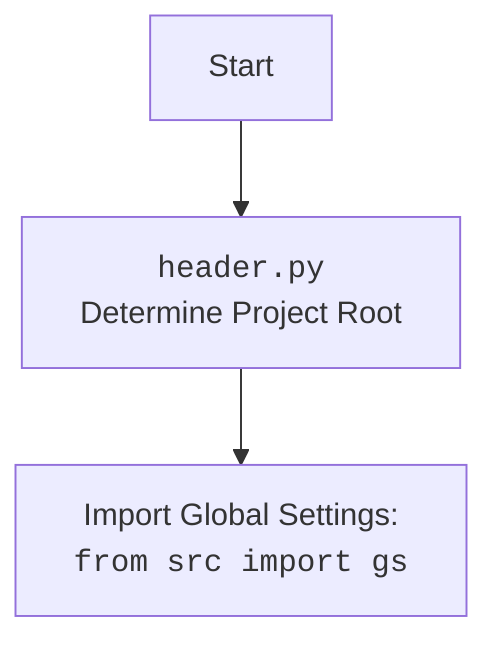

## ИНСТРУКЦИЯ:

Анализируй предоставленный код подробно и объясни его функциональность. Ответ должен включать три раздела:  

1.  **<алгоритм>**: Опиши рабочий процесс в виде пошаговой блок-схемы, включая примеры для каждого логического блока, и проиллюстрируй поток данных между функциями, классами или методами.  
2.  **<mermaid>**: Напиши код для диаграммы в формате `mermaid`, проанализируй и объясни все зависимости,
    которые импортируются при создании диаграммы.
    **ВАЖНО!** Убедитесь, что все имена переменных, используемые в диаграмме `mermaid`,
    имеют осмысленные и описательные имена. Имена переменных вроде `A`, `B`, `C`, и т.д., не допускаются!  
    
    **Дополнительно**: Если в коде есть импорт `import header`, добавьте блок `mermaid` flowchart, объясняющий `header.py`:\
    ```mermaid
    flowchart TD
        Start --> Header[<code>header.py</code><br> Determine Project Root]
    
        Header --> import[Import Global Settings: <br><code>from src import gs</code>] 
    ```

3.  **<объяснение>**: Предоставьте подробные объяснения:  
    - **Импорты**: Их назначение и взаимосвязь с другими пакетами `src.`.  
    - **Классы**: Их роль, атрибуты, методы и взаимодействие с другими компонентами проекта.  
    - **Функции**: Их аргументы, возвращаемые значения, назначение и примеры.  
    - **Переменные**: Их типы и использование.  
    - Выделите потенциальные ошибки или области для улучшения.  

Дополнительно, постройте цепочку взаимосвязей с другими частями проекта (если применимо).  

Это обеспечивает всесторонний и структурированный анализ кода.
## Формат ответа: `.md` (markdown)
**КОНЕЦ ИНСТРУКЦИИ**

### <алгоритм>

1.  **Инициализация `CampaignEditor`**:
    *   Создается экземпляр `CampaignEditor`, который является виджетом `QtWidgets.QWidget`.
    *   Сохраняется ссылка на основное приложение `main_app`.
    *   Вызываются методы `setup_ui` для настройки интерфейса и `setup_connections` для настройки связей.

2.  **Настройка UI (`setup_ui`)**:
    *   Устанавливается заголовок окна "Campaign Editor".
    *   Создается `QScrollArea` для отображения контента, который может не поместиться в окне.
    *   Внутри `QScrollArea` создается `QWidget` (`scroll_content_widget`), на котором будет располагаться контент.
    *   Создается `QGridLayout` для управления расположением виджетов.
    *   Создаются кнопки "Open JSON File" (`open_button`) и "Prepare Campaign" (`prepare_button`), а также метка для отображения имени файла (`file_name_label`).
    *   Кнопка "Open JSON File" связывается с методом `open_file`, а "Prepare Campaign" — с методом `prepare_campaign`.
    *   Виджеты добавляются в макет.

3.  **Открытие файла (`open_file`)**:
    *   Вызывается диалоговое окно `QFileDialog` для выбора JSON-файла.
    *   Если файл выбран, вызывается метод `load_file` с путем к выбранному файлу.

    *   **Пример:** Пользователь выбирает файл `campaign1.json`.

4.  **Загрузка файла (`load_file`)**:
    *   Используется функция `j_loads_ns` из модуля `src.utils.jjson` для загрузки данных из JSON-файла и преобразования их в объект `SimpleNamespace`.
    *   Сохраняется путь к загруженному файлу в `current_campaign_file`.
    *   Обновляется текст метки `file_name_label` с именем файла.
    *   Вызывается метод `create_widgets` для создания виджетов на основе загруженных данных.
    *   Создается экземпляр класса `AliCampaignEditor` из модуля `src.suppliers.aliexpress.campaign`, передавая путь к файлу.
    *   Если возникает ошибка при загрузке, выводится сообщение об ошибке.

    *   **Пример:** Из `campaign1.json` загружаются данные, например `{"title": "My Campaign", "description": "...", "promotion_name": "Promo1"}`.

5.  **Создание виджетов (`create_widgets`)**:
    *   Удаляются предыдущие виджеты, связанные с данными кампании, оставляя кнопки "Open JSON File", "Prepare Campaign" и метку `file_name_label`.
    *   Создаются поля ввода `QLineEdit` для `title`, `description` и `promotion_name`, заполненные данными из объекта `SimpleNamespace`.
    *   Метки и поля ввода добавляются в макет.
        *   **Пример:** Создаются `QLineEdit` для "Title", "Description" и "Promotion Name" и заполняются данными из `data`.

6.  **Подготовка кампании (`prepare_campaign`)**:
    *   Это асинхронный метод, использующий `asyncSlot`.
    *   Проверяется, был ли создан экземпляр `AliCampaignEditor`.
    *   Вызывается асинхронный метод `prepare` у экземпляра `AliCampaignEditor`.
    *   В случае успешной подготовки выводится информационное сообщение.
    *   Если возникает ошибка, выводится сообщение об ошибке.

    *   **Пример:**  Вызывается `self.editor.prepare()`, который, например, может отправлять данные в API.

### <mermaid>

```mermaid
flowchart TD
    Start[Start Application] --> Init[Initialize CampaignEditor]
    Init --> SetupUI[Setup UI]
    Init --> SetupConnections[Setup Connections]
    SetupUI --> CreateScrollArea[Create QScrollArea]
    CreateScrollArea --> CreateScrollContent[Create Scroll Content Widget]
    CreateScrollContent --> CreateLayout[Create QGridLayout]
    CreateLayout --> CreateButtons[Create Open and Prepare Buttons]
    CreateButtons --> ConnectButtons[Connect Buttons to Methods]
    ConnectButtons --> AddToLayout[Add Widgets to Layout]

    SetupConnections -->  Open_File_Button[Button 'Open JSON File']
    Open_File_Button --> OpenFileDialog[Open QFileDialog]
    OpenFileDialog -- File selected --> LoadFile[Load File]
    OpenFileDialog -- No file selected --> End[End]

    LoadFile --> LoadJson[Load JSON Data using j_loads_ns]
    LoadJson --> StoreData[Store Loaded Data and File Path]
    StoreData --> UpdateFileLabel[Update File Label with File Path]
    UpdateFileLabel --> CreateWidgets[Create Widgets based on Data]
    StoreData --> CreateCampaignEditor[Create AliCampaignEditor Instance]
    CreateCampaignEditor --> Prepare_Button[Button 'Prepare Campaign']
    Prepare_Button --> PrepareCampaignAsync[Call Async prepare method in AliCampaignEditor]
     PrepareCampaignAsync -- Success --> ShowSuccessMsg[Show Success Message]
     PrepareCampaignAsync -- Failure --> ShowErrorMsg[Show Error Message]

    CreateWidgets --> ClearPreviousWidgets[Clear Previous Data Widgets]
    ClearPreviousWidgets --> CreateInputFields[Create Input Fields for Data]
    CreateInputFields --> AddFieldsToLayout[Add Input Fields to Layout]

     ShowSuccessMsg --> End
     ShowErrorMsg --> End

    classDef imported fill:#f9f,stroke:#333,stroke-width:2px
    classDef internal fill:#ccf,stroke:#333,stroke-width:2px
    class Init, SetupUI, SetupConnections, CreateScrollArea, CreateScrollContent, CreateLayout, CreateButtons, ConnectButtons, AddToLayout, OpenFileDialog, LoadFile, LoadJson, StoreData, UpdateFileLabel, CreateWidgets, ClearPreviousWidgets, CreateInputFields, AddFieldsToLayout, CreateCampaignEditor, Prepare_Button, PrepareCampaignAsync, ShowSuccessMsg, ShowErrorMsg internal;
   
    class Start, End imported;
```



### <объяснение>

**Импорты:**

*   `header`: Импортирует модуль `header.py`, который, вероятно, отвечает за определение корневой директории проекта и загрузку глобальных настроек. Это позволяет другим модулям получать доступ к общим настройкам и ресурсам проекта.
*   `asyncio`: Библиотека для работы с асинхронным программированием. В данном коде она не используется напрямую, но импортируется, так как используется в `qasync`.
*   `sys`: Предоставляет доступ к некоторым переменным и функциям, взаимодействующим с интерпретатором Python. Обычно используется для работы с аргументами командной строки, но в этом файле напрямую не используется.
*   `pathlib.Path`: Используется для работы с путями к файлам и директориям в кроссплатформенном формате.
*   `types.SimpleNamespace`: Удобный класс для создания объектов с произвольными атрибутами. Используется для хранения данных, загруженных из JSON.
*   `PyQt6.QtWidgets`, `QtGui`, `QtCore`: Модули PyQt6 для создания графического интерфейса пользователя. `QtWidgets` содержит виджеты, `QtGui` содержит классы, связанные с графикой, `QtCore` содержит основные классы и функции.
*   `qasync.QEventLoop`, `asyncSlot`: Библиотека `qasync` позволяет интегрировать асинхронное программирование с циклом событий PyQt. `QEventLoop` - это цикл событий, а `asyncSlot` - декоратор для преобразования обычных методов в слоты, которые можно вызвать асинхронно.
*   `src.utils.jjson.j_loads_ns`, `j_dumps`: Функции для загрузки и сохранения данных JSON. `j_loads_ns` загружает JSON в `SimpleNamespace`, `j_dumps` - для сериализации.
*   `src.suppliers.aliexpress.campaign.AliCampaignEditor`: Класс для управления и редактирования кампаний AliExpress.
*   `styles.set_fixed_size`: Функция из `styles.py` для установки фиксированного размера виджетов.

**Классы:**

*   `CampaignEditor(QtWidgets.QWidget)`:
    *   **Роль:**  Главный класс, представляющий виджет редактора кампаний. Он управляет загрузкой данных, созданием и управлением UI, взаимодействием с `AliCampaignEditor` для подготовки кампании.
    *   **Атрибуты:**
        *   `data: SimpleNamespace`: Содержит данные, загруженные из JSON-файла кампании.
        *   `current_campaign_file: str`: Путь к текущему загруженному файлу кампании.
        *   `editor: AliCampaignEditor`: Экземпляр `AliCampaignEditor`, используемый для работы с кампанией.
        *   `main_app`: Ссылка на экземпляр основного приложения.
        *   `scroll_area`, `scroll_content_widget`, `layout`, `open_button`, `file_name_label`, `prepare_button`: Виджеты UI.
    *   **Методы:**
        *   `__init__(self, parent=None, main_app=None)`: Конструктор класса, инициализирует UI и сохраняет ссылку на `main_app`.
        *   `setup_ui(self)`: Настраивает UI, создает виджеты, устанавливает размеры и связывает кнопки.
        *   `setup_connections(self)`: В этом коде не используются, но может быть использован для связывания сигналов и слотов.
        *   `open_file(self)`: Открывает диалоговое окно для выбора JSON-файла.
        *   `load_file(self, campaign_file)`: Загружает JSON-файл, создает виджеты и экземпляр `AliCampaignEditor`.
        *   `create_widgets(self, data)`: Создает поля ввода для данных кампании на основе загруженных данных.
        *   `prepare_campaign(self)`: Асинхронно подготавливает кампанию, вызывая метод `prepare` у `AliCampaignEditor`.

**Функции:**

*   `setup_ui(self)`:
    *   **Аргументы:** `self` (экземпляр класса).
    *   **Возвращаемое значение:** `None`.
    *   **Назначение:** Создает и настраивает пользовательский интерфейс (UI) редактора кампаний, включая кнопки, метки, область прокрутки и макет.
    *   **Пример:** Создает кнопку "Open JSON File", которая вызывает метод `open_file` при нажатии.
*   `open_file(self)`:
    *   **Аргументы:** `self` (экземпляр класса).
    *   **Возвращаемое значение:** `None`.
    *   **Назначение:** Открывает диалоговое окно выбора файла и вызывает `load_file` с путем к выбранному файлу, если он выбран.
*   `load_file(self, campaign_file)`:
    *   **Аргументы:** `self` (экземпляр класса), `campaign_file` (путь к JSON-файлу).
    *   **Возвращаемое значение:** `None`.
    *   **Назначение:** Загружает данные из JSON-файла с помощью `j_loads_ns`, сохраняет путь к файлу, обновляет метку с именем файла, создает виджеты и создает экземпляр `AliCampaignEditor`.
    *   **Пример:** Загружает `campaign.json` и создает поля ввода для `title`, `description` и `promotion_name`.
*   `create_widgets(self, data)`:
    *   **Аргументы:** `self` (экземпляр класса), `data` (`SimpleNamespace` с данными кампании).
    *   **Возвращаемое значение:** `None`.
    *   **Назначение:** Удаляет предыдущие виджеты, создаёт поля ввода для данных кампании на основе `data` и добавляет их в макет.
    *   **Пример:** Создает `QLineEdit` для `data.title`, `data.description` и `data.promotion_name`, заполняя их значениями из `data`.
*   `prepare_campaign(self)`:
    *   **Аргументы:** `self` (экземпляр класса).
    *   **Возвращаемое значение:** `None`.
    *   **Назначение:** Асинхронно вызывает метод `prepare` у `AliCampaignEditor` для подготовки кампании.
    *   **Пример:** Вызывает `await self.editor.prepare()` для отправки данных кампании в API.

**Переменные:**

*   `data: SimpleNamespace`: Содержит загруженные из JSON данные в виде атрибутов.
*   `current_campaign_file: str`: Путь к выбранному JSON-файлу.
*   `editor: AliCampaignEditor`: Экземпляр класса `AliCampaignEditor` для подготовки кампании.
*   `main_app`: Ссылка на экземпляр основного приложения, из которого был запущен `CampaignEditor`.
*   `scroll_area`, `scroll_content_widget`, `layout`: Объекты, управляющие расположением и отображением UI.
*   `open_button`, `file_name_label`, `prepare_button`: Виджеты кнопок и меток UI.
*   `title_input`, `description_input`, `promotion_name_input`: `QLineEdit` для ввода данных кампании.

**Взаимосвязи с другими частями проекта:**

*   `header.py`: Обеспечивает доступ к глобальным настройкам проекта и определяет корневую директорию.
*   `src.utils.jjson`: Предоставляет функции для загрузки и сохранения JSON.
*   `src.suppliers.aliexpress.campaign.AliCampaignEditor`: Класс, отвечающий за подготовку кампании.
*   `styles.py`: Содержит функции для стилизации виджетов.

**Потенциальные ошибки и области для улучшения:**

*   Обработка ошибок: в коде есть только обработка ошибок при загрузке файла. Нужно добавить обработку ошибок в других местах, например, при подготовке кампании.
*   Валидация данных: Нет валидации данных, вводимых пользователем в `QLineEdit`.
*   Более подробный UI: UI можно улучшить, добавив больше виджетов и интерактивных элементов для редактирования кампании.
*   Асинхронность: Пока используется только `asyncSlot` для `prepare_campaign`. Остальные методы можно также сделать асинхронными, если необходимо.
*   Тестирование: Код не содержит тестов. Необходимы тесты для обеспечения стабильности.