## <алгоритм>

1. **Инициализация `CampaignEditor`:**
   - Создается экземпляр `CampaignEditor` как виджет `QtWidgets.QWidget`.
   - Сохраняется ссылка на главное приложение `main_app`.
   - Вызывается `setup_ui` для настройки пользовательского интерфейса и `setup_connections` для настройки связей между сигналами и слотами.

2. **Настройка UI (`setup_ui`):**
   - Устанавливается заголовок окна "Campaign Editor".
   - Создается `QScrollArea` для прокрутки контента, внутри которого расположен `QWidget` (`scroll_content_widget`).
   - Устанавливается `QGridLayout` для управления размещением элементов внутри `scroll_content_widget`.
   - Создаются кнопки `open_button` ("Open JSON File") и `prepare_button` ("Prepare Campaign"), а также `file_name_label` для отображения имени выбранного файла.
   - Кнопки `open_button` и `prepare_button` связываются со слотами `open_file` и `prepare_campaign` соответственно.
   - Все виджеты добавляются в `QGridLayout` и `QVBoxLayout`.

3. **Открытие файла (`open_file`):**
   - При нажатии на `open_button` вызывается `QFileDialog` для выбора JSON-файла.
   - Если файл выбран, вызывается `load_file`.

4. **Загрузка файла (`load_file`):**
   - Используется `j_loads_ns` для загрузки данных из JSON-файла в объект `SimpleNamespace`.
   - Сохраняется имя текущего файла в `current_campaign_file` и отображается в `file_name_label`.
   - Вызывается `create_widgets` для создания виджетов на основе загруженных данных.
   - Инициализируется `AliCampaignEditor` для подготовки кампании.
   - В случае ошибки выводится сообщение об ошибке.

5. **Создание виджетов (`create_widgets`):**
   - Удаляются все ранее созданные виджеты из `QGridLayout`, кроме `open_button`, `file_name_label` и `prepare_button`.
   - Создаются поля `QLineEdit` для `title`, `description`, `promotion_name` на основе загруженных данных.
   - Добавляются виджеты меток и полей ввода в `QGridLayout`.

6. **Подготовка кампании (`prepare_campaign`):**
   - При нажатии на `prepare_button` вызывается асинхронный слот `prepare_campaign`.
   - Если `editor` существует, вызывается `await self.editor.prepare()`.
   - В случае успеха выводится сообщение об успехе, в случае ошибки выводится сообщение об ошибке.

**Пример потока данных:**

```mermaid
graph LR
    A[Start] --> B(Инициализация CampaignEditor);
    B --> C{setup_ui};
    C --> D[Создание QScrollArea, QWidget, QGridLayout];
    D --> E[Создание QPushButton, QLabel];
    E --> F[Привязка сигналов к слотам];
    F --> G{Пользователь нажимает "Open JSON File"};
    G --> H[Вызов QFileDialog];
    H --> I{Файл выбран?};
    I -- Yes --> J[Вызов load_file];
    I -- No --> K[Конец];
    J --> L[Загрузка JSON с j_loads_ns];
    L --> M[Обновление file_name_label];
    M --> N[Вызов create_widgets];
    N --> O[Удаление старых виджетов];
    O --> P[Создание QLineEdit для title, description, promotion_name];
    P --> Q[Создание AliCampaignEditor];
    Q --> R{Пользователь нажимает "Prepare Campaign"};
    R --> S[Вызов prepare_campaign];
    S --> T{self.editor существует?};
    T -- Yes --> U[Вызов self.editor.prepare()];
    U --> V{Успешно?};
    V -- Yes --> W[Вывод сообщения об успехе];
    V -- No --> X[Вывод сообщения об ошибке];
    T -- No --> Y[Конец];
    W --> Y;
    X --> Y;

```

```mermaid
classDiagram
    class CampaignEditor {
        -data: SimpleNamespace
        -current_campaign_file: str
        -editor: AliCampaignEditor
        +__init__(parent: QWidget, main_app: object)
        +setup_ui()
        +setup_connections()
        +open_file()
        +load_file(campaign_file: str)
        +create_widgets(data: SimpleNamespace)
        +prepare_campaign()
    }
    class AliCampaignEditor {
        -campaign_file: str
        +prepare()
    }
    class QWidget {
        <<PyQt6.QtWidgets>>
    }
    class QScrollArea {
      <<PyQt6.QtWidgets>>
    }
    class QGridLayout {
       <<PyQt6.QtWidgets>>
    }
     class QPushButton {
       <<PyQt6.QtWidgets>>
    }
    class QLabel {
      <<PyQt6.QtWidgets>>
    }
    class QLineEdit {
        <<PyQt6.QtWidgets>>
    }
    class QMessageBox{
        <<PyQt6.QtWidgets>>
    }
    class QFileDialog{
        <<PyQt6.QtWidgets>>
    }
     class SimpleNamespace {
       <<types>>
    }
    class j_loads_ns{
        <<src.utils.jjson>>
        +j_loads_ns(file_path:str)
    }
    class set_fixed_size{
        <<styles>>
        +set_fixed_size(widget: QWidget, width: int, height: int)
    }

    CampaignEditor --|> QWidget
    CampaignEditor *-- AliCampaignEditor: editor
    CampaignEditor *-- QScrollArea: scroll_area
    CampaignEditor *-- QWidget: scroll_content_widget
    CampaignEditor *-- QGridLayout: layout
    CampaignEditor *-- QPushButton: open_button
    CampaignEditor *-- QPushButton: prepare_button
    CampaignEditor *-- QLabel: file_name_label
    CampaignEditor o-- SimpleNamespace: data
    CampaignEditor -- j_loads_ns
    CampaignEditor -- set_fixed_size
    CampaignEditor -- QFileDialog
    CampaignEditor -- QMessageBox
    CampaignEditor *-- QLineEdit : title_input
    CampaignEditor *-- QLineEdit : description_input
    CampaignEditor *-- QLineEdit : promotion_name_input
```

## <mermaid>



**Объяснение зависимостей `mermaid`:**

-   **`CampaignEditor`**: Основной класс, представляющий виджет редактирования кампаний.
-   **`AliCampaignEditor`**: Класс из `src.suppliers.aliexpress.campaign`, отвечающий за подготовку данных кампании. Имеет метод `prepare()`.
-   **`QWidget`**, **`QScrollArea`**, **`QGridLayout`**, **`QPushButton`**, **`QLabel`**, **`QLineEdit`**, **`QMessageBox`**, **`QFileDialog`**: Классы из `PyQt6.QtWidgets` для создания графического интерфейса.
-   **`SimpleNamespace`**: Класс из `types` для представления данных в виде именованных атрибутов.
-  **`j_loads_ns`**: Функция из `src.utils.jjson` для загрузки данных из JSON-файла.
-   **`set_fixed_size`**: Функция из `styles` для установки фиксированного размера виджетов.

**Дополнительно**: `header.py`


## <объяснение>

### Импорты:

-   **`header`**: Предположительно, модуль, содержащий общие настройки проекта (например, путь к корню проекта) и загружающий глобальные переменные.
-   **`asyncio`**: Библиотека для работы с асинхронным кодом.
-   **`sys`**: Модуль для доступа к параметрам и функциям, специфичным для интерпретатора Python.
-   **`pathlib.Path`**: Класс для представления файловых путей в объектно-ориентированном стиле.
-   **`types.SimpleNamespace`**: Класс для создания объектов с произвольными атрибутами, который часто используется для представления данных, полученных из JSON.
-   **`PyQt6.QtWidgets`**, **`PyQt6.QtGui`**, **`PyQt6.QtCore`**: Модули PyQt6 для создания графического интерфейса.
-   **`qasync.QEventLoop`**, **`qasync.asyncSlot`**: Классы и декораторы для интеграции асинхронного кода с PyQt6.
-   **`src.utils.jjson.j_loads_ns`**, **`src.utils.jjson.j_dumps`**: Функции для работы с JSON, загрузка и запись данных в json.
-   **`src.suppliers.aliexpress.campaign.AliCampaignEditor`**: Класс для работы с данными кампаний aliexpress.
-  **`styles.set_fixed_size`**:  Функция для стилизации UI элементов, установка фиксированного размера для виджетов.

### Классы:

-   **`CampaignEditor(QtWidgets.QWidget)`**:
    -   **Роль**: Основной класс, представляющий виджет для редактирования кампаний.
    -   **Атрибуты**:
        -   `data: SimpleNamespace`: Хранит данные, загруженные из JSON-файла.
        -   `current_campaign_file: str`: Хранит путь к текущему загруженному файлу.
        -   `editor: AliCampaignEditor`: Экземпляр `AliCampaignEditor` для подготовки кампании.
        -   `main_app`: Хранит ссылку на главное приложение.
    -   **Методы**:
        -   `__init__(self, parent=None, main_app=None)`: Конструктор класса, инициализирует виджет и сохраняет ссылку на главное приложение.
        -   `setup_ui(self)`: Настраивает пользовательский интерфейс, создавая виджеты и задавая их расположение.
        -   `setup_connections(self)`: Настраивает связи между сигналами и слотами (в данном коде не используется).
        -   `open_file(self)`: Открывает диалоговое окно для выбора JSON-файла.
        -   `load_file(self, campaign_file)`: Загружает данные из выбранного JSON-файла и создает виджеты на основе данных.
        -    `create_widgets(self, data)`: Создает виджеты для редактирования данных кампании на основе загруженных данных.
        -   `prepare_campaign(self)`: Асинхронный метод для подготовки кампании с помощью `AliCampaignEditor`.
    -   **Взаимодействие**:
        -  Взаимодействует с `QFileDialog` для выбора файла.
        -  Использует `j_loads_ns` для загрузки данных.
        -  Использует `AliCampaignEditor` для подготовки данных кампании.
        -  Взаимодействует с `QtWidgets` для создания и управления пользовательским интерфейсом.
-   **`AliCampaignEditor`**:
    -   **Роль**: Класс для подготовки данных кампании.
    -   **Атрибуты**:
        -   `campaign_file: str`: Путь к файлу кампании.
    -   **Методы**:
        -   `prepare(self)`: Асинхронный метод для подготовки данных кампании.
    -   **Взаимодействие**:
        -   Используется `CampaignEditor` для подготовки данных кампании.

### Функции:

-   **`setup_ui(self)`**:
    -   **Аргументы**: `self` (экземпляр класса `CampaignEditor`).
    -   **Возвращаемое значение**: `None`.
    -   **Назначение**: Создает и настраивает графический интерфейс виджета `CampaignEditor`.
    -   **Примеры**: Создание `QScrollArea`, `QWidget`, `QGridLayout`, кнопок `open_button` и `prepare_button`, а также `file_name_label`.
-   **`open_file(self)`**:
    -   **Аргументы**: `self` (экземпляр класса `CampaignEditor`).
    -   **Возвращаемое значение**: `None`.
    -   **Назначение**: Открывает диалоговое окно для выбора JSON-файла и вызывает `load_file` в случае успеха.
    -   **Примеры**: Вызов `QFileDialog.getOpenFileName` для выбора файла.
-   **`load_file(self, campaign_file)`**:
    -   **Аргументы**: `self` (экземпляр класса `CampaignEditor`), `campaign_file` (путь к JSON-файлу).
    -   **Возвращаемое значение**: `None`.
    -   **Назначение**: Загружает данные из JSON-файла с помощью `j_loads_ns`, сохраняет путь к файлу, вызывает `create_widgets` и создает экземпляр `AliCampaignEditor`.
    -   **Примеры**: Вызов `j_loads_ns` для загрузки данных, сохранение пути к файлу, создание виджетов.
-   **`create_widgets(self, data)`**:
    -   **Аргументы**: `self` (экземпляр класса `CampaignEditor`), `data` (данные из JSON-файла в виде `SimpleNamespace`).
    -   **Возвращаемое значение**: `None`.
    -   **Назначение**: Создает виджеты `QLineEdit` для редактирования `title`, `description` и `promotion_name` на основе загруженных данных, а так же удаляет старые виджеты.
    -   **Примеры**: Создание и добавление `QLabel` и `QLineEdit` для `title`, `description`, `promotion_name`.
-   **`prepare_campaign(self)`**:
    -   **Аргументы**: `self` (экземпляр класса `CampaignEditor`).
    -   **Возвращаемое значение**: `None`.
    -   **Назначение**: Асинхронно подготавливает кампанию, вызывая метод `prepare` у экземпляра `AliCampaignEditor`.
    -   **Примеры**: Асинхронный вызов `self.editor.prepare()`.

### Переменные:

-   `data: SimpleNamespace`: Хранит данные, загруженные из JSON-файла.
-   `current_campaign_file: str`: Хранит путь к текущему загруженному файлу.
-   `editor: AliCampaignEditor`: Экземпляр `AliCampaignEditor` для подготовки кампании.
-    `main_app`: Хранит ссылку на главное приложение.
-    `scroll_area: QScrollArea`: Виджет с возможностью прокрутки.
-    `scroll_content_widget: QWidget`:  Виджет - контейнер для содержимого с возможностью прокрутки.
-    `layout: QGridLayout`: Менеджер расположения для виджетов.
-    `open_button: QPushButton`: Кнопка "Open JSON File".
-    `file_name_label: QLabel`: Метка для отображения имени файла.
-    `prepare_button: QPushButton`: Кнопка "Prepare Campaign".
- `title_input`: `QLineEdit` для редактирования заголовка.
- `description_input`: `QLineEdit` для редактирования описания.
- `promotion_name_input`: `QLineEdit` для редактирования имени продвижения.

### Потенциальные ошибки и области для улучшения:

-   **Обработка ошибок:**
    -   Обработка ошибок в `load_file` и `prepare_campaign` ограничивается выводом сообщения об ошибке. Можно добавить более детальную обработку, журналирование и восстановление.
-   **Валидация данных:**
    -   Нет валидации данных, вводимых пользователем в `QLineEdit`. Можно добавить валидацию, например, регулярными выражениями.
-   **UI/UX:**
    -   Интерфейс может быть улучшен за счет использования более продвинутых элементов управления и макетов, что улучшит удобство использования.
-   **Использование `header.py`**:
    -   Использование `header` может нести в себе глобальные переменные, что может привести к неявным зависимостям, следует с осторожностью относиться к глобальным переменным.

### Взаимосвязи с другими частями проекта:

-   Класс `CampaignEditor` является частью модуля `src.suppliers.aliexpress.gui` и используется для работы с интерфейсом редактирования кампаний.
-   Зависит от `src.utils.jjson` для работы с JSON-файлами.
-   Зависит от `src.suppliers.aliexpress.campaign` для подготовки данных кампании.
-   Использует `styles` для установки фиксированных размеров UI элементов.

Этот анализ предоставляет полное понимание функциональности кода, его взаимодействия с другими частями проекта и возможных улучшений.