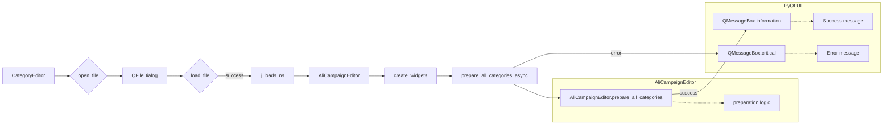

```MD
# <input code>

```python
## \file hypotez/src/suppliers/aliexpress/gui/category.py
# -*- coding: utf-8 -*-\
#! venv/Scripts/python.exe
#! venv/bin/python/python3.12

"""
.. module: src.suppliers.aliexpress.gui 
	:platform: Windows, Unix
	:synopsis:

"""
MODE = 'dev'


""" Window interface for preparing advertising campaigns """


import header
import sys
import asyncio
from pathlib import Path
from types import SimpleNamespace
from PyQt6 import QtWidgets, QtGui, QtCore
from qasync import QEventLoop, asyncSlot
from src.utils.jjson import j_loads_ns, j_dumps
from src.suppliers.aliexpress.campaign import AliCampaignEditor
```
```


```python
class CategoryEditor(QtWidgets.QWidget):
    campaign_name: str = None
    data: SimpleNamespace = None
    language: str = 'EN'
    currency: str = 'USD'
    file_path: str = None
    editor: AliCampaignEditor

    def __init__(self, parent=None, main_app=None):
        """ Initialize the main window"""
        super().__init__(parent)
        self.main_app = main_app  # Save the MainApp instance

        self.setup_ui()
        self.setup_connections()

    def setup_ui(self):
        """ Setup the user interface"""
        self.setWindowTitle("Category Editor")
        self.resize(1800, 800)

        # Define UI components
        self.open_button = QtWidgets.QPushButton("Open JSON File")
        self.open_button.clicked.connect(self.open_file)

        self.file_name_label = QtWidgets.QLabel("No file selected")

        self.prepare_all_button = QtWidgets.QPushButton("Prepare All Categories")
        self.prepare_all_button.clicked.connect(self.prepare_all_categories_async)

        self.prepare_specific_button = QtWidgets.QPushButton("Prepare Category")
        self.prepare_specific_button.clicked.connect(self.prepare_category_async)

        layout = QtWidgets.QVBoxLayout(self)
        layout.addWidget(self.open_button)
        layout.addWidget(self.file_name_label)
        layout.addWidget(self.prepare_all_button)
        layout.addWidget(self.prepare_specific_button)

        self.setLayout(layout)

    def setup_connections(self):
        """ Setup signal-slot connections"""
        pass

    def open_file(self):
        """ Open a file dialog to select and load a JSON file """
        file_path, _ = QtWidgets.QFileDialog.getOpenFileName(
            self,
            "Open JSON File",
            "c:/user/documents/repos/hypotez/data/aliexpress/campaigns",
            "JSON files (*.json)"
        )
        if not file_path:
            return  # No file selected

        self.load_file(file_path)

    def load_file(self, campaign_file):
        """ Load a JSON file """
        try:
            self.data = j_loads_ns(campaign_file)
            self.campaign_file = campaign_file
            self.file_name_label.setText(f"File: {self.campaign_file}")
            self.campaign_name = self.data.campaign_name
            path = Path(campaign_file)
            self.language = path.stem  # This will give you the file name without extension
            self.editor = AliCampaignEditor(campaign_file=campaign_file)
            self.create_widgets(self.data)
        except Exception as ex:
            QtWidgets.QMessageBox.critical(self, "Error", f"Failed to load JSON file: {ex}")

    def create_widgets(self, data):
        """ Create widgets based on the data loaded from the JSON file """
        layout = self.layout()

        # Remove previous widgets except open button and file label
        for i in reversed(range(layout.count())):
            widget = layout.itemAt(i).widget()
            if widget not in [self.open_button, self.file_name_label, self.prepare_all_button, self.prepare_specific_button]:
                widget.deleteLater()

        title_label = QtWidgets.QLabel(f"Title: {data.title}")
        layout.addWidget(title_label)

        campaign_label = QtWidgets.QLabel(f"Campaign Name: {data.campaign_name}")
        layout.addWidget(campaign_label)

        # Correct way to handle SimpleNamespace as a dict
        for category in data.categories:
            category_label = QtWidgets.QLabel(f"Category: {category.name}")
            layout.addWidget(category_label)

    @asyncSlot()
    async def prepare_all_categories_async(self):
        """ Asynchronously prepare all categories """
        if self.editor:
            try:
                await self.editor.prepare_all_categories()
                QtWidgets.QMessageBox.information(self, "Success", "All categories prepared successfully.")
            except Exception as ex:
                QtWidgets.QMessageBox.critical(self, "Error", f"Failed to prepare all categories: {ex}")

    @asyncSlot()
    async def prepare_category_async(self):
        """ Asynchronously prepare a specific category """
        if self.editor:
            try:
                await self.editor.prepare_category(self.data.campaign_name)
                QtWidgets.QMessageBox.information(self, "Success", "Category prepared successfully.")
            except Exception as ex:
                QtWidgets.QMessageBox.critical(self, "Error", f"Failed to prepare category: {ex}")
```
```

# <algorithm>

**Шаг 1:** Инициализация `CategoryEditor`.
* При создании объекта `CategoryEditor` выполняется `setup_ui` для настройки интерфейса и `setup_connections` для подключения сигналов.
* `main_app` сохраняется для дальнейшего использования (например, для взаимодействия).


**Шаг 2:** Обработка события нажатия кнопки "Открыть JSON файл".
* Вызывается `open_file`.
* Показывается диалоговое окно для выбора файла.
* Если файл выбран, то `load_file` загружает данные из файла.

**Шаг 3:** Загрузка файла `load_file`.
* Происходит попытка загрузки файла (`j_loads_ns`).
* Если загрузка прошла успешно, то данные сохраняются в `self.data`, создается `AliCampaignEditor`, заполняется  `self.editor` и `create_widgets`.
* В противном случае, выводится сообщение об ошибке.

**Шаг 4:** Создание виджетов `create_widgets`.
* Удаляются все виджеты, кроме начальных (open_button, file_name_label).
* Создаются и добавляются виджеты, отображающие информацию из загруженного файла (`data`).


**Шаг 5:** Асинхронная подготовка категорий.
* При нажатии на кнопки "Подготовить все категории" или "Подготовить категорию" запускаются асинхронные методы `prepare_all_categories_async` или `prepare_category_async`.
* Эти методы вызывают аналогичные методы в `AliCampaignEditor`.
* После успешной подготовки категории выводится сообщение об успехе.
* Если возникает ошибка, выводится сообщение об ошибке.


# <mermaid>



# <explanation>

**Импорты:**

* `header`, `sys`, `asyncio`, `pathlib`, `types`, `QtWidgets`, `QtGui`, `QtCore`, `qasync`, `j_loads_ns`, `j_dumps`, `AliCampaignEditor`: Импортируются необходимые модули из разных библиотек и пакетов проекта.  Например, `qasync` —  для асинхронных операций в PyQt, `jjson` - для работы с JSON, `AliCampaignEditor` — класс из модуля `campaign.py`, который отвечает за подготовку рекламных кампаний.

**Классы:**

* `CategoryEditor`: Класс, представляющий окно для редактирования категорий.  Содержит атрибуты для хранения данных о загруженном файле, имени кампании, пути к файлу и редакторе кампаний.  Содержит методы для инициализации, настройки пользовательского интерфейса (UI), обработки событий нажатия кнопок и загрузки/подготовки данных.

**Функции:**

* `setup_ui()`:  Настраивает UI-компоненты (кнопки, метки) и макет окна.
* `setup_connections()`: Устанавливает соединения сигналов с слотами (нажатие кнопок).  В данном коде  этот метод пустой.
* `open_file()`: Открывает диалоговое окно выбора JSON файла.
* `load_file(campaign_file)`: Загружает данные из JSON файла и инициализирует необходимые компоненты.  Обработка ошибок важна.
* `create_widgets(data)`: Создает виджеты для отображения данных из загруженного файла (заголовок, имя кампании, категории).  Реализован эффективный способ удаления предыдущих виджетов.
* `prepare_all_categories_async()`, `prepare_category_async()`: Асинхронно выполняют подготовку категорий.


**Переменные:**

* `MODE`: Переменная, вероятно, используется для определения режима работы (например, `dev` или `prod`).
* `campaign_name`, `data`, `language`, `currency`, `file_path`, `editor`:  Содержат данные о кампании, загруженные данные, язык, валюту, путь к файлу и экземпляр класса `AliCampaignEditor`.

**Возможные ошибки и улучшения:**

* Непонятно, что происходит в методе `header`.
* Нет проверки наличия `data.title`, `data.campaign_name` и `data.categories` в `load_file` и `create_widgets`. Это может привести к ошибкам при работе с файлами, которые не соответствуют ожидаемому формату.
*  Обработка ошибок в `load_file` очень важна, так как при возникновении ошибок, например, в формате JSON, приложение может аварийно завершиться.
*  Вместо `SimpleNamespace` лучше использовать стандартный словарь `dict`, так как это более удобный и гибкий способ работы с данными.
*  Нет обработки пустого файла JSON.
*  В `create_widgets` необходимо добавить проверку на корректность типа данных для `data`. Например, проверка, что `data` на самом деле является `SimpleNamespace` и содержит необходимые поля.

**Взаимосвязи с другими частями проекта:**

* `AliCampaignEditor`:  Этот класс явно взаимодействует с данным кодом.  Судя по имени, он, вероятно, находится в модуле `campaign.py` и отвечает за логику подготовки кампаний.
* `j_loads_ns`:  Функция загрузки из JSON, скорее всего, находится в модуле `jjson.py`.


```