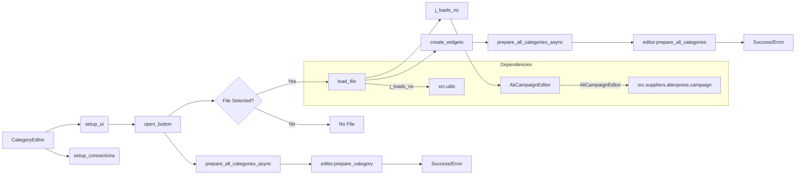

# <input code>

```python
## \file hypotez/src/suppliers/aliexpress/gui/category.py
# -*- coding: utf-8 -*-\
#! venv/Scripts/python.exe
#! venv/bin/python/python3.12

"""
.. module: src.suppliers.aliexpress.gui 
	:platform: Windows, Unix
	:synopsis:

"""
MODE = 'dev'


"""
	:platform: Windows, Unix
	:synopsis:

"""


"""
	:platform: Windows, Unix
	:synopsis:

"""


"""
  :platform: Windows, Unix

"""
"""
  :platform: Windows, Unix
  :platform: Windows, Unix
  :synopsis:
"""MODE = 'dev'
  
""" module: src.suppliers.aliexpress.gui """


""" Window interface for preparing advertising campaigns """


import header
import sys
import asyncio
from pathlib import Path
from types import SimpleNamespace
from PyQt6 import QtWidgets, QtGui, QtCore
from qasync import QEventLoop, asyncSlot
from src.utils import j_loads_ns, j_dumps
from src.suppliers.aliexpress.campaign import AliCampaignEditor
```

```markdown
# <algorithm>

**Шаг 1: Инициализация**

- Создается объект `CategoryEditor` с параметрами `parent` и `main_app`.
- Вызывается метод `setup_ui()` для настройки пользовательского интерфейса.
- Вызывается метод `setup_connections()` для настройки связей между элементами интерфейса.

**Шаг 2: Настройка пользовательского интерфейса**

- Устанавливается заголовок окна.
- Устанавливаются размеры окна.
- Создаются кнопки "Открыть JSON файл", "Подготовить все категории", "Подготовить категорию".
- Подключаются обработчики кликов кнопок к методам `open_file()`, `prepare_all_categories_async()`, `prepare_category_async()`.
- Создается и устанавливается основной макет (`QVBoxLayout`).

**Шаг 3: Обработка открытия файла**

- Вызывается диалоговое окно выбора файла.
- Если файл выбран, вызывается метод `load_file()` для загрузки данных из JSON файла.
- В методе `load_file()`:
  - Загружаются данные из JSON файла с использованием функции `j_loads_ns()`.
  - Устанавливается имя файла в соответствующей метке.
  - Сохраняется название кампании.
  - Сохраняется путь к файлу.
  - Создается объект `AliCampaignEditor` для работы с кампанией.
  - Создаются виджеты с информацией из загруженных данных.

**Шаг 4: Подготовка категорий**

- Если нажата кнопка "Подготовить все категории", вызывается асинхронный метод `prepare_all_categories_async()`.
- В `prepare_all_categories_async()`:
  - Выполняется асинхронная операция подготовки всех категорий с помощью `editor.prepare_all_categories()`.
  - Выводятся сообщения об успехе или ошибке.

- Аналогично для кнопки "Подготовить категорию" вызывается `prepare_category_async()`, выполняющий подготовку конкретной категории.

**Шаг 5: Создание виджетов**

- Метод `create_widgets()` очищает предыдущие виджеты, кроме кнопок и метки файла.
- Создает и добавляет метки с информацией о загруженных данных из `data`.

**Пример данных:**

Входной JSON:
```json
{
  "campaign_name": "MyCampaign",
  "title": "Campaign Title",
  "categories": [
    {"name": "Category 1"},
    {"name": "Category 2"}
  ]
}
```

```markdown
# <mermaid>


**Объяснение зависимостей:**

- `src.utils`:  Функции `j_loads_ns` и `j_dumps` для работы с JSON-данными.
- `src.suppliers.aliexpress.campaign`: Класс `AliCampaignEditor` для подготовки рекламных кампаний.

```markdown
# <explanation>

**Импорты:**

- `header`: Вероятно, импортирует вспомогательные функции или конфигурацию для проекта.  Без кода `header.py` сложно сказать точно.
- `sys`: Стандартный модуль Python, используемый для взаимодействия с командной строкой и системой.
- `asyncio`: Для поддержки асинхронных операций.
- `pathlib`: Для работы с файловыми путями.
- `SimpleNamespace`: Для создания объектов, похожих на словари, но с атрибутами.
- `PyQt6`: Библиотека для создания графического интерфейса пользователя в Python.
- `qasync`: Расширение для PyQt, добавляющее поддержку асинхронных операций.
- `src.utils`: Модуль, вероятно, содержит вспомогательные функции (например, для работы с JSON).
- `src.suppliers.aliexpress.campaign`: Модуль, содержащий класс `AliCampaignEditor`, отвечающий за бизнес-логику подготовки кампаний.

**Классы:**

- `CategoryEditor`: Главный класс, отвечающий за создание и управление окном.
- `AliCampaignEditor`: Класс, отвечающий за бизнес-логику подготовки кампаний, вероятно, выполняет асинхронные запросы и обновления данных.

**Функции:**

- `setup_ui()`: Настраивает пользовательский интерфейс.
- `setup_connections()`: Настраивает связи между элементами интерфейса (сигналами и слотами).
- `open_file()`: Открывает диалоговое окно выбора файла.
- `load_file()`: Загружает данные из выбранного JSON файла, инициализирует `AliCampaignEditor`.
- `create_widgets()`: Создает виджеты на основе данных из загруженного файла.
- `prepare_all_categories_async()`: Асинхронно готовит все категории.
- `prepare_category_async()`: Асинхронно готовит конкретную категорию.


**Переменные:**

- `campaign_name`, `data`, `language`, `currency`, `file_path`: Хранят данные, связанные с кампанией и выбранным файлом.
- `editor`: Объект класса `AliCampaignEditor`.

**Возможные ошибки и улучшения:**

- **Обработка ошибок:** Необходимо добавить более подробную обработку ошибок при загрузке файла (JSON может быть некорректным) и при выполнении операций подготовки.
- **Обработка пустых данных:** Проверить на пустоту переменную `data` при создании виджетов.
- **Использование более подходящей структуры данных:** Вместо `SimpleNamespace` использовать `dict` для хранения данных.
- **Отдельная функция/метод для загрузки данных и отображения:**  Разделить метод `load_file` на более мелкие, которые загружают данные и обновляют UI.
- **Комментарии:** Добавить более подробные комментарии к коду для лучшего понимания логики.
- **Оптимизация:** При большом количестве категорий можно оптимизировать процесс отображения и обновления виджетов.


**Взаимосвязь с другими частями проекта:**

Класс `CategoryEditor` взаимодействует с `AliCampaignEditor` из модуля `src.suppliers.aliexpress.campaign`.  Этот модуль, скорее всего, содержит логику для подготовки кампаний.  `src.utils` необходим для парсинга JSON.  Проект, вероятно, использует архитектуру, где `gui` отвечает за отрисовку и обработку событий, а `campaign` за выполнение бизнес-логики.