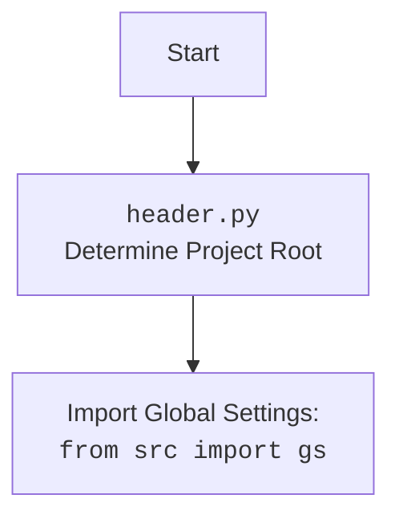

## <алгоритм>

1. **Инициализация `CategoryEditor`:**
   - Создается экземпляр `CategoryEditor`, который является виджетом `QtWidgets.QWidget`.
   - Сохраняется ссылка на `main_app` для возможного взаимодействия.
   - Вызываются `setup_ui` и `setup_connections` для настройки интерфейса и связей.
   
2. **Настройка UI (`setup_ui`):**
   - Устанавливается заголовок окна "Category Editor" и его размеры.
   - Создаются кнопки "Open JSON File", "Prepare All Categories", "Prepare Category".
   - Создается лейбл для отображения имени выбранного файла.
   - Настраивается `QVBoxLayout` для управления расположением элементов.
   - Кнопки связываются со слотами `open_file`, `prepare_all_categories_async`, `prepare_category_async`.

3. **Открытие файла (`open_file`):**
   - Открывается диалоговое окно выбора файла.
   - Если файл выбран, вызывается `load_file` с путем к файлу.

4. **Загрузка файла (`load_file`):**
   - Используется `j_loads_ns` для загрузки данных из JSON-файла в `SimpleNamespace`.
   - Сохраняются путь к файлу, имя файла, устанавливается язык из имени файла (без расширения)
   - Создается экземпляр `AliCampaignEditor`.
   - Вызывается `create_widgets` для генерации виджетов на основе загруженных данных.
   - В случае ошибки загрузки выводится сообщение об ошибке.

5. **Создание виджетов (`create_widgets`):**
    - Очищается текущий `layout` от всех элементов, кроме кнопок `open_button`, `file_name_label`, `prepare_all_button` и  `prepare_specific_button`
    - Создаются виджеты для отображения названия кампании (`title_label`), имени кампании (`campaign_label`).
    - Для каждой категории в `data.categories` создается лейбл с именем категории (`category_label`).

6. **Подготовка всех категорий (`prepare_all_categories_async`):**
    - Проверяется, инициализирован ли `self.editor`.
    - Если да, вызывается асинхронный метод `prepare_all_categories` из `AliCampaignEditor`.
    - Выводится сообщение об успехе или ошибке.

7. **Подготовка конкретной категории (`prepare_category_async`):**
    - Проверяется, инициализирован ли `self.editor`.
    - Если да, вызывается асинхронный метод `prepare_category` из `AliCampaignEditor` с именем кампании.
    - Выводится сообщение об успехе или ошибке.

## <mermaid>

```mermaid
flowchart TD
    Start(Start) --> Init[Инициализация CategoryEditor]
    Init --> SetupUI[setup_ui(): Настройка UI]
    SetupUI --> OpenButton[open_button: Кнопка "Open JSON File"]
    OpenButton -- click --> OpenFile[open_file(): Открытие диалога выбора файла]
    OpenFile -- Файл выбран --> LoadFile[load_file(file_path): Загрузка JSON файла]
    OpenFile -- Файл не выбран --> End[End]
    LoadFile --> JLoads[j_loads_ns(): Загрузка данных из JSON в SimpleNamespace]
    JLoads --> CreateEditor[Создание AliCampaignEditor]
    CreateEditor --> CreateWidgets[create_widgets(data): Создание виджетов]
    CreateWidgets --> DisplayData[Отображение данных на UI]
    DisplayData --> PrepareAllButton[prepare_all_button: Кнопка "Prepare All Categories"]
    DisplayData --> PrepareSpecificButton[prepare_specific_button: Кнопка "Prepare Category"]
    PrepareAllButton -- click --> PrepareAllAsync[prepare_all_categories_async(): Асинхронная подготовка всех категорий]
    PrepareSpecificButton -- click --> PrepareCategoryAsync[prepare_category_async(): Асинхронная подготовка категории]
    PrepareAllAsync --> PrepareAll[editor.prepare_all_categories(): Подготовка всех категорий через AliCampaignEditor]
    PrepareCategoryAsync --> PrepareCategory[editor.prepare_category(campaign_name): Подготовка конкретной категории через AliCampaignEditor]
    PrepareAll -- Успех --> SuccessAll[Показ сообщения об успехе]
    PrepareAll -- Ошибка --> ErrorAll[Показ сообщения об ошибке]
    PrepareCategory -- Успех --> SuccessCategory[Показ сообщения об успехе]
    PrepareCategory -- Ошибка --> ErrorCategory[Показ сообщения об ошибке]
    SuccessAll --> End
    ErrorAll --> End
    SuccessCategory --> End
    ErrorCategory --> End
   
    
    
```


## <объяснение>

### Импорты:

-   `header`: Используется для определения корневой директории проекта, что позволяет правильно импортировать другие модули, такие как `src.utils.jjson` и `src.suppliers.aliexpress.campaign`.  Используется для загрузки глобальных настроек проекта.
-   `sys`: Предоставляет доступ к системным переменным и функциям, хотя в данном коде явно не используется. 
-   `asyncio`: Используется для поддержки асинхронных операций, которые необходимы для выполнения неблокирующих задач.
-   `pathlib.Path`: Модуль для работы с путями файлов и директорий.
-   `types.SimpleNamespace`: Используется для создания объектов, которые могут хранить атрибуты. Данные JSON после загрузки преобразуются в `SimpleNamespace`.
-   `PyQt6.QtWidgets`, `QtGui`, `QtCore`: Модули из библиотеки PyQt6 для создания графического интерфейса.
-   `qasync.QEventLoop`, `qasync.asyncSlot`: Используются для интеграции асинхронного кода с GUI PyQt. `QEventLoop` запускает цикл событий PyQt, а `asyncSlot` позволяет использовать асинхронные функции в качестве слотов Qt.
-   `src.utils.jjson`: Модуль для загрузки и выгрузки данных в формате JSON. `j_loads_ns` загружает JSON и преобразует его в объект `SimpleNamespace`.
-   `src.suppliers.aliexpress.campaign.AliCampaignEditor`: Класс для управления рекламными кампаниями AliExpress. 

### Классы:

-   `CategoryEditor(QtWidgets.QWidget)`:
    -   **Роль**: Основной класс, представляющий виджет для редактирования категорий.
    -   **Атрибуты**:
        -   `campaign_name (str)`: Имя кампании.
        -   `data (SimpleNamespace)`: Данные кампании, загруженные из JSON.
        -   `language (str)`: Язык кампании. По умолчанию ‘EN’.
        -   `currency (str)`: Валюта кампании. По умолчанию ‘USD’.
        -   `file_path (str)`: Путь к файлу с данными кампании.
        -   `editor (AliCampaignEditor)`: Экземпляр редактора кампаний `AliCampaignEditor`.
        -   `main_app`: Ссылка на главное приложение.
    -   **Методы**:
        -   `__init__(self, parent=None, main_app=None)`: Конструктор, инициализирует окно и устанавливает UI.
        -   `setup_ui(self)`: Настраивает UI, добавляя кнопки и другие элементы.
        -   `setup_connections(self)`: Устанавливает связи между сигналами и слотами (в данном случае, пустая функция).
        -   `open_file(self)`: Открывает диалог выбора файла и вызывает `load_file`.
        -   `load_file(self, campaign_file)`: Загружает JSON-файл, создаёт экземпляр `AliCampaignEditor` и вызывает `create_widgets`.
        -   `create_widgets(self, data)`: Создаёт виджеты для отображения данных о кампании.
        -   `prepare_all_categories_async(self)`: Асинхронно подготавливает все категории с помощью `AliCampaignEditor`.
        -   `prepare_category_async(self)`: Асинхронно подготавливает конкретную категорию с помощью `AliCampaignEditor`.

### Функции:

-  `__init__(self, parent=None, main_app=None)`:
    -   **Аргументы**:
        -   `parent`: Родительский виджет.
        -  `main_app`: Ссылка на главное приложение.
    -   **Назначение**: Инициализирует виджет, сохраняет ссылку на `main_app`, настраивает пользовательский интерфейс и устанавливает соединения.
-   `setup_ui(self)`:
    -   **Аргументы**: `self` (экземпляр класса).
    -   **Назначение**: Настраивает пользовательский интерфейс, создает кнопки, устанавливает заголовок окна и layout.
-   `setup_connections(self)`:
    -   **Аргументы**: `self` (экземпляр класса).
    -   **Назначение**: Устанавливает соединения сигналов и слотов. В текущей реализации не выполняет никаких действий, является заготовкой для будущей реализации.
-  `open_file(self)`:
    -   **Аргументы**: `self` (экземпляр класса).
    -   **Назначение**: Открывает диалоговое окно для выбора JSON файла. Если файл выбран, вызывает метод `load_file`.
    - **Пример**:
         ```python
            # Запускается диалог выбора файла
            file_path, _ = QtWidgets.QFileDialog.getOpenFileName(
                self,
                "Open JSON File",
                "c:/user/documents/repos/hypotez/data/aliexpress/campaigns",
                "JSON files (*.json)"
            )
            # Если файл выбран - вызов load_file()
            if file_path:
               self.load_file(file_path)
         ```

-  `load_file(self, campaign_file)`:
    -   **Аргументы**:
        -  `campaign_file`: Путь к загружаемому JSON файлу.
    -   **Назначение**: Загружает данные из JSON файла, сохраняет имя файла, путь к файлу, язык, и создает экземпляр `AliCampaignEditor`.
    -   **Возвращаемое значение**: Нет.
    - **Пример**:
         ```python
            self.data = j_loads_ns(campaign_file)  # Загружает данные в SimpleNamespace
            self.campaign_file = campaign_file # Сохраняем имя файла
            self.file_name_label.setText(f"File: {self.campaign_file}")  # Отображаем имя файла
            self.campaign_name = self.data.campaign_name # Сохраняем имя кампании
            path = Path(campaign_file)  # Создаем объект Path
            self.language = path.stem  # Определяем язык из имени файла
            self.editor = AliCampaignEditor(campaign_file=campaign_file) # Создаем редактор кампаний
            self.create_widgets(self.data) # Создаем виджеты на основе загруженных данных

         ```

-  `create_widgets(self, data)`:
    -   **Аргументы**:
        -   `data`: Объект `SimpleNamespace` с данными кампании.
    -   **Назначение**: Создает и добавляет виджеты (метки) на основе данных кампании, отображая имя кампании, заголовок и категории.
    -   **Возвращаемое значение**: Нет.
    - **Пример**:
         ```python
            layout = self.layout() # Получаем Layout
            for i in reversed(range(layout.count())): # Очистка layout
                 widget = layout.itemAt(i).widget()
                 if widget not in [self.open_button, self.file_name_label, self.prepare_all_button, self.prepare_specific_button]:
                     widget.deleteLater()

            title_label = QtWidgets.QLabel(f"Title: {data.title}") # Создание виджета
            layout.addWidget(title_label)  # Добавление виджета в layout

            campaign_label = QtWidgets.QLabel(f"Campaign Name: {data.campaign_name}")
            layout.addWidget(campaign_label)

            for category in data.categories:
               category_label = QtWidgets.QLabel(f"Category: {category.name}")
               layout.addWidget(category_label)
         ```

-   `prepare_all_categories_async(self)`:
    -   **Аргументы**: `self` (экземпляр класса).
    -   **Назначение**: Асинхронно вызывает метод `prepare_all_categories` из `AliCampaignEditor` для обработки всех категорий.
    -   **Возвращаемое значение**: Нет.
    -   **Пример**:
         ```python
            if self.editor: # Проверяем существование редактора
                try:
                     await self.editor.prepare_all_categories() # Вызываем асинхронный метод редактора
                     QtWidgets.QMessageBox.information(self, "Success", "All categories prepared successfully.") # Вывод сообщения
                except Exception as ex:
                     QtWidgets.QMessageBox.critical(self, "Error", f"Failed to prepare all categories: {ex}") # Вывод сообщения об ошибке
         ```

-   `prepare_category_async(self)`:
    -   **Аргументы**: `self` (экземпляр класса).
    -   **Назначение**: Асинхронно вызывает метод `prepare_category` из `AliCampaignEditor` для обработки конкретной категории.
    -   **Возвращаемое значение**: Нет.
    -   **Пример**:
        ```python
            if self.editor: # Проверяем существование редактора
                try:
                   await self.editor.prepare_category(self.data.campaign_name) # Вызываем асинхронный метод редактора
                   QtWidgets.QMessageBox.information(self, "Success", "Category prepared successfully.") # Вывод сообщения
                except Exception as ex:
                   QtWidgets.QMessageBox.critical(self, "Error", f"Failed to prepare category: {ex}") # Вывод сообщения об ошибке
         ```

### Переменные:

-   `campaign_name (str)`: Имя кампании, полученное из данных JSON.
-   `data (SimpleNamespace)`: Данные кампании, загруженные из JSON файла.
-   `language (str)`: Язык, извлеченный из имени файла.
-   `currency (str)`: Валюта, по умолчанию USD.
-   `file_path (str)`: Путь к загруженному файлу.
-   `editor (AliCampaignEditor)`: Экземпляр класса `AliCampaignEditor`.
-   `open_button (QtWidgets.QPushButton)`: Кнопка для открытия файла.
-  `file_name_label (QtWidgets.QLabel)`: Лейбл для отображения имени файла.
-   `prepare_all_button (QtWidgets.QPushButton)`: Кнопка для подготовки всех категорий.
-   `prepare_specific_button (QtWidgets.QPushButton)`: Кнопка для подготовки конкретной категории.
-  `layout (QtWidgets.QVBoxLayout)`: Layout для управления расположением элементов
- `campaign_file (str)`: путь к файлу кампании

### Потенциальные ошибки и области для улучшения:

1.  **Обработка ошибок**: В коде присутствуют блоки `try...except`, но обработка ошибок может быть более подробной, например, логирование ошибок.
2.  **UI/UX**: Интерфейс можно улучшить, добавив индикаторы загрузки, прогресс-бары, и т.д.
3.  **Валидация данных**: Можно добавить проверку данных при загрузке, например, проверку наличия нужных полей в JSON.
4.  **Гибкость**: Можно сделать более гибким путь к файлам (например, запоминать последний открытый путь).
5.  **`setup_connections`**: Метод `setup_connections` не имеет реализации, что может быть областью для будущего развития функциональности.

### Взаимосвязи с другими частями проекта:

-   Импортирует `src.utils.jjson` для работы с JSON.
-   Импортирует `src.suppliers.aliexpress.campaign.AliCampaignEditor` для управления кампаниями AliExpress.
-   Использует `header.py` для определения корневой директории проекта.

В целом, код обеспечивает базовую функциональность для редактирования и подготовки категорий из JSON-файлов.