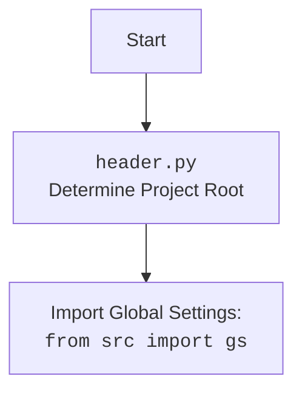

## <алгоритм>

1. **Инициализация:**
   - Создается экземпляр класса `CategoryEditor`.
   - Сохраняется ссылка на главное приложение `main_app`.
   - Вызывается `setup_ui` для настройки интерфейса и `setup_connections` для установки связей.

   ```python
   def __init__(self, parent=None, main_app=None):
       super().__init__(parent)
       self.main_app = main_app
       self.setup_ui()
       self.setup_connections()
   ```

2. **Настройка UI (`setup_ui`):**
   - Устанавливается заголовок окна.
   - Определяются кнопки "Open JSON File" (`open_button`), "Prepare All Categories" (`prepare_all_button`), "Prepare Category" (`prepare_specific_button`), и метка для отображения имени файла (`file_name_label`).
   - Устанавливаются обработчики событий для кнопок:
     - `open_button` вызывает метод `open_file` при нажатии.
     - `prepare_all_button` вызывает `prepare_all_categories_async`.
     - `prepare_specific_button` вызывает `prepare_category_async`.
   - Компоненты добавляются на макет окна.

   ```python
    def setup_ui(self):
        self.setWindowTitle("Category Editor")
        self.resize(1800, 800)
        self.open_button = QtWidgets.QPushButton("Open JSON File")
        self.open_button.clicked.connect(self.open_file)
        self.file_name_label = QtWidgets.QLabel("No file selected")
        self.prepare_all_button = QtWidgets.QPushButton("Prepare All Categories")
        self.prepare_all_button.clicked.connect(self.prepare_all_categories_async)
        self.prepare_specific_button = QtWidgets.QPushButton("Prepare Category")
        self.prepare_specific_button.clicked.connect(self.prepare_category_async)

        layout = QtWidgets.QVBoxLayout(self)
        layout.addWidget(self.open_button)
        layout.addWidget(self.file_name_label)
        layout.addWidget(self.prepare_all_button)
        layout.addWidget(self.prepare_specific_button)
        self.setLayout(layout)
   ```

3. **Открытие файла (`open_file`):**
   - Открывается диалоговое окно выбора файла (`QFileDialog`).
   - Если файл выбран, вызывается `load_file` с путем к файлу.

    ```python
    def open_file(self):
        file_path, _ = QtWidgets.QFileDialog.getOpenFileName(
            self,
            "Open JSON File",
            "c:/user/documents/repos/hypotez/data/aliexpress/campaigns",
            "JSON files (*.json)"
        )
        if not file_path:
            return  
        self.load_file(file_path)
   ```

4. **Загрузка файла (`load_file`):**
   - Загружает JSON-данные из файла с помощью `j_loads_ns` и сохраняет в `self.data`.
   - Сохраняет путь к файлу в `self.campaign_file`.
   - Устанавливает текст метки имени файла.
   - Извлекает имя кампании из `self.data.campaign_name`.
   - Определяет язык на основе имени файла.
   - Создает экземпляр `AliCampaignEditor`.
   - Вызывает `create_widgets` для создания виджетов на основе загруженных данных.
   - В случае ошибки выводит сообщение об ошибке.

    ```python
   def load_file(self, campaign_file):
        try:
            self.data = j_loads_ns(campaign_file)
            self.campaign_file = campaign_file
            self.file_name_label.setText(f"File: {self.campaign_file}")
            self.campaign_name = self.data.campaign_name
            path = Path(campaign_file)
            self.language = path.stem
            self.editor = AliCampaignEditor(campaign_file=campaign_file)
            self.create_widgets(self.data)
        except Exception as ex:
            QtWidgets.QMessageBox.critical(self, "Error", f"Failed to load JSON file: {ex}")
    ```

5. **Создание виджетов (`create_widgets`):**
   - Очищает макет от старых виджетов, кроме кнопок "Open" и меток.
   - Создает метки для отображения заголовка и имени кампании.
   - Для каждой категории создает метку с ее именем.

    ```python
    def create_widgets(self, data):
        layout = self.layout()
        for i in reversed(range(layout.count())):
            widget = layout.itemAt(i).widget()
            if widget not in [self.open_button, self.file_name_label, self.prepare_all_button, self.prepare_specific_button]:
                widget.deleteLater()
        title_label = QtWidgets.QLabel(f"Title: {data.title}")
        layout.addWidget(title_label)
        campaign_label = QtWidgets.QLabel(f"Campaign Name: {data.campaign_name}")
        layout.addWidget(campaign_label)

        for category in data.categories:
            category_label = QtWidgets.QLabel(f"Category: {category.name}")
            layout.addWidget(category_label)
    ```

6. **Подготовка всех категорий (`prepare_all_categories_async`):**
   - Асинхронно вызывает метод `prepare_all_categories` экземпляра `AliCampaignEditor`.
   - Выводит сообщение об успехе или ошибке.

    ```python
    @asyncSlot()
    async def prepare_all_categories_async(self):
        if self.editor:
            try:
                await self.editor.prepare_all_categories()
                QtWidgets.QMessageBox.information(self, "Success", "All categories prepared successfully.")
            except Exception as ex:
                QtWidgets.QMessageBox.critical(self, "Error", f"Failed to prepare all categories: {ex}")
    ```
7. **Подготовка конкретной категории (`prepare_category_async`):**
   - Асинхронно вызывает метод `prepare_category` экземпляра `AliCampaignEditor`.
   - Выводит сообщение об успехе или ошибке.

    ```python
   @asyncSlot()
    async def prepare_category_async(self):
        if self.editor:
            try:
                await self.editor.prepare_category(self.data.campaign_name)
                QtWidgets.QMessageBox.information(self, "Success", "Category prepared successfully.")
            except Exception as ex:
                QtWidgets.QMessageBox.critical(self, "Error", f"Failed to prepare category: {ex}")
    ```

## <mermaid>
```mermaid
flowchart TD
    Start[Start] --> Init[<code>CategoryEditor</code><br>Initialize GUI]
    Init --> SetupUI[<code>setup_ui</code><br>Set up User Interface]
    SetupUI --> OpenButton[Open JSON File Button]
    OpenButton --Click--> OpenFile[<code>open_file</code><br>Open File Dialog]
    OpenFile --File Selected--> LoadFile[<code>load_file</code><br>Load JSON File]
    OpenFile --No File--> End[End]    
    LoadFile --> CreateEditor[Create <code>AliCampaignEditor</code> instance]
    LoadFile --> CreateWidgets[<code>create_widgets</code><br>Create UI Elements from Data]
    CreateWidgets --> DisplayData[Display data on window]
    SetupUI --> PrepareAllButton[Prepare All Categories Button]
    PrepareAllButton --Click--> PrepareAllAsync[<code>prepare_all_categories_async</code><br>Asynchronously Prepare All Categories]
    PrepareAllAsync --> AliPrepareAll[<code>editor.prepare_all_categories()</code>]
    AliPrepareAll --> ShowMessageSuccessAll[Show success message]    
    PrepareAllAsync -- Exception --> ShowMessageErrorAll[Show error message]
    
    SetupUI --> PrepareSpecificButton[Prepare Category Button]
    PrepareSpecificButton --Click--> PrepareCategoryAsync[<code>prepare_category_async</code><br>Asynchronously Prepare Category]
    PrepareCategoryAsync --> AliPrepareCategory[<code>editor.prepare_category()</code>]
     AliPrepareCategory --> ShowMessageSuccessCategory[Show success message]    
    PrepareCategoryAsync -- Exception --> ShowMessageErrorCategory[Show error message]
    ShowMessageSuccessAll-->End
    ShowMessageErrorAll-->End
     ShowMessageSuccessCategory-->End
    ShowMessageErrorCategory-->End
   
    DisplayData --> End
    CreateEditor--> End
    
```



## <объяснение>

**Импорты:**

-   `import header`: Импортирует модуль `header.py`, который, вероятно, отвечает за определение корневого каталога проекта и глобальных настроек. (См. `mermaid` блок выше)
-   `import sys`: Предоставляет доступ к некоторым переменным и функциям, взаимодействующим с интерпретатором Python.
-   `import asyncio`: Используется для поддержки асинхронного программирования, позволяя выполнять операции ввода-вывода неблокирующим способом.
-   `from pathlib import Path`: Предоставляет класс `Path` для работы с путями к файлам и директориям.
-   `from types import SimpleNamespace`: Используется для создания объектов с произвольными атрибутами, что удобно для хранения данных, загруженных из JSON.
-   `from PyQt6 import QtWidgets, QtGui, QtCore`: Импортирует необходимые модули из библиотеки PyQt6 для создания графического интерфейса пользователя.
-   `from qasync import QEventLoop, asyncSlot`: Интегрирует асинхронное программирование в цикл событий PyQt6.
-   `from src.utils.jjson import j_loads_ns, j_dumps`: Импортирует функции `j_loads_ns` и `j_dumps` из модуля `src.utils.jjson` для загрузки и сохранения данных в формате JSON. Функция `j_loads_ns`, вероятно, загружает JSON и преобразует его в `SimpleNamespace`.
-   `from src.suppliers.aliexpress.campaign import AliCampaignEditor`: Импортирует класс `AliCampaignEditor` из модуля `src.suppliers.aliexpress.campaign`, который отвечает за подготовку рекламных кампаний AliExpress.

**Классы:**

-   **`CategoryEditor(QtWidgets.QWidget)`**:
    -   **Роль**: Главный класс, представляющий окно редактора категорий. Наследуется от `QtWidgets.QWidget`, что делает его виджетом PyQt.
    -   **Атрибуты**:
        -   `campaign_name`: Строка с именем кампании.
        -   `data`: Объект `SimpleNamespace`, содержащий данные, загруженные из JSON-файла.
        -   `language`: Строка, представляющая язык (по умолчанию 'EN').
        -   `currency`: Строка, представляющая валюту (по умолчанию 'USD').
        -   `file_path`: Строка с путем к файлу.
        -   `editor`: Экземпляр класса `AliCampaignEditor`.
        -    `main_app`: Ссылка на главное приложение, переданная при инициализации.
    -   **Методы**:
        -   `__init__(self, parent=None, main_app=None)`: Конструктор класса, инициализирует окно и устанавливает UI.
        -   `setup_ui(self)`: Настраивает пользовательский интерфейс окна, создавая кнопки и метки.
        -   `setup_connections(self)`: Настраивает соединения между сигналами и слотами (в данном случае, пока не используется).
        -   `open_file(self)`: Открывает диалоговое окно выбора файла и вызывает метод `load_file`, если файл выбран.
        -   `load_file(self, campaign_file)`: Загружает данные из JSON-файла, устанавливает путь к файлу и создает `AliCampaignEditor`.
        -   `create_widgets(self, data)`: Создает виджеты на основе загруженных данных, включая метки для заголовка, имени кампании и категорий.
        -   `prepare_all_categories_async(self)`: Асинхронно подготавливает все категории, используя `AliCampaignEditor`.
        -   `prepare_category_async(self)`: Асинхронно подготавливает конкретную категорию, используя `AliCampaignEditor`.

**Функции:**

-   Все методы, объявленные в классе `CategoryEditor`, являются функциями. Их назначение подробно описано в разделе "Классы" выше.
-   `asyncSlot()`: Декоратор, позволяющий асинхронным методам корректно работать в цикле событий PyQt6.
-   `j_loads_ns(campaign_file)`: Функция из `src.utils.jjson`, загружает JSON из файла и возвращает `SimpleNamespace`.
-   `QFileDialog.getOpenFileName(...)`: Статический метод из `QtWidgets.QFileDialog`, открывает диалоговое окно для выбора файла.
-   `QMessageBox.critical(...)`: Статический метод из `QtWidgets.QMessageBox`, отображает окно с сообщением об ошибке.
-   `QMessageBox.information(...)`: Статический метод из `QtWidgets.QMessageBox`, отображает окно с информационным сообщением.

**Переменные:**

-   `campaign_name`, `data`, `language`, `currency`, `file_path`, `editor`, `main_app`: Атрибуты класса `CategoryEditor`, типы которых определены в разделе "Классы".
-   `self`: Ссылка на текущий экземпляр класса `CategoryEditor`.
-   `parent`: Родительский виджет, переданный при создании экземпляра `CategoryEditor` (по умолчанию `None`).
-   `layout`: Объект макета, используемый для размещения виджетов.
-   `file_path`: Путь к выбранному файлу.
-   `_`:  Переменная, используемая для обозначения игнорируемого возвращаемого значения из функции `getOpenFileName`.
-  `title_label`, `campaign_label`, `category_label`: Локальные переменные для создания и добавления виджетов `QLabel`.

**Цепочка взаимосвязей с другими частями проекта:**

-   Модуль `category.py` является частью GUI для работы с поставщиком AliExpress. Он зависит от `src.suppliers.aliexpress.campaign.AliCampaignEditor`, который отвечает за логику подготовки кампаний.
-   Использует `src.utils.jjson` для загрузки данных из JSON-файлов.
-   Использует `src.header`, вероятно для получения доступа к глобальным настройкам.
-   Работает в асинхронном режиме с использованием `asyncio` и `qasync`.
-   GUI построен на основе `PyQt6`.
-   Зависит от структуры JSON-файлов с данными о кампаниях.

**Потенциальные ошибки и области для улучшения:**

-   Отсутствует обработка случая, когда `self.editor` равен `None` в асинхронных методах (`prepare_all_categories_async`, `prepare_category_async`). Хотя это не должно происходить, если файл был загружен успешно, лучше добавить дополнительную проверку.
-  В методе `load_file` язык извлекается из имени файла, что может быть не всегда корректно, стоит сделать более гибкий способ определения языка.
-  В методе `create_widgets` используется хардкод для исключения виджетов из удаления. Возможно стоит создать отдельный список виджетов для исключения, чтобы сделать код более читаемым и гибким.
-   Интерфейс выглядит очень просто, возможно стоит добавить больше функциональности и визуальных элементов, например, для редактирования данных.
-   Обработка ошибок может быть улучшена, например, можно добавить логирование ошибок и подробные сообщения для пользователя.
-   Не предусмотрена валидация данных, загружаемых из JSON. Это может привести к ошибкам при обработке некорректных данных.
-   Метод `setup_connections` не содержит никакой логики. Возможно стоит добавить функционал по обработке сигналов/событий.