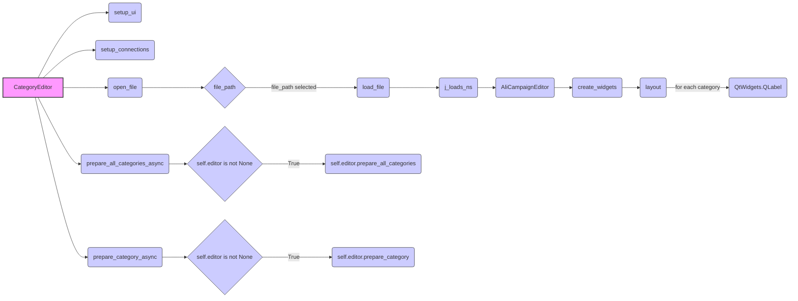

## <алгоритм>

**Блок-схема:**

1.  **Инициализация ( `__init__` ):**
    *   Создается экземпляр `CategoryEditor`, наследующий от `QtWidgets.QWidget`.
    *   Сохраняется ссылка на `main_app`.
    *   Вызывается `setup_ui()` для настройки интерфейса.
    *   Вызывается `setup_connections()` для настройки связей (в данном коде пока не реализовано).
    *   **Пример:** `category_editor = CategoryEditor(parent, main_app)`

2.  **Настройка UI ( `setup_ui` ):**
    *   Устанавливается заголовок окна "Category Editor".
    *   Устанавливается размер окна.
    *   Создаются кнопки "Open JSON File", "Prepare All Categories", "Prepare Category".
    *   Создается метка `file_name_label` для отображения имени файла.
    *   Кнопки связываются с соответствующими функциями-обработчиками событий ( `open_file`, `prepare_all_categories_async`, `prepare_category_async`).
    *   Добавление всех виджетов в вертикальный макет.
    *   **Пример:** Создается кнопка "Open JSON File" и привязывается к `open_file`.

3.  **Открытие файла ( `open_file` ):**
    *   Открывается диалоговое окно для выбора JSON-файла.
        *   **Пример:** Пользователь выбирает `campaign_en.json`.
    *   Если файл не выбран, функция завершается.
    *   Вызывается `load_file()` с путем к файлу.

4.  **Загрузка файла ( `load_file` ):**
    *   Загружает JSON-файл с помощью `j_loads_ns` и преобразует в `SimpleNamespace`.
    *   Сохраняет путь к файлу в `self.campaign_file` и устанавливает текст метки.
    *   Извлекает имя файла без расширения и сохраняет в `self.language`.
    *   Создает экземпляр `AliCampaignEditor` с путем к файлу.
    *   Вызывает `create_widgets()` для создания динамических виджетов.
    *   Обрабатывает исключения с выводом ошибки.
     *   **Пример:**  JSON файл `campaign_en.json` с данными  `{"campaign_name": "test_campaign", "title": "Test Campaign", "categories": [{"name": "Category 1"}, {"name": "Category 2"}]}` преобразуется в SimpleNamespace.

5.  **Создание виджетов ( `create_widgets` ):**
    *   Получает макет окна.
    *   Удаляет все предыдущие виджеты, кроме кнопок `open_button` и меток `file_name_label`, `prepare_all_button` и `prepare_specific_button`.
    *   Создает и добавляет метку с названием кампании.
    *   Создает и добавляет метку с именем кампании.
    *   Для каждой категории в `data.categories` создает метку с названием категории.
    *   **Пример:**  Для данных  `{"campaign_name": "test_campaign", "title": "Test Campaign", "categories": [{"name": "Category 1"}, {"name": "Category 2"}]}` создаются метки "Title: Test Campaign", "Campaign Name: test_campaign", "Category: Category 1", "Category: Category 2".

6.  **Асинхронная подготовка всех категорий (`prepare_all_categories_async`):**
    *   Проверяет, что `self.editor` инициализирован.
    *   Вызывает `self.editor.prepare_all_categories()` асинхронно.
    *   Выводит сообщение об успехе или ошибке.
      *   **Пример:** Вызов `await self.editor.prepare_all_categories()` приводит к асинхронному выполнению подготовки категорий, по завершении отображается сообщение.

7.  **Асинхронная подготовка категории (`prepare_category_async`):**
    *   Проверяет, что `self.editor` инициализирован.
    *   Вызывает `self.editor.prepare_category()` асинхронно с именем кампании.
    *   Выводит сообщение об успехе или ошибке.
        *   **Пример:** Вызов `await self.editor.prepare_category(self.data.campaign_name)` приводит к асинхронному выполнению подготовки категории, по завершении отображается сообщение.

## <mermaid>

**Анализ зависимостей:**

*   `CategoryEditor`: Основной класс, представляющий окно редактора категорий.
*   `setup_ui`: Метод для настройки пользовательского интерфейса.
*   `setup_connections`: Метод для установки связей между сигналами и слотами (в данном коде пока не реализовано).
*    `open_file`: Метод для открытия диалогового окна выбора файла.
*   `file_path`: Переменная, содержащая путь к выбранному файлу.
*    `load_file`: Метод для загрузки данных из JSON-файла.
*   `j_loads_ns`: Функция из `src.utils.jjson` для загрузки JSON в `SimpleNamespace`.
*   `AliCampaignEditor`: Класс из `src.suppliers.aliexpress.campaign` для редактирования кампаний.
*   `create_widgets`: Метод для динамического создания виджетов на основе загруженных данных.
*   `layout`: Ссылка на layout виджета.
*    `QtWidgets.QLabel`: Виджет для отображения текстовой информации.
*   `prepare_all_categories_async`: Асинхронный метод для подготовки всех категорий.
*    `self.editor`: Экземпляр класса `AliCampaignEditor`.
*    `self.editor.prepare_all_categories`: Метод класса `AliCampaignEditor` для подготовки всех категорий.
*   `prepare_category_async`: Асинхронный метод для подготовки конкретной категории.
*   `self.editor.prepare_category`: Метод класса `AliCampaignEditor` для подготовки категории.

**Описание зависимостей:**

*   Класс `CategoryEditor` использует `QtWidgets` для создания GUI.
*   `CategoryEditor` использует `j_loads_ns` для загрузки данных из JSON.
*   `CategoryEditor` использует `AliCampaignEditor` для подготовки данных кампании.
*   Методы `prepare_all_categories_async` и `prepare_category_async` асинхронно вызывают методы `AliCampaignEditor`.

## <объяснение>

**Импорты:**

*   `header`: Импортируется для, вероятно, общих настроек.
*   `sys`: Стандартный модуль для доступа к системным параметрам.
*   `asyncio`: Стандартный модуль для асинхронного программирования.
*   `pathlib.Path`:  Для работы с путями к файлам.
*   `types.SimpleNamespace`: Для создания объектов, атрибуты которых можно задавать как свойства.
*   `PyQt6.QtWidgets`, `QtGui`, `QtCore`: Библиотека PyQt6 для создания GUI.
*   `qasync.QEventLoop`, `asyncSlot`:  Для интеграции асинхронного кода с PyQt6.
*   `src.utils.jjson.j_loads_ns`, `j_dumps`: Функции для работы с JSON, загрузка и сохранение, соответственно.
*   `src.suppliers.aliexpress.campaign.AliCampaignEditor`: Класс для редактирования кампаний.

**Классы:**

*   `CategoryEditor(QtWidgets.QWidget)`:
    *   **Роль:** Основной класс для создания окна редактора категорий.
    *   **Атрибуты:**
        *   `campaign_name` (str): Имя кампании.
        *   `data` (SimpleNamespace): Данные, загруженные из JSON.
        *   `language` (str): Язык кампании.
        *   `currency` (str): Валюта кампании (по умолчанию "USD").
        *   `file_path` (str): Путь к файлу.
        *   `editor` (AliCampaignEditor): Экземпляр редактора кампаний.
        *   `main_app`:  Ссылка на экземпляр главного приложения.
    *   **Методы:**
        *   `__init__(self, parent=None, main_app=None)`: Инициализирует окно, устанавливает пользовательский интерфейс и связи.
        *   `setup_ui(self)`: Настраивает пользовательский интерфейс, создавая кнопки, метки и организуя их расположение в макете.
        *   `setup_connections(self)`:  Метод для настройки сигналов и слотов. В данном примере пока не используется.
        *   `open_file(self)`: Открывает диалог выбора файла и вызывает `load_file` если файл выбран.
        *   `load_file(self, campaign_file)`: Загружает данные из JSON-файла, создает экземпляр `AliCampaignEditor`, создает виджеты.
        *   `create_widgets(self, data)`: Создает динамические виджеты на основе загруженных данных.
        *  `prepare_all_categories_async(self)`: Асинхронно подготавливает все категории через `self.editor.prepare_all_categories()`
        *   `prepare_category_async(self)`: Асинхронно подготавливает выбранную категорию через  `self.editor.prepare_category(self.data.campaign_name)`
    *   **Взаимодействие:**
        *   Взаимодействует с `QtWidgets` для создания GUI.
        *   Использует `src.utils.jjson` для загрузки данных из JSON.
        *   Использует `AliCampaignEditor` для подготовки данных кампаний.
        *   Взаимодействует с `main_app` через ссылку на экземпляр главного приложения, переданного в конструктор.

**Функции:**

*   `__init__`:  Инициализатор класса `CategoryEditor`. Принимает ссылку на родительский виджет `parent` и ссылку на экземпляр главного приложения `main_app`.
*   `setup_ui`: Создает и настраивает пользовательский интерфейс окна (кнопки, метки, макет).
*   `setup_connections`: Настраивает связи сигналов и слотов, в данном коде не реализован.
*   `open_file`: Открывает диалог выбора файла, вызывыет `load_file`, если файл выбран.
*   `load_file`: Загружает данные из JSON-файла с использованием `j_loads_ns`, устанавливает текст метки с именем файла, создает экземпляр `AliCampaignEditor`, создает динамические виджеты.
*   `create_widgets`: Создает виджеты для отображения данных о кампании (заголовок, имя кампании, категории).
*    `prepare_all_categories_async`: Асинхронно подготавливает все категории. Вызывает метод  `self.editor.prepare_all_categories()`, если `self.editor` инициализирован, выводит сообщение об успехе или ошибке.
*    `prepare_category_async`: Асинхронно подготавливает выбранную категорию. Вызывает метод `self.editor.prepare_category(self.data.campaign_name)`, если `self.editor` инициализирован, выводит сообщение об успехе или ошибке.

**Переменные:**

*   `MODE`: Глобальная переменная, установленная в `'dev'`, предположительно для указания режима работы.
*   `campaign_name`: Строка, содержащая имя кампании.
*   `data`:  Объект `SimpleNamespace`, содержащий данные, загруженные из JSON файла.
*    `language`: Строка, представляющая язык кампании.
*    `currency`: Строка, представляющая валюту кампании.
*    `file_path`: Строка, представляющая путь к файлу.
*    `editor`: Экземпляр `AliCampaignEditor`, используемый для подготовки данных.
*    `main_app`: Ссылка на экземпляр главного приложения.

**Потенциальные ошибки и области для улучшения:**

*   **Обработка ошибок:** Код обрабатывает исключения при загрузке файла и подготовке категорий, но можно добавить более подробное логирование.
*   **Связи (setup_connections):**  Метод `setup_connections` пока не реализован, что может быть расширено в будущих версиях.
*   **Управление памятью:** При удалении старых виджетов в `create_widgets` используется `deleteLater()`, что хорошо, но нужно убедиться, что удалены все связанные объекты.
*   **Модульность:**  Возможно разбить класс `CategoryEditor` на более мелкие, чтобы каждый класс отвечал за свою часть функционала.

**Взаимосвязи с другими частями проекта:**

*   Использует `src.utils.jjson` для работы с JSON.
*   Использует `src.suppliers.aliexpress.campaign.AliCampaignEditor` для редактирования кампаний Aliexpress.
*   Предположительно, является частью более крупного GUI-приложения.
*   Зависит от `header` для общих настроек, которые, вероятно, используются во всем проекте.