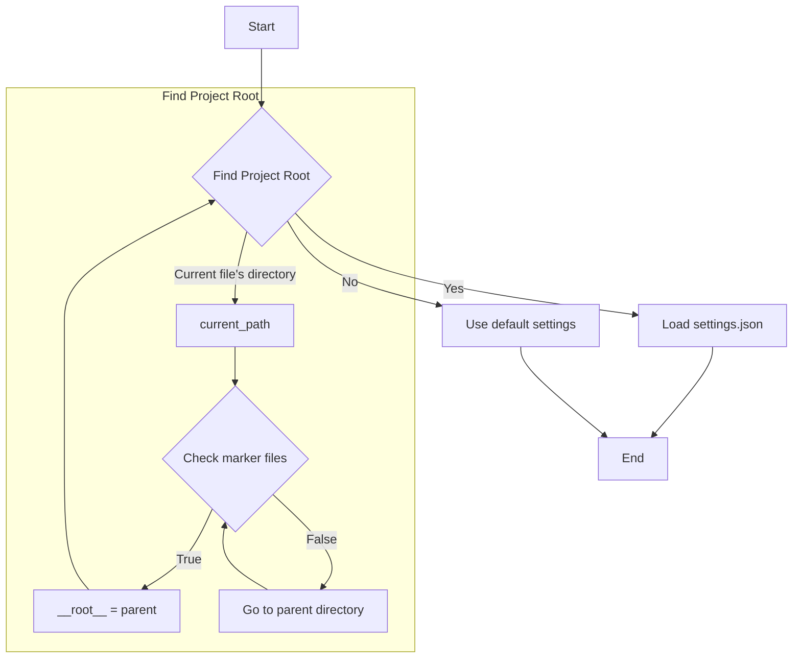
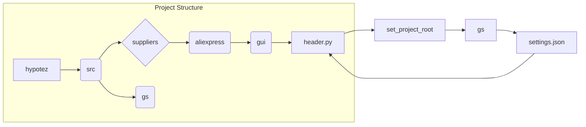

```MD
# <input code>

```python
## \file hypotez/src/suppliers/aliexpress/gui/header.py
# -*- coding: utf-8 -*-\
#! venv/Scripts/python.exe
#! venv/bin/python/python3.12

"""
.. module: src.suppliers.aliexpress.gui 
	:platform: Windows, Unix
	:synopsis:

"""
MODE = 'dev'

import sys
import json
from packaging.version import Version

from pathlib import Path
def set_project_root(marker_files=(\'pyproject.toml\', \'requirements.txt\', \'.git\')) -> Path:
    """
    Finds the root directory of the project starting from the current file's directory,
    searching upwards and stopping at the first directory containing any of the marker files.

    Args:
        marker_files (tuple): Filenames or directory names to identify the project root.
    
    Returns:
        Path: Path to the root directory if found, otherwise the directory where the script is located.
    """
    __root__:Path
    current_path:Path = Path(__file__).resolve().parent
    __root__ = current_path
    for parent in [current_path] + list(current_path.parents):
        if any((parent / marker).exists() for marker in marker_files):
            __root__ = parent
            break
    if __root__ not in sys.path:
        sys.path.insert(0, str(__root__))
    return __root__


# Get the root directory of the project
__root__ = set_project_root()
"""__root__ (Path): Path to the root directory of the project"""

from src import gs

settings:dict = None
try:
    with open(gs.path.root / 'src' / 'settings.json', 'r') as settings_file:
        settings = json.load(settings_file)
except (FileNotFoundError, json.JSONDecodeError):
    ...
```

# <algorithm>



**Пример:**

Если файл `header.py` находится в `hypotez/src/suppliers/aliexpress/gui`, поиск корневой директории начнется с этой папки и будет продолжен вверх по дереву директорий.  Если в `pyproject.toml`, `requirements.txt` или `.git` есть в директории `hypotez`, то эта директория станет корневой.

# <mermaid>



**Объяснение диаграммы:**

Диаграмма демонстрирует взаимосвязи внутри проекта. `hypotez` - корневая директория. `src` - директория содержащая ресурсы проекта. `gs` - вероятно, модуль для работы с файловой системой (`gs.path.root`). `settings.json` - файл с настройками.  `header.py` использует `set_project_root` для определения `__root__` и далее `gs` для доступа к `settings.json`.


# <explanation>

**Импорты:**

- `sys`: Предоставляет доступ к системным переменным, в частности, `sys.path`, что важно для импорта модулей из других директорий проекта.
- `json`: Для работы с файлами JSON.
- `packaging.version`: Для работы с версиями пакетов.
- `pathlib`: Для работы с путями к файлам.
- `src.gs`: Импортируется модуль `gs`, предположительно, содержащий вспомогательные функции для работы с файлами, включая получение пути к корневой директории проекта (зависимость от `gs`).

**Классы:**

Код не содержит классов.

**Функции:**

- `set_project_root(marker_files=...) -> Path`:  Находит корневую директорию проекта, начиная с текущего файла.
    - `marker_files`: кортеж с именами файлов/директорий, по наличию которых определяется корневая директория. По умолчанию `pyproject.toml`, `requirements.txt` и `.git`.
    - Возвращает `Path` к корневой директории или директорию текущего файла, если корневая не найдена.
    - Вставляет корневую директорию в `sys.path`, что позволяет импортировать модули из других частей проекта.

**Переменные:**

- `MODE`: Строковая константа, содержащая режим работы.
- `__root__`: `Path` объект, хранящий путь к корневой директории проекта.
- `settings`: `dict` объект, хранящий настройки из `settings.json` или `None` при ошибке.

**Возможные ошибки или области для улучшений:**

- **Обработка ошибок:** Блок `try...except` для открытия и чтения `settings.json` обрабатывает `FileNotFoundError` и `json.JSONDecodeError`, но не предоставляет пользователю информации об ошибке. Можно добавить вывод сообщений об ошибке.
- **`gs` модуль:** Нет ясности, что делает модуль `gs`. Необходимо определить его роль и функциональность, чтобы улучшить понимание кода.
- **Типизация:** При использовании аннотаций типов в `set_project_root` стоит использовать `Union`.  Возвращаемое значение может быть как `Path` так и обычной строкой.
- **Обработка путей:** Лучше использовать абсолютные пути (`Path.absolute()`) при работе с файлами, что повышает надежность, особенно в разных средах.

**Цепочка взаимосвязей:**

`header.py` -> `set_project_root()` -> `gs` -> `settings.json` -> ... (другие части приложения).  `header.py` использует `gs` для работы с `settings.json`, который содержит конфигурацию для всего приложения.


```