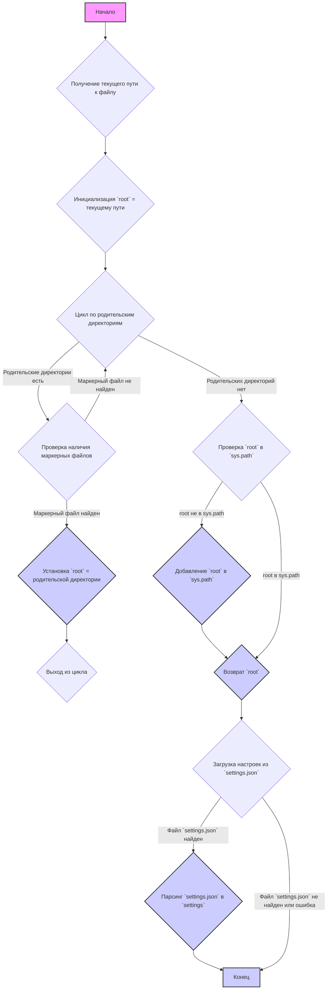
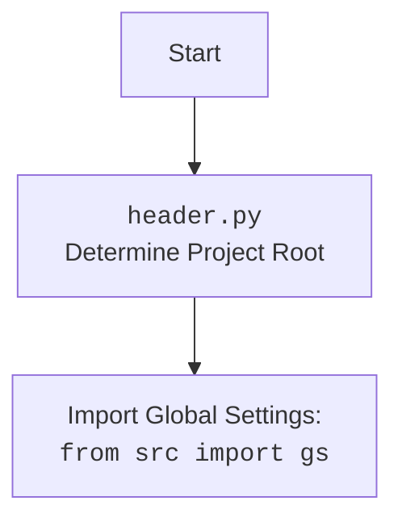

## ИНСТРУКЦИЯ:

Анализируй предоставленный код подробно и объясни его функциональность. Ответ должен включать три раздела:  

1. **<алгоритм>**: Опиши рабочий процесс в виде пошаговой блок-схемы, включая примеры для каждого логического блока, и проиллюстрируй поток данных между функциями, классами или методами.  
2. **<mermaid>**: Напиши код для диаграммы в формате `mermaid`, проанализируй и объясни все зависимости, 
    которые импортируются при создании диаграммы. 
    **ВАЖНО!** Убедитесь, что все имена переменных, используемые в диаграмме `mermaid`, 
    имеют осмысленные и описательные имена. Имена переменных вроде `A`, `B`, `C`, и т.д., не допускаются!  
    
    **Дополнительно**: Если в коде есть импорт `import header`, добавьте блок `mermaid` flowchart, объясняющий `header.py`:\
    ```mermaid
    flowchart TD
        Start --> Header[<code>header.py</code><br> Determine Project Root]
    
        Header --> import[Import Global Settings: <br><code>from src import gs</code>] 
    ```

3. **<объяснение>**: Предоставьте подробные объяснения:  
   - **Импорты**: Их назначение и взаимосвязь с другими пакетами `src.`.  
   - **Классы**: Их роль, атрибуты, методы и взаимодействие с другими компонентами проекта.  
   - **Функции**: Их аргументы, возвращаемые значения, назначение и примеры.  
   - **Переменные**: Их типы и использование.  
   - Выделите потенциальные ошибки или области для улучшения.  

Дополнительно, постройте цепочку взаимосвязей с другими частями проекта (если применимо).  

Это обеспечивает всесторонний и структурированный анализ кода.
## Формат ответа: `.md` (markdown)
**КОНЕЦ ИНСТРУКЦИИ**
```markdown
## <алгоритм>


**Примеры для блоков:**

*   **GetCurrentPath:** Если скрипт расположен в `/home/user/project/src/suppliers/aliexpress/gui/header.py`, то текущий путь будет `/home/user/project/src/suppliers/aliexpress/gui`.
*   **InitializeRoot:** `__root__` будет инициализирована как `/home/user/project/src/suppliers/aliexpress/gui`.
*   **LoopThroughParents:** Цикл будет перебирать директории:
    1.  `/home/user/project/src/suppliers/aliexpress/gui`
    2.  `/home/user/project/src/suppliers/aliexpress`
    3.  `/home/user/project/src/suppliers`
    4. `/home/user/project/src`
    5.  `/home/user/project`
    6.  `/home/user`
    7.  `/home`
*  **CheckMarkerFiles:** На каждой итерации цикла проверяется наличие файлов `__root__` или `.git` в текущей директории.
*  **SetRoot:** Если, например, `.git` найден в `/home/user/project`, то `__root__` будет установлен в `/home/user/project`.
*  **AddRootToPath:** Если `/home/user/project` не было в `sys.path`, то оно будет добавлено, чтобы модули проекта могли быть импортированы.
*  **LoadSettings:** Попытка загрузить `settings.json` из `/home/user/project/src/settings.json`.
*  **ParseSettings:** Если `settings.json` загружен успешно, то его содержимое будет помещено в переменную `settings`.

## <mermaid>
```mermaid
flowchart TD
    Start --> SetProjectRoot[<code>set_project_root(marker_files)</code><br>Determine Project Root];
     SetProjectRoot --> GetCurrentFilePath[Get current file path:<br><code>Path(__file__).resolve().parent</code>];
    GetCurrentFilePath --> InitializeRootPath[Initialize Root Path:<br><code>__root__ = current_path</code>];
    InitializeRootPath --> LoopThroughParents[Loop through parent directories of current path];
    LoopThroughParents -- "Parent directories exist" --> CheckMarkerFiles[Check if marker files exist:<br><code>any((parent / marker).exists() for marker in marker_files)</code>];
    CheckMarkerFiles -- "Marker files found" --> SetProjectRootPath[Set project root path:<br><code>__root__ = parent</code>];
    SetProjectRootPath --> BreakLoop[Break the loop];
    CheckMarkerFiles -- "Marker files not found" --> LoopThroughParents;
    LoopThroughParents -- "No more parent directories" --> CheckSysPath[Check if __root__ is in sys.path];
   CheckSysPath -- "__root__ not in sys.path" --> InsertRootPath[Insert __root__ into sys.path];
     InsertRootPath --> ReturnRootPath[Return __root__];
    CheckSysPath -- "__root__ in sys.path" --> ReturnRootPath;
    ReturnRootPath --> SetGlobalRoot[Set global project root:<br><code>__root__ = set_project_root()</code>];
    SetGlobalRoot --> ImportGlobalSettings[Import global settings:<br><code>from src import gs</code>];
    ImportGlobalSettings --> LoadSettingsFile[Load settings from settings.json:<br><code>open(gs.path.root / 'src' / 'settings.json', 'r')</code>];
    LoadSettingsFile -- "Settings file found" --> ParseSettingsFile[Parse settings from json:<br><code>settings = json.load(settings_file)</code>];
    ParseSettingsFile --> End[End];
    LoadSettingsFile -- "Settings file not found or error" --> End;
   
    style Start fill:#f9f,stroke:#333,stroke-width:2px
    style End fill:#ccf,stroke:#333,stroke-width:2px
     style SetProjectRoot fill:#ccf,stroke:#333,stroke-width:2px
     style SetProjectRootPath fill:#ccf,stroke:#333,stroke-width:2px
     style ReturnRootPath fill:#ccf,stroke:#333,stroke-width:2px
    style  InsertRootPath fill:#ccf,stroke:#333,stroke-width:2px
     style ParseSettingsFile fill:#ccf,stroke:#333,stroke-width:2px
```


**Анализ зависимостей:**

*   `pathlib.Path`: Используется для работы с путями к файлам и директориям, обеспечивает кроссплатформенность. 
*   `sys`: Используется для модификации `sys.path`, чтобы добавить путь к корневой директории проекта, что позволяет импортировать модули из этого проекта.
*   `json`: Используется для загрузки настроек из JSON файла.
*  `packaging.version.Version`: Хотя он импортируется, он не используется в этом коде.

## <объяснение>
### Импорты:
*   `import sys`: Модуль `sys` предоставляет доступ к некоторым переменным и функциям, взаимодействующим с интерпретатором Python. Здесь он используется для изменения `sys.path`, добавляя путь к корневой директории проекта. Это необходимо, чтобы Python мог найти другие модули внутри проекта.
*    `import json`:  Модуль `json` используется для работы с JSON-данными. В данном коде он применяется для чтения файла настроек `settings.json`.
*   `from packaging.version import Version`: Импортирует класс `Version` из библиотеки `packaging`. Хотя этот класс импортируется, он нигде не используется в предоставленном коде.
* `from pathlib import Path`: `Path` используется для работы с путями к файлам и директориям, что обеспечивает кросс-платформенность. `Path` объект предоставляет удобные методы для манипуляции путями.

### Функции:
*   `set_project_root(marker_files: tuple = ('__root__', '.git')) -> Path`:
    *   **Аргументы**:
        *   `marker_files` (tuple): Кортеж с именами файлов или каталогов, которые используются для определения корня проекта. По умолчанию `('__root__', '.git')`.
    *   **Возвращаемое значение**:
        *   `Path`: Объект `Path` к корневой директории проекта.
    *   **Назначение**: Функция ищет корень проекта, начиная с текущей директории файла и двигаясь вверх по иерархии директорий. Она останавливается, как только находит директорию, содержащую один из маркерных файлов.
    *   **Пример:** 
        ```python
        root_path = set_project_root()
        print(root_path) # Выведет путь к корню проекта
        ```

### Переменные:
*   `__root__`:
    *   **Тип**: `Path`
    *   **Использование**: Хранит путь к корневой директории проекта. Инициализируется в начале работы программы, чтобы все модули могли легко находить файлы относительно корня проекта. 
* `settings`:
    *   **Тип**: `dict`
    *   **Использование**: Предназначена для хранения настроек проекта, загруженных из файла `settings.json`. Инициализируется как `None`, а затем пытается загрузить настройки из файла.
### Объяснения:
1.  **Определение корня проекта:** Функция `set_project_root` выполняет важную роль в определении корня проекта. Она используется для того, чтобы гарантировать, что все пути в проекте будут вычисляться относительно корня проекта, что делает код переносимым.
2.  **Добавление корня в `sys.path`:** После определения корня, он добавляется в `sys.path`. Это позволяет импортировать модули, которые находятся в разных частях проекта. Это очень важно для больших проектов.
3.  **Загрузка настроек:** После определения корня проекта код пытается загрузить настройки из файла `settings.json`, расположенного в `src` директории корня.
4.  **Обработка ошибок**: Используется try/except для обработки возможных ошибок `FileNotFoundError` и `json.JSONDecodeError`, которые могут возникнуть при чтении или парсинге `settings.json`.

### Потенциальные ошибки и области для улучшения:

1.  **Неиспользуемый импорт**: Импорт `Version` из `packaging.version` нигде не используется, что делает его излишним и может быть удален.
2.  **Обработка ошибок:**  Используется `...` в блоке `except` для обработки ошибок,  что не является лучшей практикой.  Хорошо было бы добавить логирование ошибки или выводить предупреждение.
3.  **Зависимость от структуры проекта**: Код жестко привязан к структуре проекта (`src` директория, `settings.json` в `src` директории)  . Было бы полезно сделать эти пути настраиваемыми или использовать константы.
4.  **Отсутствие явной обработки случая если файл настроек отсутствует:** Код не дает явного понять,  что файл настроек не найден,  и если его нет, то переменная `settings` останется `None`.
5. **Конфигурация маркерных файлов:**  Значение маркерных файлов жестко закодировано, стоит  вынести в конфигурацию.

### Цепочка взаимосвязей:

*   **`header.py`** является начальной точкой для конфигурации проекта, устанавливает корневую директорию и загружает общие настройки. Он используется другими модулями проекта, которые импортируют его для доступа к корневой директории и настройкам.
*   `src.gs`: Глобальные настройки проекта импортируются через `from src import gs`. Это позволяет другим модулям использовать путь к корню проекта.
*   `settings.json`: Файл содержит настройки, используемые в других частях проекта.
```