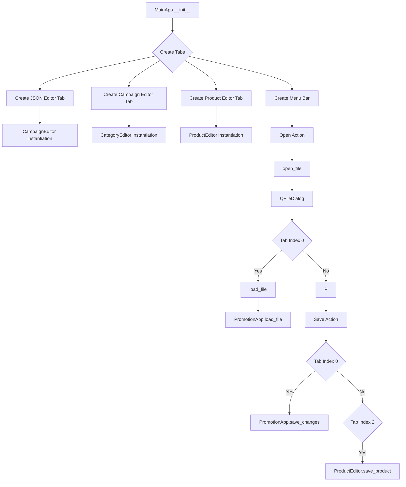

# <input code>

```python
## \file hypotez/src/suppliers/aliexpress/gui/main.py
# -*- coding: utf-8 -*-\
#! venv/Scripts/python.exe
#! venv/bin/python/python3.12

"""
.. module: src.suppliers.aliexpress.gui 
	:platform: Windows, Unix
	:synopsis:

"""
MODE = 'dev'


""" Main window interface for managing advertising campaigns """


import header
import asyncio
import sys
from PyQt6 import QtWidgets, QtGui, QtCore
from qasync import QEventLoop
from pathlib import Path
from src.utils.jjson import j_loads_ns, j_dumps
from product import ProductEditor
from campaign import CampaignEditor
from category import CategoryEditor
from src.suppliers.aliexpress.campaign import AliCampaignEditor
from styles import set_fixed_size

class MainApp(QtWidgets.QMainWindow):
    def __init__(self):
        """ Initialize the main application with tabs """
        super().__init__()
        self.setWindowTitle("Main Application with Tabs")
        self.setGeometry(100, 100, 1800, 800)

        self.tab_widget = QtWidgets.QTabWidget()
        self.setCentralWidget(self.tab_widget)

        # Create the JSON Editor tab and add it to the tab widget
        self.tab1 = QtWidgets.QWidget()
        self.tab_widget.addTab(self.tab1, "JSON Editor")
        self.promotion_app = CampaignEditor(self.tab1, self)

        # Create the Campaign Editor tab and add it to the tab widget
        self.tab2 = QtWidgets.QWidget()
        self.tab_widget.addTab(self.tab2, "Campaign Editor")
        self.campaign_editor_app = CategoryEditor(self.tab2, self)

        # Create the Product Editor tab and add it to the tab widget
        self.tab3 = QtWidgets.QWidget()
        self.tab_widget.addTab(self.tab3, "Product Editor")
        self.product_editor_app = ProductEditor(self.tab3, self)

        self.create_menubar()

    def create_menubar(self):
        """ Create a menu bar with options for file operations and edit commands """
        menubar = self.menuBar()

        file_menu = menubar.addMenu("File")
        open_action = QtGui.QAction("Open", self)
        open_action.triggered.connect(self.open_file)
        file_menu.addAction(open_action)
        save_action = QtGui.QAction("Save", self)
        save_action.triggered.connect(self.save_file)
        file_menu.addAction(save_action)
        exit_action = QtGui.QAction("Exit", self)
        exit_action.triggered.connect(self.exit_application)
        file_menu.addAction(exit_action)

        edit_menu = menubar.addMenu("Edit")
        copy_action = QtGui.QAction("Copy", self)
        copy_action.triggered.connect(self.copy)
        edit_menu.addAction(copy_action)
        paste_action = QtGui.QAction("Paste", self)
        paste_action.triggered.connect(self.paste)
        edit_menu.addAction(paste_action)

        open_product_action = QtGui.QAction("Open Product File", self)
        open_product_action.triggered.connect(self.product_editor_app.open_file)
        file_menu.addAction(open_product_action)

    # ... (rest of the code)
```

# <algorithm>



**Example Data Flow:**

The user selects a JSON file (`campaign_file`).  `open_file` function calls `load_file`, which passes the file path to `promotion_app.load_file`. `PromotionApp` parses the JSON data and displays it in the JSON editor tab.


# <mermaid>

```mermaid
graph LR
    subgraph MainApp
        MainApp --> CampaignEditor
        MainApp --> CategoryEditor
        MainApp --> ProductEditor
    end
    subgraph CampaignEditor
        CampaignEditor --> AliCampaignEditor
    end
    subgraph CategoryEditor
    end
    subgraph ProductEditor
    end
    MainApp --> QFileDialog;
    QFileDialog --> MainApp;
    MainApp --> QtWidgets;
    QtWidgets --> QtGui;
    QtWidgets --> QtCore;
    MainApp --> Path;
    MainApp --> j_loads_ns;
    MainApp --> j_dumps;
    MainApp --> styles;
    MainApp --> header;
    MainApp --> asyncio;
    MainApp --> sys;
    MainApp --> qasync;
    style MainApp fill:#ccf,stroke:#333,stroke-width:2px
    style CampaignEditor fill:#eee,stroke:#555,stroke-width:2px
    style CategoryEditor fill:#ddd,stroke:#777,stroke-width:2px
    style ProductEditor fill:#ccc,stroke:#999,stroke-width:2px
```

This mermaid code shows the main dependencies between the `MainApp` class and other components, including `CampaignEditor`, `CategoryEditor`, `ProductEditor`, and PyQt6, etc.  It illustrates the class-based structure, while the data flow is explained separately in the `algorithm` section.


# <explanation>

**Импорты:**

- `header`:  Likely a custom module, crucial to the specific project and not explicitly explained within the snippet. Understanding its contents would need the `header.py` file.
- `asyncio`:  Used for asynchronous operations, which could be important for handling potentially time-consuming tasks.
- `sys`: Provides access to system-specific parameters and functions, commonly used for managing the application's execution.
- `PyQt6`: The primary GUI framework for the project, providing widgets and tools for creating the user interface.
- `QEventLoop`:  From `qasync`, essential for managing asynchronous operations within the PyQt6 context.
- `Path`: From `pathlib`, for working with file paths in a platform-independent manner.
- `j_loads_ns`, `j_dumps`: Functions from `src.utils.jjson` for loading and saving JSON data. This likely handles JSON with namespace support.
- `ProductEditor`, `CampaignEditor`, `CategoryEditor`, `AliCampaignEditor`: Custom classes for handling different aspects of managing campaigns and products. They likely reside in different modules (e.g. `src.suppliers.aliexpress.campaign.py`, `src.product.py`, etc.).
- `styles`:  Likely a module containing styling functions, such as `set_fixed_size`.

**Классы:**

- `MainApp`: The main application window.
    - `__init__`: Initializes the main window, creates tabs for JSON editing, Campaign, Product editing, and a menu bar.
    - `create_menubar`:  Creates the menu bar with `File` and `Edit` options.  The key methods like `open_file`, `save_file`, `exit_application`, and the file-related actions (open, save, exit) are connected to actions triggered by user interactions.
    - `open_file`, `save_file`, `exit_application`, `copy`, `paste`: Methods to handle file operations, copying/pasting text (using clipboard), and application closing.  These methods demonstrate a clear structure in handling user interactions.
    - `load_file`: Loads a JSON file, potentially parsing it using `j_loads_ns`, based on the index of the tab that is currently selected. Critically important is the error handling in this function (using `try...except`).
- `CampaignEditor`, `CategoryEditor`, `ProductEditor`, `AliCampaignEditor`:  Subclasses or similar specialized classes responsible for handling specific aspects of campaign management or product editing.  They implement methods such as `load_file` and `save_changes` that likely interact with data from the JSON data or data from their specific sources.  The `AliCampaignEditor` suggests handling campaigns specific to AliExpress.  The lack of detail about these classes makes it hard to analyze their full implementation, but the structure is consistent with a tab-based application.


**Функции:**

- `main()`: Initializes the Qt application and creates an instance of the `MainApp` class.  It ensures proper handling of asynchronous operations using the QEventLoop. This is crucial for interaction with the GUI framework.

**Переменные:**

- `MODE`: Likely stores the current mode of operation (e.g., 'dev', 'prod'), potentially used for conditional logic within other modules.

**Возможные ошибки и улучшения:**

- **Error Handling:** While `load_file` has `try...except`, other critical functions might lack it, leading to crashes. Consider adding error handling in critical parts of the code.
- **Data Validation:**  The code lacks data validation (e.g. checking JSON structure) when loading JSON.  This could lead to unexpected errors.
- **Dependency Management:**  The code doesn't explicitly declare the dependencies.  The use of `src` suggests a package structure, but the precise dependencies should be documented and possibly managed using `requirements.txt`.  A missing `header` file without documentation makes understanding the program much more difficult.


**Взаимосвязи с другими частями проекта:**

The code heavily relies on other modules within the `hypotez` package, specifically `src.utils.jjson`, `product`, `campaign`, `category`, and `src.suppliers.aliexpress.campaign`.  Without the implementation details of these components, one can't definitively trace the full interactions, but the code structure suggests a modular design. A detailed analysis would involve inspecting the relevant parts of `src`.