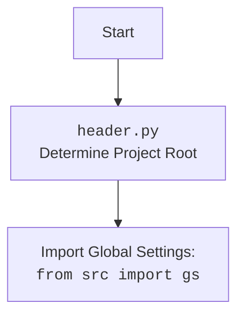

## <алгоритм>

1.  **Инициализация приложения:**
    *   Создается экземпляр `QtWidgets.QApplication`, который управляет жизненным циклом GUI приложения.
    *   Устанавливается асинхронный event loop `QEventLoop` для поддержки асинхронных операций в PyQt.

2.  **Создание главного окна (`MainApp`):**
    *   Создается главное окно приложения, наследующееся от `QtWidgets.QMainWindow`.
    *   Устанавливается заголовок окна, размеры и начальная позиция.
    *   Создается `QTabWidget` для организации интерфейса с вкладками.
        *   Вкладка 1: "JSON Editor" - `CampaignEditor`
        *   Вкладка 2: "Campaign Editor" - `CategoryEditor`
        *   Вкладка 3: "Product Editor" - `ProductEditor`
    *   Создается меню (`create_menubar`) для управления файлами и редактированием.

3.  **Работа с меню:**
    *   **File Menu:**
        *   **Open**: Вызывает `open_file` для открытия JSON файла через диалог.
        *   **Save**: Вызывает `save_file` для сохранения данных в зависимости от активной вкладки.
        *   **Exit**: Вызывает `exit_application` для закрытия приложения.
        *   **Open Product File**: Вызывает `open_file` класса ProductEditor для открытия файла через диалог.

    *   **Edit Menu:**
        *   **Copy**: Вызывает `copy` для копирования текста из активного текстового виджета.
        *   **Paste**: Вызывает `paste` для вставки текста в активный текстовый виджет.

4.  **Обработка открытия файла (`open_file`):**
    *   Открывает диалоговое окно для выбора JSON файла.
    *   Если файл выбран, вызывает метод `load_file` для загрузки данных в зависимости от выбранной вкладки.

5.  **Обработка сохранения файла (`save_file`):**
    *   Определяет активную вкладку и вызывает соответствующий метод для сохранения данных.
    *   Сохраняет изменения `promotion_app` для "JSON Editor"
    *   Сохраняет продукт `product_editor_app` для "Product Editor"

6.  **Выход из приложения (`exit_application`):**
    *   Закрывает главное окно приложения.

7.  **Копирование текста (`copy`):**
    *   Определяет активный виджет с фокусом.
    *   Если виджет является текстовым полем (QLineEdit, QTextEdit, QPlainTextEdit), вызывает метод `copy`.

8.  **Вставка текста (`paste`):**
    *   Определяет активный виджет с фокусом.
    *   Если виджет является текстовым полем, вызывает метод `paste`.

9.  **Загрузка файла (`load_file`):**
    *   Вызывает метод `load_file` класса `CampaignEditor` для загрузки JSON файла.
    *   Обрабатывает исключения и показывает сообщение об ошибке, если загрузка не удалась.

10. **Запуск приложения:**
    *   Создается экземпляр `MainApp`.
    *   Окно отображается с помощью `main_app.show()`.
    *   Запускается event loop (`loop.run_forever()`), чтобы приложение реагировало на события GUI.

## <mermaid>

```mermaid
flowchart TD
    Start --> AppInit[Initialize QApplication]
    AppInit --> EventLoopInit[Initialize QEventLoop]
    EventLoopInit --> SetAsyncEventLoop[Set Asynchronous Event Loop]
    SetAsyncEventLoop --> MainAppCreate[Create MainApp Instance]
    MainAppCreate --> ShowMainApp[Show Main Application Window]
    ShowMainApp --> RunEventLoop[Run Event Loop]

    classDef classFill fill:#f9f,stroke:#333,stroke-width:2px
    class AppInit,EventLoopInit,SetAsyncEventLoop,MainAppCreate,ShowMainApp,RunEventLoop classFill

    subgraph MainApp
        direction TB
        MainAppCreate --> MainWindowInit[Initialize Main Window]
        MainWindowInit --> TabWidgetCreate[Create QTabWidget]
        TabWidgetCreate --> AddTabs[Add Tabs to TabWidget]
        AddTabs --> CreateMenuBar[Create Menu Bar]
        CreateMenuBar --> MenuActions[Menu Actions (File, Edit)]
        MenuActions --> OpenFileAction[Open File Action]
        MenuActions --> SaveFileAction[Save File Action]
        MenuActions --> ExitAction[Exit Action]
        MenuActions --> CopyAction[Copy Action]
        MenuActions --> PasteAction[Paste Action]
        OpenFileAction --> OpenFileDialog[Open File Dialog]
        OpenFileDialog --> LoadJsonFile[Load JSON File]
        SaveFileAction --> SaveFile[Save File]
        OpenFileAction -->|select JSON file| LoadJsonFile
        
        
        classDef mainAppClass fill:#ccf,stroke:#333,stroke-width:2px
        class MainWindowInit,TabWidgetCreate,AddTabs,CreateMenuBar,MenuActions,OpenFileAction,SaveFileAction,ExitAction,CopyAction,PasteAction,OpenFileDialog,LoadJsonFile,SaveFile mainAppClass

       
    end

    subgraph File Operations
      direction TB
      LoadJsonFile --> LoadDataToEditor[Load data to CampaignEditor]
      LoadDataToEditor --> UpdateUI[Update UI]
      SaveFile --> CheckActiveTab[Check Active Tab]
      CheckActiveTab --> SaveCampaignEditorData[Save data in CampaignEditor]
      CheckActiveTab --> SaveProductEditorData[Save data in ProductEditor]
    end
     
    subgraph Edit Operations
      direction TB
      CopyAction --> GetFocusedWidget[Get focused widget]
      GetFocusedWidget --> CopyText[Copy selected text]
       PasteAction --> GetFocusedWidgetPaste[Get focused widget]
      GetFocusedWidgetPaste --> PasteText[Paste text to widget]
    end

    RunEventLoop --> Exit[Exit Application]
    
    
    
    linkStyle 0,1,2,3,4,5,6 stroke:#333,stroke-width:2px
    linkStyle 7,8,9,10,11,12,13,14,15 stroke:#444,stroke-width:2px
    linkStyle 16,17,18,19,20,21,22 stroke:#444,stroke-width:2px
    linkStyle 23,24,25,26 stroke:#444,stroke-width:2px
    
```



## <объяснение>

**Импорты:**

*   `import header`: Предположительно, `header.py` используется для определения корневой директории проекта и, возможно, для инициализации глобальных настроек.
*   `import asyncio`:  Библиотека для асинхронного программирования. Используется для управления асинхронным event loop в PyQt.
*   `import sys`:  Модуль для доступа к параметрам командной строки и функциям, специфичным для интерпретатора Python. Используется для получения аргументов командной строки при запуске приложения.
*   `from PyQt6 import QtWidgets, QtGui, QtCore`: Импортирует необходимые классы из PyQt6 для создания GUI, такие как виджеты, диалоги, события.
*   `from qasync import QEventLoop`:  Импортирует `QEventLoop` для интеграции асинхронного event loop с PyQt.
*   `from pathlib import Path`: Импортирует `Path` для работы с путями файлов в более объектно-ориентированном стиле.
*   `from src.utils.jjson import j_loads_ns, j_dumps`: Импортирует функции для работы с JSON, `j_loads_ns` вероятно для загрузки JSON с учетом namespace, а `j_dumps` для сериализации данных в JSON.
*   `from product import ProductEditor`: Импортирует класс `ProductEditor`, который вероятно представляет редактор для управления продуктами.
*   `from campaign import CampaignEditor`: Импортирует класс `CampaignEditor`, который вероятно представляет редактор для управления рекламными кампаниями.
*   `from category import CategoryEditor`: Импортирует класс `CategoryEditor`, который вероятно представляет редактор для управления категориями.
*   `from src.suppliers.aliexpress.campaign import AliCampaignEditor`: Импортирует класс `AliCampaignEditor`, который, вероятно, является специализированным редактором для кампаний AliExpress.
*    `from styles import set_fixed_size`: Импортирует функцию `set_fixed_size`, которая вероятно используется для задания фиксированного размера виджетам.

**Классы:**

*   **`MainApp(QtWidgets.QMainWindow)`:**
    *   **Роль:** Главное окно приложения, управляющее пользовательским интерфейсом и координирующее работу редакторов.
    *   **Атрибуты:**
        *   `tab_widget`: Экземпляр `QtWidgets.QTabWidget` для организации вкладок.
        *   `promotion_app`: Экземпляр `CampaignEditor` для работы с рекламными кампаниями.
        *   `campaign_editor_app`: Экземпляр `CategoryEditor` для работы с категориями.
        *   `product_editor_app`: Экземпляр `ProductEditor` для работы с продуктами.
    *   **Методы:**
        *   `__init__()`: Инициализирует главное окно, устанавливает заголовок, размеры и создает виджет вкладок.
        *   `create_menubar()`: Создает меню с опциями для файлов и редактирования.
        *   `open_file()`: Открывает диалог выбора файла для загрузки JSON.
        *   `save_file()`: Сохраняет изменения из активной вкладки в соответствующий редактор.
        *   `exit_application()`: Закрывает приложение.
        *   `copy()`: Копирует выделенный текст из активного текстового виджета.
        *   `paste()`: Вставляет текст в активный текстовый виджет.
        *   `load_file(campaign_file)`: Загружает JSON файл в редактор кампаний.

**Функции:**

*   **`main()`:**
    *   **Аргументы:** Нет.
    *   **Возвращаемое значение:** Нет.
    *   **Назначение:**  Инициализирует и запускает основное приложение. Создает экземпляр `QtWidgets.QApplication`, `QEventLoop`, `MainApp` и запускает основной цикл событий.

**Переменные:**

*   `app`: Экземпляр `QtWidgets.QApplication`, управляющий GUI приложения.
*   `loop`: Экземпляр `QEventLoop`, управляющий асинхронными операциями.
*   `main_app`: Экземпляр `MainApp`, главное окно приложения.
*   `menubar`, `file_menu`, `edit_menu`, `open_action`, `save_action`, `exit_action`, `copy_action`, `paste_action` : Экземпляры `QMenu` и `QAction` для создания и управления меню.
*  `open_product_action` : Экземпляр `QAction` для открытия файла продукта.
*  `file_dialog`: Экземпляр `QtWidgets.QFileDialog` для выбора файлов.
* `file_path`, `_`: Переменные для хранения пути к файлу и неиспользуемая переменная, полученные из `file_dialog.getOpenFileName`.
* `widget` : Переменная для хранения текущего виджета в фокусе.
*  `current_index` : Индекс текущей активной вкладки.
* `campaign_file` : путь к файлу для загрузки.

**Потенциальные ошибки и улучшения:**

*   **Обработка ошибок:** Не все операции `save_file`  могут быть защищены через `try/except`, добавьте обработку исключений.
*   **Абстракция:** Можно создать общий интерфейс для `ProductEditor`, `CampaignEditor` и `CategoryEditor`, чтобы уменьшить дублирование кода.
*   **Зависимости:** `AliCampaignEditor` (как и `product`, `campaign`, `category`)  находится на одном уровне, но  импортируется из `src.suppliers.aliexpress`, хотя находится на уровне `gui`. Стоит пересмотреть структуру проекта.
*   **Неявные зависимости:**  Зависимость `open_product_action`  от `product_editor_app.open_file` может быть неявной для других разработчиков, стоит переименовать действие на более очевидное.
*   **Использование `_`:** Использование `_` как неиспользуемой переменной допустимо, но если в дальнейшем потребуется использовать имя переменной, это может вызвать трудности. Можно использовать более описательное имя.

**Цепочка взаимосвязей:**

1.  **`header.py`:** Определяет корневую директорию проекта и инициализирует глобальные настройки, которые могут использоваться другими частями проекта, через `src.gs`
2.  **`main.py`:** Основное приложение, управляющее GUI, использует `header.py` для инициализации и импортирует классы-редакторы из других модулей: `ProductEditor`, `CampaignEditor`, `CategoryEditor`, `AliCampaignEditor`.
3.  **`src.utils.jjson`:** Используется для загрузки и сохранения данных в формате JSON в `MainApp` и, вероятно, в редакторах.
4.  **`ProductEditor`, `CampaignEditor`, `CategoryEditor`:**  Предоставляют функциональность для управления данными и вызываются из `main.py`. `AliCampaignEditor` - частный случай `CampaignEditor`.
5.  **PyQt6:** Обеспечивает базовую функциональность GUI для создания окон, вкладок, меню, диалогов и обработки событий.
6.  **qasync:** Обеспечивает асинхронный event loop для обработки асинхронных операций в PyQt6.

Этот анализ обеспечивает структурированное понимание кода, его функциональности и связей между различными компонентами проекта.