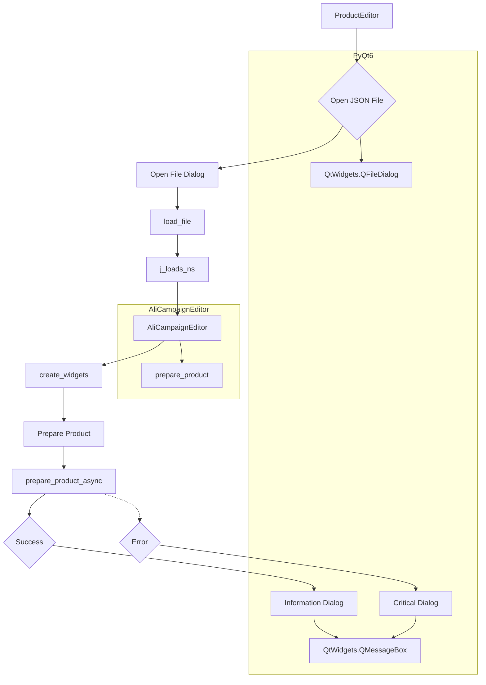

```MD
# <input code>

```python
## \file hypotez/src/suppliers/aliexpress/gui/product.py
# -*- coding: utf-8 -*-
#! venv/Scripts/python.exe
#! venv/bin/python/python3.12

"""
.. module: src.suppliers.aliexpress.gui 
	:platform: Windows, Unix
	:synopsis:

"""
MODE = 'dev'


""" Window editor for products """


import header
import sys
from pathlib import Path
from types import SimpleNamespace
from PyQt6 import QtWidgets, QtGui, QtCore
from src.utils.jjson import j_loads_ns, j_dumps
from src.suppliers.aliexpress.campaign import AliCampaignEditor

class ProductEditor(QtWidgets.QWidget):
    data: SimpleNamespace = None
    language: str = 'EN'
    currency: str = 'USD'
    file_path: str = None
    editor: AliCampaignEditor

    def __init__(self, parent=None, main_app=None):
        """ Initialize the ProductEditor widget """
        super().__init__(parent)
        self.main_app = main_app  # Save the MainApp instance

        self.setup_ui()
        self.setup_connections()

    def setup_ui(self):
        """ Setup the user interface """
        self.setWindowTitle("Product Editor")
        self.resize(1800, 800)

        # Define UI components
        self.open_button = QtWidgets.QPushButton("Open JSON File")
        self.open_button.clicked.connect(self.open_file)

        self.file_name_label = QtWidgets.QLabel("No file selected")

        self.prepare_button = QtWidgets.QPushButton("Prepare Product")
        self.prepare_button.clicked.connect(self.prepare_product_async)

        layout = QtWidgets.QVBoxLayout(self)
        layout.addWidget(self.open_button)
        layout.addWidget(self.file_name_label)
        layout.addWidget(self.prepare_button)

        self.setLayout(layout)

    def setup_connections(self):
        """ Setup signal-slot connections """
        pass

    def open_file(self):
        """ Open a file dialog to select and load a JSON file """
        file_path, _ = QtWidgets.QFileDialog.getOpenFileName(
            self,
            "Open JSON File",
            "c:/user/documents/repos/hypotez/data/aliexpress/products",
            "JSON files (*.json)"
        )
        if not file_path:
            return  # No file selected

        self.load_file(file_path)

    def load_file(self, file_path):
        """ Load a JSON file """
        try:
            self.data = j_loads_ns(file_path)
            self.file_path = file_path
            self.file_name_label.setText(f"File: {self.file_path}")
            self.editor = AliCampaignEditor(file_path=file_path)
            self.create_widgets(self.data)
        except Exception as ex:
            QtWidgets.QMessageBox.critical(self, "Error", f"Failed to load JSON file: {ex}")

    def create_widgets(self, data):
        """ Create widgets based on the data loaded from the JSON file """
        layout = self.layout()

        # Remove previous widgets except open button and file label
        for i in reversed(range(layout.count())):
            widget = layout.itemAt(i).widget()
            if widget not in [self.open_button, self.file_name_label, self.prepare_button]:
                widget.deleteLater()

        title_label = QtWidgets.QLabel(f"Product Title: {data.title}")
        layout.addWidget(title_label)

        # Additional product-specific details
        product_details_label = QtWidgets.QLabel(f"Product Details: {data.details}")
        layout.addWidget(product_details_label)

    @QtCore.pyqtSlot()
    async def prepare_product_async(self):
        """ Asynchronously prepare the product """
        if self.editor:
            try:
                await self.editor.prepare_product()
                QtWidgets.QMessageBox.information(self, "Success", "Product prepared successfully.")
            except Exception as ex:
                QtWidgets.QMessageBox.critical(self, "Error", f"Failed to prepare product: {ex}")
```

# <algorithm>

**Шаг 1**: Инициализация `ProductEditor`.

* Пример: Создается экземпляр `ProductEditor` с родительским виджетом и приложением.

**Шаг 2**: Настройка пользовательского интерфейса (`setup_ui`).

* Пример: Создаются кнопки "Открыть JSON файл" и "Подготовить продукт".
* Устанавливается заголовок окна и размер.

**Шаг 3**: Настройка соединений (`setup_connections`) - на данном этапе пуста, но должна быть реализована для обработки событий.

**Шаг 4**: Обработка нажатия кнопки "Открыть JSON файл" (`open_file`).

* Пример: Используется диалоговое окно выбора файла.
* Если файл выбран, происходит загрузка файла (`load_file`).

**Шаг 5**: Загрузка JSON файла (`load_file`).

* Пример: Используется функция `j_loads_ns` из `src.utils.jjson` для парсинга JSON файла.
* Создается объект `AliCampaignEditor`.
* Создаются виджеты (`create_widgets`) с информацией из загруженного файла.


**Шаг 6**: Создание виджетов (`create_widgets`).

* Пример: Удаляются предыдущие виджеты (кроме кнопок), создаются новые метки с заголовком и описанием.
* Устанавливаются эти виджеты в макет.

**Шаг 7**: Асинхронная подготовка продукта (`prepare_product_async`).

* Пример: Вызывается метод `prepare_product` объекта `AliCampaignEditor`.
* Обработка успешного выполнения и ошибок (с использованием диалоговых окон).

**Переменные**: `data`, `file_path`, `editor` - хранят данные из файла, путь к файлу и экземпляр класса `AliCampaignEditor` соответственно.


# <mermaid>




**Объяснение диаграммы**:

* `ProductEditor` – главный класс, отвечающий за UI и взаимодействие с пользователем.
* `Open JSON File` – действие, инициирующее выбор файла.
* `Open File Dialog` – диалоговое окно для выбора файла.
* `load_file` – загружает JSON файл.
* `j_loads_ns` – парсит JSON данные.
* `AliCampaignEditor` – класс для обработки данных продукта.
* `prepare_product` – метод внутри `AliCampaignEditor` для подготовки продукта.
* `prepare_product_async` – асинхронная версия `prepare_product`.
* `Information Dialog`, `Critical Dialog` – диалоговые окна для отображения сообщений об успехе или ошибке.
* `QtWidgets.QFileDialog`, `QtWidgets.QMessageBox` – компоненты PyQt6 для взаимодействия с пользователем.

# <explanation>

**Импорты**:

* `header`: Вероятно, содержит пользовательские настройки или импорты, специфичные для проекта.
* `sys`: Для работы со средой выполнения Python.
* `pathlib`: Для работы с путями к файлам.
* `types`: Для работы с типом `SimpleNamespace`.
* `PyQt6`: Библиотека для создания графических интерфейсов.
* `src.utils.jjson`:  Модуль для работы с JSON данными, вероятно, содержит функции для загрузки и сериализации JSON данных в SimpleNamespace.
* `src.suppliers.aliexpress.campaign`: Модуль `AliCampaignEditor`, содержащий функционал для подготовки продукта с Алиэкспресс. 

**Классы**:

* `ProductEditor`: Класс для создания окна редактирования продукта. Содержит данные о продукте, пути к файлам, экземпляр класса `AliCampaignEditor` и методы для управления интерфейсом и данными.
* `AliCampaignEditor`: Вероятно, класс для подготовки продукта с Алиэкспресс (например, для получения дополнительных данных, обработки данных или выполнения каких-либо операций).  Подробная функциональность не видна в данном фрагменте кода.

**Функции**:

* `__init__`: Инициализирует `ProductEditor`.
* `setup_ui`: Настраивает графический интерфейс окна.
* `setup_connections`: Устанавливает соединения между элементами UI (сигналы и слоты).
* `open_file`: Открывает диалоговое окно для выбора файла.
* `load_file`: Загружает JSON данные из файла в объект `data`.
* `create_widgets`: Создает виджеты (метки) с информацией из данных.
* `prepare_product_async`: Асинхронная функция для подготовки продукта.

**Переменные**:

* `data`: Хранит загруженные JSON данные.
* `file_path`: Путь к выбранному JSON файлу.
* `editor`: Экземпляр класса `AliCampaignEditor`.
* `language`, `currency`: Язык и валюта (по умолчанию).

**Возможные ошибки и улучшения**:

* Отсутствие проверки существования файла перед `j_loads_ns`.
* Отсутствие обработки исключений в методах, кроме `load_file`.
* Неочевидно, как происходит обработка ошибок в методе `prepare_product`.
* Отсутствие документации для методов внутри `AliCampaignEditor`.
* Не указано назначение переменных `language` и `currency`.


**Взаимосвязи**:

`ProductEditor` использует `AliCampaignEditor` для подготовки данных продукта. `ProductEditor` использует `j_loads_ns` из `src.utils.jjson` для загрузки JSON данных.  `AliCampaignEditor` скорее всего взаимодействует с другими модулями для получения дополнительных данных или выполнения операций подготовки.  `header` вероятно необходим для настройки проекта, но точный функционал неясен.