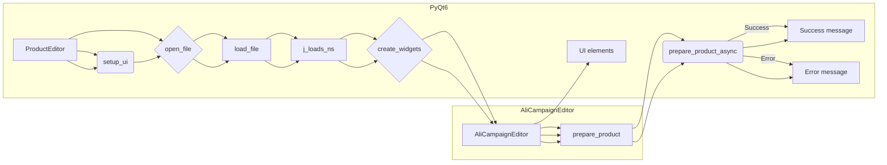

# <input code>

```python
## \file hypotez/src/suppliers/aliexpress/gui/product.py
# -*- coding: utf-8 -*-\n#! venv/Scripts/python.exe\n#! venv/bin/python/python3.12\n
"""
.. module: src.suppliers.aliexpress.gui 
	:platform: Windows, Unix
	:synopsis:

"""
MODE = 'dev'

"""
	:platform: Windows, Unix
	:synopsis:

"""

"""
	:platform: Windows, Unix
	:synopsis:

"""


"""
  :platform: Windows, Unix

"""
"""
  :platform: Windows, Unix
  :platform: Windows, Unix
  :synopsis:
"""MODE = 'dev'
  
""" module: src.suppliers.aliexpress.gui """


""" Window editor for products """


import header
import sys
from pathlib import Path
from types import SimpleNamespace
from PyQt6 import QtWidgets, QtGui, QtCore
from src.utils import j_loads_ns, j_dumps
from src.suppliers.aliexpress.campaign import AliCampaignEditor

class ProductEditor(QtWidgets.QWidget):
    data: SimpleNamespace = None
    language: str = 'EN'
    currency: str = 'USD'
    file_path: str = None
    editor: AliCampaignEditor

    def __init__(self, parent=None, main_app=None):
        """ Initialize the ProductEditor widget """
        super().__init__(parent)
        self.main_app = main_app  # Save the MainApp instance

        self.setup_ui()
        self.setup_connections()

    def setup_ui(self):
        """ Setup the user interface """
        self.setWindowTitle("Product Editor")
        self.resize(1800, 800)

        # Define UI components
        self.open_button = QtWidgets.QPushButton("Open JSON File")
        self.open_button.clicked.connect(self.open_file)

        self.file_name_label = QtWidgets.QLabel("No file selected")
        
        self.prepare_button = QtWidgets.QPushButton("Prepare Product")
        self.prepare_button.clicked.connect(self.prepare_product_async)

        layout = QtWidgets.QVBoxLayout(self)
        layout.addWidget(self.open_button)
        layout.addWidget(self.file_name_label)
        layout.addWidget(self.prepare_button)

        self.setLayout(layout)

    def setup_connections(self):
        """ Setup signal-slot connections """
        pass

    def open_file(self):
        """ Open a file dialog to select and load a JSON file """
        file_path, _ = QtWidgets.QFileDialog.getOpenFileName(
            self,
            "Open JSON File",
            "c:/user/documents/repos/hypotez/data/aliexpress/products",
            "JSON files (*.json)"
        )
        if not file_path:
            return  # No file selected

        self.load_file(file_path)

    def load_file(self, file_path):
        """ Load a JSON file """
        try:
            self.data = j_loads_ns(file_path)
            self.file_path = file_path
            self.file_name_label.setText(f"File: {self.file_path}")
            self.editor = AliCampaignEditor(file_path=file_path)
            self.create_widgets(self.data)
        except Exception as ex:
            QtWidgets.QMessageBox.critical(self, "Error", f"Failed to load JSON file: {ex}")

    def create_widgets(self, data):
        """ Create widgets based on the data loaded from the JSON file """
        layout = self.layout()

        # Remove previous widgets except open button and file label
        for i in reversed(range(layout.count())):
            widget = layout.itemAt(i).widget()
            if widget not in [self.open_button, self.file_name_label, self.prepare_button]:
                widget.deleteLater()

        title_label = QtWidgets.QLabel(f"Product Title: {data.title}")
        layout.addWidget(title_label)

        # Additional product-specific details
        product_details_label = QtWidgets.QLabel(f"Product Details: {data.details}")
        layout.addWidget(product_details_label)

    @QtCore.pyqtSlot()
    async def prepare_product_async(self):
        """ Asynchronously prepare the product """
        if self.editor:
            try:
                await self.editor.prepare_product()
                QtWidgets.QMessageBox.information(self, "Success", "Product prepared successfully.")
            except Exception as ex:
                QtWidgets.QMessageBox.critical(self, "Error", f"Failed to prepare product: {ex}")
```

# <algorithm>

**Шаг 1:** Инициализация `ProductEditor` с родительским элементом и приложением.

**Пример:** Создается объект `ProductEditor`, передавая в конструктор родительский элемент и ссылку на основное приложение.

**Шаг 2:**  Настройка пользовательского интерфейса (`setup_ui`).

**Пример:** Устанавливается заголовок окна, размер, добавляются кнопка "Открыть JSON файл", метка для имени файла и кнопка "Подготовить продукт".

**Шаг 3:** Обработка события нажатия кнопки "Открыть JSON файл" (`open_file`).

**Пример:** Открывается диалог выбора файла, загружается JSON файл, обновляется метка с именем файла.
**Данные:** `file_path`

**Шаг 4:** Загрузка JSON файла (`load_file`).

**Пример:** Используя `j_loads_ns` загружается JSON файл в объект `SimpleNamespace`, обновляется переменная `file_path`, обновляется метка для имени файла, создается экземпляр класса `AliCampaignEditor` для обработки конкретных данных по подготовке продукта.
**Данные:** `self.data`, `self.file_path`, `self.editor`

**Шаг 5:** Создание виджетов на основе загруженных данных (`create_widgets`).

**Пример:** Удаляются предыдущие виджеты, добавляются новые метки с заголовком и деталями продукта.
**Данные:** `data` (данные продукта)

**Шаг 6:** Подготовка продукта асинхронно (`prepare_product_async`).

**Пример:** Запускает метод `prepare_product` у объекта `AliCampaignEditor`, который обрабатывает продукт. При успехе - выводит сообщение об успехе, при ошибке - выводит сообщение об ошибке.
**Данные:** `self.editor`

# <mermaid>



**Объяснение диаграммы:**

* `ProductEditor` - главный класс, управляющий взаимодействием с пользователем и данными.
* `setup_ui`, `open_file`, `load_file`, `create_widgets`, `prepare_product_async` - методы класса `ProductEditor`.
* `j_loads_ns` - функция из модуля `src.utils`, загружающая JSON данные в объект `SimpleNamespace`.
* `AliCampaignEditor` - класс, отвечающий за подготовку продукта.  Имеет зависимость от `file_path` и метода `prepare_product`.
* `prepare_product` - метод класса `AliCampaignEditor` отвечающий за подготовку продукта. Он может зависеть от внешних сервисов или данных.
* `UI elements` - компоненты пользовательского интерфейса (кнопки, метки), создаваемые и управляемые `ProductEditor`.

# <explanation>

**Импорты:**

* `header`: Непонятно, какой модуль. Потенциально содержит вспомогательные функции или константы для приложения.
* `sys`: Стандартный модуль Python, используемый для взаимодействия с системными функциями.
* `pathlib`: Модуль для работы с путями к файлам.
* `types`: Модуль предоставляет набор типов данных, в частности `SimpleNamespace`.
* `PyQt6`: Библиотека для создания графического интерфейса.
* `src.utils`: Модуль `src.utils` содержит функции `j_loads_ns` и `j_dumps`, вероятно, для работы с JSON данными.
* `src.suppliers.aliexpress.campaign`: Модуль `AliCampaignEditor`, содержащий класс `AliCampaignEditor`, который, по всей видимости, отвечает за конкретную логику обработки продуктов компании `AliExpress`.

**Классы:**

* `ProductEditor`:  Класс отвечает за создание и управление интерфейсом для редактирования продукта `AliExpress`, загрузку данных, создание дополнительных виджетов и запуск асинхронной подготовки продукта.
* `AliCampaignEditor`:  Класс отвечает за подготовку продукта. По данному коду, неизвестна его внутренняя реализация, но предполагается, что он работает с спецификой продукта `AliExpress`.

**Функции:**

* `__init__`: Инициализирует `ProductEditor`, создает интерфейс и сохраняет ссылку на главное приложение.
* `setup_ui`: Создает пользовательский интерфейс (виджеты, макет).
* `setup_connections`: Устанавливает связи между элементами интерфейса.
* `open_file`: Открывает диалог выбора JSON файла.
* `load_file`: Загружает JSON файл, парсит его и создает экземпляр `AliCampaignEditor` с загруженными данными.
* `create_widgets`: Создает новые виджеты на основе данных, загруженных из JSON файла.
* `prepare_product_async`: Асинхронно запускает процесс подготовки продукта.

**Переменные:**

* `data`: `SimpleNamespace`, хранит загруженные данные из JSON файла.
* `language`, `currency`, `file_path`: Характеризуют настройки продукта.
* `editor`: Экземпляр класса `AliCampaignEditor`, отвечающего за подготовку продукта.


**Возможные ошибки/улучшения:**

* Отсутствует валидация данных, загружаемых из файла. Если структура JSON некорректна, программа может упасть.
* Обработка ошибок в `load_file` не очень подробна. Нужно ловить конкретные типы ошибок (например, `FileNotFoundError`).
* `AliCampaignEditor` не показан в полном объёме. Неясно, какие данные он ожидает, как обрабатывает и что делает.
* Отсутствие логики обработки ошибок в `prepare_product_async` - нехватка описания для исправления.
* Не указан способ организации асинхронных операций. Важно, чтобы асинхронный код был написан грамотно для эффективной работы.
* Отсутствует описание работы класса `header`, что мешает пониманию кода и проекта в целом.

**Цепочка взаимосвязей:**

`ProductEditor` получает данные из `AliCampaignEditor`. `AliCampaignEditor` предполагается, что взаимодействует с другими частями проекта (возможно база данных, сервисы) для подготовки продукта,  а `ProductEditor` отвечает за отображение и взаимодействие с пользователем, при этом `j_loads_ns` и `j_dumps` из `src.utils` используются для взаимодействия с данными в формате JSON.