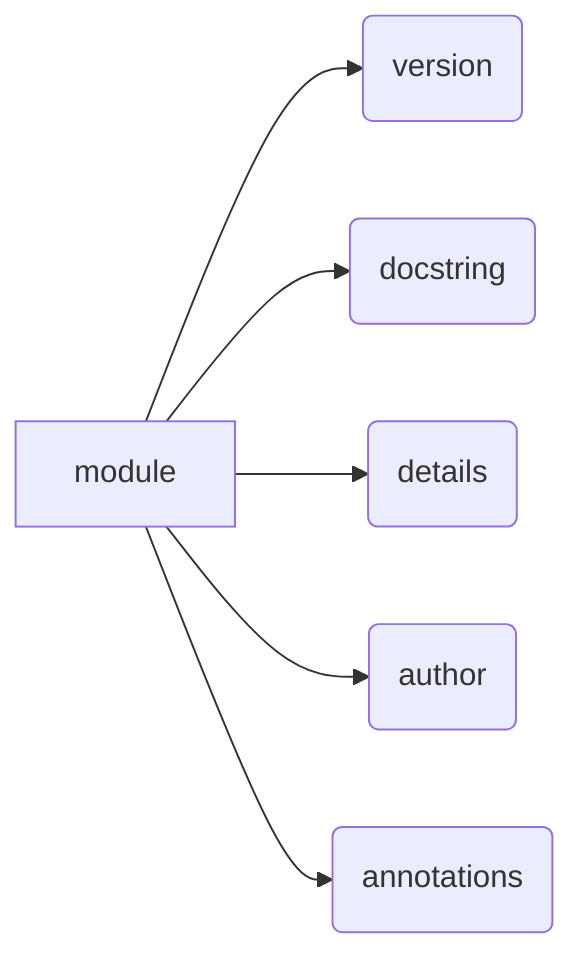

```MD
# <input code>

```python
## \file hypotez/src/suppliers/aliexpress/gui/version.py
# -*- coding: utf-8 -*-\n#! venv/Scripts/python.exe\n#! venv/bin/python/python3.12\n\n"""
.. module: src.suppliers.aliexpress.gui 
	:platform: Windows, Unix
	:synopsis:

"""
MODE = 'dev'

"""
	:platform: Windows, Unix
	:synopsis:

"""


"""
	:platform: Windows, Unix
	:synopsis:

"""


"""
  :platform: Windows, Unix

"""
"""
  :platform: Windows, Unix
  :platform: Windows, Unix
  :synopsis:
"""MODE = 'dev'
  
""" module: src.suppliers.aliexpress.gui """


"""
- `__version__`: This variable holds the version of the module or package.
- `__name__`: Contains the name of the module. If the script is being run directly, the value will be `"__main__"`.
- `__doc__`: The module's documentation string.
- `__details__`: This variable likely contains additional details about the module, but the exact purpose depends on the specific module or package.
- `__annotations__`: Contains type annotations for variables and functions in the module.
- `__author__`: The name(s) of the author(s) of the module.
"""
__name__:str
__version__="3.12.0.0.0.4"
__doc__:str=f""" Графический интерфейс для управления рекламными кампаниями. """

__details__:str=f"""  """

__annotations__


__author__='hypotez '
```

# <algorithm>

Этот код не содержит алгоритма в привычном понимании. Он представляет собой файл с дескрипторами и метаданными, которые описывают модуль `src.suppliers.aliexpress.gui`.  В нем задаются переменные, описывающие версию, название, автора и краткое описание модуля.  Алгоритм отсутствует, т.к. код не содержит управляющих структур (циклов, условий).  Данные не передаются между функциями.

# <mermaid>



# <explanation>

Этот файл `version.py` является файлом с метаданными, который определяет информацию о модуле `src.suppliers.aliexpress.gui`.  Он не содержит логики выполнения, а лишь описывает его.  Рассмотрим ключевые моменты:

* **Импорты:** Нет импортируемых модулей.  Файл описывает информацию о самом себе.
* **Классы:** Нет классов.  Этот файл не реализует какие-либо классы, предназначенные для использования в других модулях.
* **Функции:** Нет функций. Файл не содержит никакой функции, которая могла бы выполняться.
* **Переменные:**
    * `__version__`: Строковая переменная, содержащая версию модуля.
    * `__doc__`: Строковая переменная, содержащая строку документации (документацию модуля).
    * `__details__`: Строковая переменная, содержащая дополнительные детали о модуле.
    * `__author__`: Строковая переменная, содержащая имя автора модуля.
    * `MODE`: Строковая переменная, вероятно, определяет режим работы, например, 'dev' (разработка), 'prod' (производство).

* **Комментарии:** Код содержит много документационных строк (docstrings), которые описывают назначение модуля, атрибутов и переменных. Это важная практика, позволяющая другим разработчикам легко понять, как использовать и что делает модуль.
* **Связь с другими частями проекта:** Этот файл является частью иерархии проекта. Вероятно, он используется другими модулями, которые обращаются к нему для получения информации о версии или других дескрипторов, например, для отображения сведений о версии в пользовательском интерфейсе.

**Возможные ошибки/улучшения:**

* **Недостаток валидации данных:** Переменные `__version__`, `__doc__`, `__details__`, `__author__` и `MODE` не валидируются на соответствие ожидаемому формату.  В будущем, в зависимости от используемого фреймворка или инструментов, рекомендуется вводить валидацию для этих переменных, чтобы предотвратить потенциальные ошибки.
* **Недостаток документирования переменных `__annotations__`**: Нет объяснения о том, какую информацию будет содержать переменная `__annotations__`.
* **Слишком много комментариев `"""..."""`**: Комментарии могут содержать избыточную информацию и могли бы быть сгруппированы в единый docstring для улучшения читабельности.

В целом, код представляет собой правильный и хорошо документированный шаблон для файла метаданных Python, описывающего модуль, но с возможностями улучшения для валидации данных и лучшего оформления.