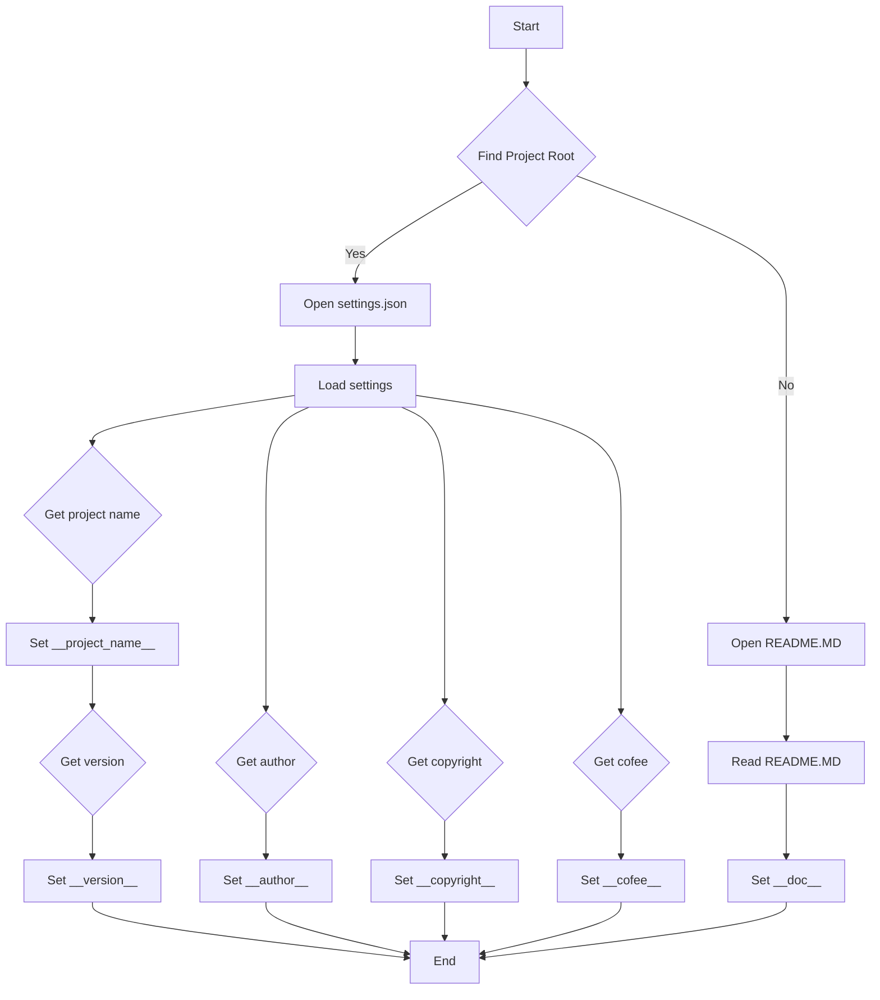

# <input code>

```python
## \file hypotez/src/suppliers/aliexpress/header.py
# -*- coding: utf-8 -*-\
#! venv/Scripts/python.exe
#! venv/bin/python/python3.12

"""
.. module: src.suppliers.aliexpress 
	:platform: Windows, Unix
	:synopsis:

"""
MODE = 'dev'

import sys
import json
from packaging.version import Version

from pathlib import Path
def set_project_root(marker_files=('pyproject.toml', 'requirements.txt', '.git')) -> Path:
    """
    Finds the root directory of the project starting from the current file's directory,
    searching upwards and stopping at the first directory containing any of the marker files.

    Args:
        marker_files (tuple): Filenames or directory names to identify the project root.
    
    Returns:
        Path: Path to the root directory if found, otherwise the directory where the script is located.
    """
    __root__:Path
    current_path:Path = Path(__file__).resolve().parent
    __root__ = current_path
    for parent in [current_path] + list(current_path.parents):
        if any((parent / marker).exists() for marker in marker_files):
            __root__ = parent
            break
    if __root__ not in sys.path:
        sys.path.insert(0, str(__root__))
    return __root__


# Get the root directory of the project
__root__ = set_project_root()
"""__root__ (Path): Path to the root directory of the project"""

from src import gs

settings:dict = None
try:
    with open(gs.path.root / 'src' /  'settings.json', 'r') as settings_file:
        settings = json.load(settings_file)
except (FileNotFoundError, json.JSONDecodeError):
    ...

doc_str:str = None
try:
    with open(gs.path.root / 'src' /  'README.MD', 'r') as settings_file:
        doc_str = settings_file.read()
except (FileNotFoundError, json.JSONDecodeError):
    ...


__project_name__ = settings.get("project_name", 'hypotez') if settings  else 'hypotez'
__version__: str = settings.get("version", '')  if settings  else ''
__doc__: str = doc_str if doc_str else ''
__details__: str = ''
__author__: str = settings.get("author", '')  if settings else ''
__copyright__: str = settings.get("copyrihgnt", '')  if settings else ''
__cofee__: str = settings.get("cofee", "Treat the developer to a cup of coffee for boosting enthusiasm in development: https://boosty.to/hypo69")  if settings else "Treat the developer to a cup of coffee for boosting enthusiasm in development: https://boosty.to/hypo69"
```

# <algorithm>



**Example Data Flow:**

1. The script starts (`A`).
2. It searches for the project root directory (`B`) using `set_project_root`, starting from the current file's directory and going up the directory tree until it finds `pyproject.toml`, `requirements.txt`, or `.git`.  _Example:_ If the current file is in `hypotez/src/suppliers/aliexpress/header.py`, it will search `hypotez/src/suppliers/aliexpress`, `hypotez/src`, `hypotez`, etc.
3. If the root directory is found (`B-Yes`), it opens `settings.json` in the `src` directory (`C`). 
4. It loads the JSON data into the `settings` variable (`E`). _Example:_ `settings = {'project_name': 'MyProject', 'version': '1.0.0', ...}`
5. The script then extracts the project name, version, author, and other details from the `settings` dictionary and sets the corresponding variables (`G`, `K`, `M`, `O`, `Q`). _Example:_ `__project_name__ = 'MyProject'`, `__version__ = '1.0.0'`, etc.
6. If `settings.json` is not found or cannot be parsed, the script proceeds without setting these values (`C - No`).
7. If `README.MD` exists, the script opens it (`D`), reads the content (`H`), and sets the `__doc__` variable.  _Example:_ `__doc__ = 'This is the project README.'`
8. If `README.MD` is not found or cannot be parsed, `__doc__` remains empty.
9. The script finishes (`R`).


# <mermaid>

```mermaid
graph LR
    subgraph Project Root Finding
        A[header.py] --> B(Path(__file__));
        B --> C{resolve()};
        C --> D[parent directories];
        D --> E{any marker file exists?};
        E -- Yes --> F[__root__ = parent];
        E -- No --> D;
    end
    subgraph File Loading
        F --> G[open settings.json];
        G --> H[json.load()];
        H --> I[settings];
        G --> J[open README.MD];
        J --> K[read() / content];
        K --> L[__doc__];
    end
    subgraph Variable Setting
        I --> M{get('project_name')};
        M --> N[__project_name__];
        I --> O{get('version')};
        O --> P[__version__];
    ... other variables are set similarly.
    end
    I --> Q[Exit];
```

# <explanation>

**Импорты:**

- `sys`: Модуль для взаимодействия с системой, используется для добавления директории проекта в `sys.path`, что позволяет импортировать модули из корневой директории проекта.
- `json`: Модуль для работы с JSON-форматом, используется для загрузки настроек проекта из файла `settings.json`.
- `packaging.version`: Модуль для работы с версиями пакетов, используется для правильной обработки версий в настройках проекта.
- `pathlib`: Модуль для работы с путями к файлам, используется для удобного обращения с файловой системой.


**Классы:**

В данном коде нет явных определений классов.

**Функции:**

- `set_project_root(marker_files)`: Эта функция находит корневую директорию проекта, начиная от текущей директории файла и итеративно поднимаясь вверх по директориям, пока не найдёт директорию содержащую указанные маркерные файлы (`pyproject.toml`, `requirements.txt`, `.git`).  Она возвращает найденную директорию.
    - *Аргументы*: `marker_files` - кортеж с именами файлов/папок, по которым определяется корень проекта.
    - *Возвращаемое значение*: `Path` - путь к корневой директории проекта.
    - *Пример*: Если текущий файл находится в `hypotez/src/suppliers/aliexpress/header.py`, функция будет искать корневую директорию, проверяя директории `hypotez/src/suppliers/aliexpress`, `hypotez/src`, `hypotez`.

**Переменные:**

- `__root__`: Переменная, хранящая путь к корневой директории проекта.  Тип `Path`.
- `settings`: Словарь, хранящий настройки проекта, загруженные из файла `settings.json`.  Тип `dict`.
- `doc_str`: Строка, содержащая содержимое файла `README.MD`.  Тип `str`.
- `__project_name__`, `__version__`, `__doc__`, `__details__`, `__author__`, `__copyright__`, `__cofee__`:  Константы, содержащие информацию о проекте, извлечённую из `settings.json`. Тип `str`.
- `MODE`: Переменная, хранящая режим работы. Тип `str`.


**Возможные ошибки и области для улучшений:**

- **Обработка ошибок:** Использование блоков `try...except` для обработки `FileNotFoundError` и `json.JSONDecodeError` - хороший подход.  Можно добавить более конкретные исключения или логирование для лучшей диагностики проблем.
- **Оптимизация поиска корневой директории:** Если проект имеет сложную структуру директорий, возможно, поиск корня может быть неэффективным.  Можно продумать более точную логику или использовать другие инструменты для определения корневой директории проекта.
- **Документация:**  Дополнить комментарии более детальной информацией, особенно для переменных, имеющих специфическое значение, например, маркерные файлы.
- **Использование `importlib.util`:** Вместо манипуляций с `sys.path` возможно, было бы эффективнее использовать `importlib.util` для импорта модулей из конкретной директории.

**Взаимосвязи с другими частями проекта:**

Модуль `gs` из пакета `src` используется для доступа к корневой директории проекта.  Эта зависимость необходима для корректного пути к файлам `settings.json` и `README.MD`.  Предполагается, что в `src` имеется модуль `gs` с определёнными свойствами, например, `gs.path.root`.