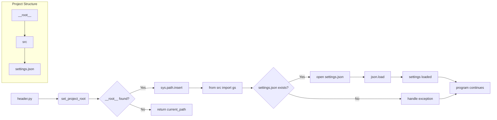

# <input code>

```python
## \file hypotez/src/suppliers/aliexpress/header.py
# -*- coding: utf-8 -*-\n#! venv/Scripts/python.exe\n#! venv/bin/python/python3.12\n\n"""\n.. module: src.suppliers.aliexpress \n\t:platform: Windows, Unix\n\t:synopsis:\n\n"""\nMODE = 'dev'\n\nimport sys\nimport json\nfrom packaging.version import Version\n\nfrom pathlib import Path\ndef set_project_root(marker_files=(\'pyproject.toml\', \'requirements.txt\', \'.git\')) -> Path:\n    """\n    Finds the root directory of the project starting from the current file\'s directory,\n    searching upwards and stopping at the first directory containing any of the marker files.\n\n    Args:\n        marker_files (tuple): Filenames or directory names to identify the project root.\n    \n    Returns:\n        Path: Path to the root directory if found, otherwise the directory where the script is located.\n    """\n    __root__:Path\n    current_path:Path = Path(__file__).resolve().parent\n    __root__ = current_path\n    for parent in [current_path] + list(current_path.parents):\n        if any((parent / marker).exists() for marker in marker_files):\n            __root__ = parent\n            break\n    if __root__ not in sys.path:\n        sys.path.insert(0, str(__root__))\n    return __root__\n\n\n# Get the root directory of the project\n__root__ = set_project_root()\n"""__root__ (Path): Path to the root directory of the project"""\n\nfrom src import gs\n\nsettings:dict = None\ntry:\n    with open(gs.path.root / 'src' /  'settings.json', 'r') as settings_file:\n        settings = json.load(settings_file)\nexcept (FileNotFoundError, json.JSONDecodeError):\n    ...\n
```

# <algorithm>

**Шаг 1:** Определение корневой директории проекта.
* На вход функции `set_project_root` подается кортеж `marker_files`, содержащий имена файлов (или папок), по которым можно определить корень проекта.
* Функция начинает поиск с текущей директории (`current_path`) файла `header.py`.
* Она последовательно проверяет родительские директории (`current_path.parents`), пока не найдет директорию, содержащую хотя бы один из файлов из `marker_files`.
* Если корневая директория найдена, она добавляется в список `sys.path`.
* Возвращается найденная корневая директория (`__root__`).

**Пример:**
Если `__file__` указывает на `hypotez/src/suppliers/aliexpress/header.py`, поиск начнется с `hypotez/src/suppliers/aliexpress/`, затем `hypotez/src/suppliers/`, и так далее, пока не найдется папка с `pyproject.toml`, `requirements.txt` или `.git`.  Если папка найдена, она будет возвращена.


**Шаг 2:** Получение настроек из файла `settings.json`.
*  Используется модуль `json` для загрузки данных из файла `settings.json`.
* Файл `settings.json` предполагается находящимся в папке `src` корня проекта, определяемого в шаге 1.
* При успешном чтении и парсинге JSON данных в переменную `settings` загружаются настройки.
* Обрабатываются исключения `FileNotFoundError` и `json.JSONDecodeError`, если файл не найден или не является корректным JSON.

**Пример:**
Если файл `settings.json` существует и содержит валидные данные JSON, то настройки загружаются в переменную `settings` и программа продолжает работу.


# <mermaid>



# <explanation>

**Импорты:**

* `sys`: Предоставляет доступ к системным переменным и функциям, в данном случае используется для добавления корневой директории проекта в `sys.path`.
* `json`: Используется для работы с файлами JSON, в данном случае для загрузки настроек из файла `settings.json`.
* `packaging.version`: Используется для работы с версиями пакетов, но в данном фрагменте кода не используется.
* `pathlib`: Предоставляет объектно-ориентированный способ работы с файлами и каталогами.
* `gs`: Вероятно, это собственный модуль или пакет проекта (`src`).  Обращение к `gs.path.root` подразумевает, что модуль `gs` определяет структуру путей к ресурсам проекта.


**Классы:**

Нет явных определений классов в данном фрагменте кода.

**Функции:**

* `set_project_root(marker_files=...)`:
    * Назначение: Находит корень проекта, начиная с текущего файла.
    * Аргументы: `marker_files` (кортеж строк, по умолчанию `('pyproject.toml', 'requirements.txt', '.git')`).
    * Возвращаемое значение: `Path` к корневой директории.
    * Пример использования: `__root__ = set_project_root()`.

**Переменные:**

* `MODE`: Строковая константа, вероятно, для определения режима работы приложения.
* `__root__`: Переменная, хранящая `Path` объекта к корню проекта.
* `settings`: Словарь, хранящий настройки, загруженные из файла `settings.json`.

**Возможные ошибки и улучшения:**

* **Обработка ошибок:**  Хотя исключения `FileNotFoundError` и `json.JSONDecodeError` обрабатываются, можно добавить более подробную информацию об ошибке (например, вывести сообщение об ошибке в консоль).
* **Использование `try...except` блоков:**  Дополнительные `try...except` блоки (например, для `ImportError`) могут быть полезны, если предполагается, что модуль `gs` может не быть импортирован в определенных средах.
* **Документация:** Добавить более подробную документацию к функциям и переменным.


**Взаимосвязь с другими частями проекта:**

Модуль `gs` (видимо, `src/gs.py`) играет важную роль в определении структуры путей внутри проекта.  Без понимания реализации `gs` невозможно полностью понять, как данный фрагмент кода интегрируется с остальной частью проекта.  Знание реализации `gs` (в частности, определения `gs.path.root`) необходимо для понимания, как этот код будет взаимодействовать с другими частями приложения.