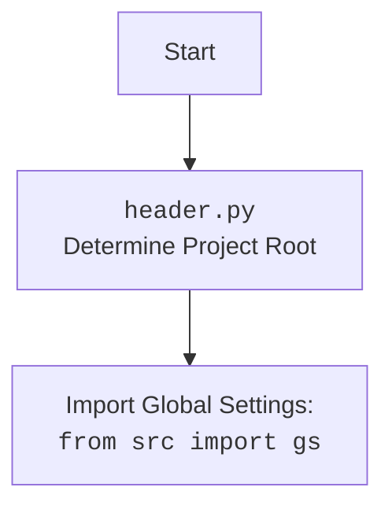

## АНАЛИЗ КОДА: `hypotez/src/suppliers/aliexpress/header.py`

### <алгоритм>

1. **Начало**:
   - Инициализация: Запускается скрипт `header.py`.
   - Импорт модулей: Импортируются необходимые модули `sys`, `json`, `Version` из `packaging.version` и `Path` из `pathlib`.

2. **`set_project_root(marker_files)`**:
   - Поиск корневой директории проекта:
     - Инициализация `__root__` текущим расположением файла (`__file__`).
     - Проход по родительским директориям (включая текущую).
     - Проверка наличия `marker_files` (например, `__root__`) в каждой директории.
     - Если маркер найден, `__root__` устанавливается в эту директорию и цикл прерывается.
     - Если `__root__` отсутствует в `sys.path`, то она добавляется в начало.
   - Возврат: Возвращается `__root__` (путь к корневой директории).
   - *Пример:* Пусть `marker_files` это кортеж `('__root__',)`. Если файл `__root__` существует в директории `/home/user/project/`, и текущий файл находится по пути `/home/user/project/src/suppliers/aliexpress/header.py`, то `__root__` станет `/home/user/project/`.

3. **Определение `__root__`**:
   - Вызов `set_project_root()` для определения корневой директории проекта и сохранение результата в `__root__`.
    - `__root__` теперь содержит путь к корневой директории проекта.

4. **Импорт `gs`**:
   - Импортируется `gs` из `src`. Предполагается, что `gs` содержит глобальные настройки проекта, включая путь к корневой директории.

5. **Загрузка настроек**:
   - Инициализация: Переменная `settings` устанавливается в `None`.
   - Попытка чтения `settings.json`:
     - Открытие файла `settings.json`, расположенного в `<root>/src/settings.json`.
     - Загрузка JSON из файла в словарь `settings`.
   - Обработка исключений:
     - Если `FileNotFoundError` (файл не найден) или `json.JSONDecodeError` (ошибка разбора JSON), то действие пропускается (`...`).
     - *Пример:* Если в проекте есть файл `/home/user/project/src/settings.json` с содержимым `{"key": "value"}`, то `settings` будет словарем `{'key': 'value'}`.

6. **Конец**:
   - Скрипт завершает работу.
### <mermaid>

```mermaid
flowchart TD
    Start[Начало] --> FindProjectRoot[<code>set_project_root()</code><br>Определение корневой директории проекта];
    
    FindProjectRoot --> InitializeRoot[Инициализация <code>__root__</code> текущей директорией]
    InitializeRoot --> LoopThroughParents[Цикл по родительским директориям]
    LoopThroughParents -- MarkerFound --> SetRoot[Установка <code>__root__</code> в найденную директорию]
    LoopThroughParents -- MarkerNotFound --> NextParent[Переход к следующей родительской директории]
    SetRoot --> BreakLoop[Выход из цикла]
    NextParent --> LoopThroughParents
    BreakLoop --> CheckInSysPath[Проверка наличия <code>__root__</code> в <code>sys.path</code>]
    CheckInSysPath -- NotInPath --> AddToSysPath[Добавление <code>__root__</code> в <code>sys.path</code>]
    CheckInSysPath -- InPath --> ReturnRoot[Возврат <code>__root__</code>]
    AddToSysPath --> ReturnRoot
    ReturnRoot --> SetGlobalRoot[Установка <code>__root__</code> как глобальной переменной]
    
    SetGlobalRoot --> ImportGS[Импорт глобальных настроек: <br><code>from src import gs</code>]
    ImportGS --> InitializeSettings[Инициализация <code>settings</code> в <code>None</code>]
    InitializeSettings --> TryOpenSettingsFile[Попытка открытия <code>settings.json</code>]
    TryOpenSettingsFile --> LoadSettingsFromFile[Загрузка настроек из <code>settings.json</code>]
    LoadSettingsFromFile --> End[Конец]
    TryOpenSettingsFile -- FileError --> SkipLoading[Пропуск загрузки]
     TryOpenSettingsFile -- JSONError --> SkipLoading
    SkipLoading --> End
    
    
```



### <объяснение>

**Импорты:**

*   `sys`: Этот модуль обеспечивает доступ к некоторым переменным и функциям, взаимодействующим с интерпретатором Python. В данном случае используется для изменения `sys.path`, добавляя корневой каталог проекта, чтобы другие модули могли быть импортированы.
*   `json`: Модуль используется для работы с JSON. В коде используется для загрузки настроек из файла `settings.json`.
*   `packaging.version.Version`: Этот класс используется для представления версий и их сравнения, но в предоставленном коде он не используется, что может быть связано с наличием более сложного функционала в других частях проекта.
*   `pathlib.Path`: Предоставляет объектно-ориентированный способ работы с путями файловой системы. Это позволяет делать код более читаемым и переносимым между различными операционными системами.

**Функция:**

*   `set_project_root(marker_files: tuple = ('__root__',)) -> Path`:
    *   **Аргументы**:
        *   `marker_files` (tuple): Кортеж с именами файлов или папок, которые служат маркерами корневой директории. По умолчанию это `('__root__',)`.
    *   **Возвращает**:
        *   `Path`: Объект пути к корневой директории проекта, либо к директории где находится сам файл, если маркер не найден.
    *   **Назначение**: Функция ищет корневую директорию проекта, поднимаясь по иерархии каталогов вверх от текущего файла. Она проверяет наличие файлов-маркеров.
    *   **Примеры**:
        *   `set_project_root()`: Ищет файл `__root__` для определения корневой папки проекта.
        *   `set_project_root(marker_files=('setup.py',))`: Ищет файл `setup.py` для определения корневой папки проекта.

**Переменные:**

*   `__root__`: (Path) Глобальная переменная, хранящая путь к корневой директории проекта. Она инициализируется с помощью `set_project_root()` и используется для доступа к файлам и папкам проекта.
*   `settings`: (dict) Словарь, который хранит настройки проекта, загруженные из `settings.json`.
*   `current_path`: (Path) Локальная переменная, хранящая путь к директории, в которой находится текущий файл.
*   `parent`: (Path) Локальная переменная, представляющая родительскую директорию в цикле поиска корневой директории.

**Объяснения:**

1.  **Поиск корневой директории**: Функция `set_project_root` является важным компонентом, так как позволяет определять корень проекта, независимо от того, откуда запускается скрипт. Это делает структуру проекта более гибкой.
2.  **Загрузка настроек**: Блок `try...except` используется для безопасной загрузки настроек из файла `settings.json`. Это позволяет обрабатывать ситуации, когда файл отсутствует или имеет некорректный формат, без остановки работы программы.
3.  **Глобальные настройки `gs`**: Импорт `from src import gs` предполагает, что `gs` содержит глобальные переменные и функции, используемые в проекте. Эта переменная импортируется после установки `__root__`, что позволяет правильно сконфигурировать пути к файлам.
4.  **Путь `sys.path`**: Добавление корневой директории в `sys.path` позволяет Python импортировать модули из этой директории как если бы они были установлены в стандартной библиотеке.

**Потенциальные ошибки и области для улучшения:**

*   **Обработка ошибок**: Исключение `json.JSONDecodeError` обрабатывается как `FileNotFoundError`, что может затруднить отладку. Лучше явно обрабатывать оба исключения.
*   **Отсутствие `settings.json`**: Если `settings.json` не найден, `settings` останется `None`. Это может привести к ошибкам в дальнейшем коде, который полагается на `settings`. Следует добавить обработку случая, когда `settings` равно `None`.
*   **Скрытая логика**: Логика работы с `sys.path` может быть не очевидной для новых разработчиков. Следует добавить комментарии, объясняющие, почему это нужно.
*   **Отсутствие проверки типа `settings`**: После загрузки настроек не производится проверка типа `settings`. Это может привести к проблемам, если файл `settings.json` содержит данные другого типа.

**Взаимосвязи с другими частями проекта**:
*   Данный файл является частью процесса инициализации проекта. Он обеспечивает корректную работу модулей, определяя корневую директорию и загружая необходимые настройки.
*   `gs` (глобальные настройки) используются в разных частях проекта, и данный файл гарантирует их доступность.
*  Настройка `sys.path` необходима для корректного импорта модулей, которые лежат в каталоге проекта, что является важной частью работы с Python проектами.