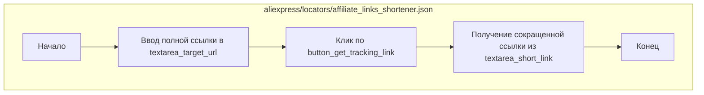

## АНАЛИЗ КОДА: `hypotez/src/suppliers/aliexpress/locators/affiliate_links_shortener.json`

### 1. <алгоритм>

Данный JSON файл описывает локаторы для элементов веб-страницы, используемые для сокращения партнерских ссылок AliExpress. Процесс работы с этими локаторами можно представить следующим образом:

1. **Ввод целевого URL:**
   - Находится элемент `textarea` с `id='targetUrl'` (локатор: `"textarea_target_url"`).
   - Текст в элементе `textarea` очищается, затем в него вводится полная ссылка (значение `%EXTERNAL_MESSAGE%`).
   * **Пример**:
     *  `selector`: `//textarea[@id = 'targetUrl']`
     *  `event`: `clear();https://aliexpress.ru/item/12345.html`
     *  `Результат`: Текстовое поле ввода URL очищено и заполнено ссылкой.

2. **Нажатие кнопки "Получить партнерскую ссылку":**
   - Находится элемент `button` с `class`, содержащим `link-form-submit` (локатор: `"button_get_tracking_link"`).
   - По найденному элементу происходит клик.
   * **Пример**:
     *  `selector`: `//button[contains(@class, 'link-form-submit')]`
     *  `event`: `click()`
     *  `Результат`: Отправляется форма запроса на сокращение ссылки.

3. **Получение сокращенной ссылки:**
    - Находится элемент `textarea` внутри `form` с `class` содержащим `link-form-text` (локатор: `"textarea_short_link"`).
    - Извлекается значение атрибута `value` найденного `textarea`.
    * **Пример**:
      *  `selector`: `//form[contains(@class, 'link-form-text')]//textarea`
      *  `attribute`: `value`
      * `Результат`: Из поля ввода получаем готовую короткую ссылку.
    *  `Возвращаемое значение`: Значение атрибута `value` в формате строки, представляющее короткую ссылку.

**Поток данных:**

1.  **Ввод ссылки**: `textarea_target_url` <- `full_link` (переменная `%EXTERNAL_MESSAGE%` содержащая полную ссылку)
2.  **Отправка формы**: `button_get_tracking_link` -> `click event`
3.  **Получение сокращенной ссылки**: `textarea_short_link` -> `short_link_value` (значение атрибута `value`)

### 2. <mermaid>

**Объяснение:**

- `Start`: Начало процесса.
- `InputFullLink`: Представляет этап, на котором полная ссылка вводится в поле ввода `textarea` (локатор `textarea_target_url`).
- `ClickButton`: Представляет этап, на котором происходит клик по кнопке "Получить партнерскую ссылку" (локатор `button_get_tracking_link`).
- `GetShortLink`:  Представляет этап, на котором происходит извлечение значения из `textarea` с сокращенной ссылкой (локатор `textarea_short_link`).
- `End`: Конец процесса.

### 3. <объяснение>

**Импорты:**

Данный файл не содержит импортов. Это JSON-файл, который используется как конфигурационный файл.

**Классы:**

В данном файле нет классов, поскольку это JSON-файл, хранящий конфигурацию.

**Функции:**

В данном файле нет функций, поскольку это JSON-файл, хранящий конфигурацию.

**Переменные:**

JSON-файл описывает три основные переменные (в контексте работы программы):

-   `textarea_target_url`:
    -   **Тип:** `dict` (словарь).
    -   **Назначение:** Описывает локатор для поля ввода, куда вводится полная ссылка.
    -   **Атрибуты:**
        -   `attribute`: `false` (атрибут не используется для поиска элемента).
        -   `by`: `XPATH` (метод поиска элемента).
        -   `selector`: `//textarea[@id = 'targetUrl']` (XPATH-селектор для поиска).
        -   `if_list`: `"first"`(если найдено несколько элементов, брать первый).
         -   `use_mouse`: `false` (не используется взаимодействие мышью).
        -  `timeout`: `0` (таймаут на поиск элемента).
        -   `timeout_for_event`: `presence_of_element_located` (ожидание появления элемента).
        -   `event`: `"clear();%EXTERNAL_MESSAGE%"` (событие: сначала очистка, затем ввод внешней переменной `%EXTERNAL_MESSAGE%`).
        -   `mandatory`: `true` (локатор обязательный).
        -   `locator_description`: `"Full link input box"` (описание локатора).
-   `button_get_tracking_link`:
    -   **Тип:** `dict` (словарь).
    -   **Назначение:** Описывает локатор для кнопки "Получить партнерскую ссылку".
    -   **Атрибуты:**
        -   `attribute`: `false` (атрибут не используется для поиска элемента).
        -   `by`: `XPATH` (метод поиска элемента).
        -   `selector`: `//button[contains(@class, 'link-form-submit')]` (XPATH-селектор для поиска).
        -   `if_list`: `"first"`(если найдено несколько элементов, брать первый).
        -   `use_mouse`: `false` (не используется взаимодействие мышью).
        -   `timeout`: `0` (таймаут на поиск элемента).
        -   `timeout_for_event`: `presence_of_element_located` (ожидание появления элемента).
        -   `event`: `"click()"` (событие: клик).
        -   `mandatory`: `true` (локатор обязательный).
        -   `locator_description`: `"Send form button"` (описание локатора).
-    `textarea_short_link`:
    -   **Тип:** `dict` (словарь).
    -   **Назначение:** Описывает локатор для поля вывода сокращенной ссылки.
    -   **Атрибуты:**
        -   `attribute`: `"value"` (берем значение атрибута).
        -   `by`: `XPATH` (метод поиска элемента).
        -   `selector`: `//form[contains(@class, 'link-form-text')]//textarea` (XPATH-селектор для поиска).
        -   `if_list`: `"first"`(если найдено несколько элементов, брать первый).
        -   `use_mouse`: `false` (не используется взаимодействие мышью).
        -   `timeout`: `0` (таймаут на поиск элемента).
        -   `timeout_for_event`: `presence_of_element_located` (ожидание появления элемента).
        -   `event`: `false` (событие не применяется).
        -   `mandatory`: `true` (локатор обязательный).
        -   `locator_description`: `"Send form button"` (описание локатора).

**Потенциальные ошибки и области для улучшения:**

-   **Жестко заданные XPATH:** XPATH-селекторы могут сломаться при изменении структуры HTML-страницы AliExpress. Необходимо предусмотреть варианты их обновления или использования более устойчивых стратегий поиска элементов.
-   **Отсутствие явного ожидания:** В текущей конфигурации используется `presence_of_element_located`. В зависимости от условий работы может потребоваться использовать более явные ожидания, чтобы избежать ошибок при загрузке страницы.
-   **Обработка ошибок:** Не предусмотрена обработка ошибок, если какой-либо из элементов не будет найден или если что-то пойдет не так с событиями (например, невозможно кликнуть на кнопку). Необходимо добавить обработку возможных исключений.

**Взаимосвязь с другими частями проекта:**

-   Этот JSON-файл является частью системы автоматизации взаимодействия с AliExpress для сокращения партнерских ссылок. Предположительно, он используется в модуле, который занимается автоматизацией действий на веб-страницах с помощью Selenium или аналогичных инструментов.
-  Переменная `%EXTERNAL_MESSAGE%` предполагает интеграцию с другой частью проекта, которая передает полную ссылку для сокращения.