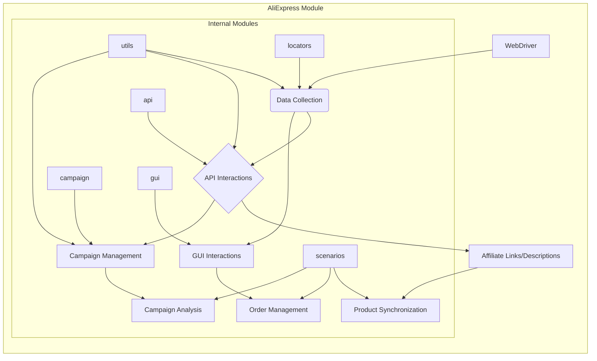

# Анализ кода модуля AliExpress

## <input code>

```
# Aliexpress  
## Module for interactions with the supplier `aliexpress.com`

This module provides access to supplier data via the `HTTPS` (webdriver) and `API` protocols.

**webdriver**
- Direct access to the product's `html` pages via `Driver`. It allows executing data collection scripts, including navigating through categories.

**api**
- Used to obtain `affiliate links` and brief product descriptions.

## Internal Modules:
### `utils`  
Contains helper functions and utility classes for performing common operations in the AliExpress integration. It likely includes tools for data formatting, error handling, logging, and other tasks that simplify interaction with the AliExpress ecosystem.

---

### `api`  
Provides methods and classes for direct interaction with the AliExpress API. Likely includes functionality for sending requests, processing responses, and managing authentication, simplifying interaction with the API for retrieving or sending data.

---

### `campaign`  
Designed for managing marketing campaigns on AliExpress. It likely includes tools for creating, updating, and tracking campaigns, as well as methods for analyzing their effectiveness and optimizing based on provided metrics.

---

### `gui`  
Provides graphical user interface elements for interacting with AliExpress functionality. It likely includes implementations of forms, dialogs, and other visual components that allow users to more intuitively manage AliExpress operations.

---

### `locators`  
Contains definitions for locating elements on AliExpress web pages. These locators are used in conjunction with WebDriver tools to perform automated interactions, such as data collection or executing actions on the AliExpress platform.

---

### `scenarios`  
Defines complex scenarios or sequences of actions for interacting with AliExpress. It likely includes combinations of tasks (e.g., API requests, GUI interactions, and data processing) as part of larger operations, such as product synchronization, order management, or campaign execution.
```

## <algorithm>

К сожалению, предоставленный код не содержит конкретного алгоритма в виде кода. Это описание модуля AliExpress, и алгоритмы реализованы в внутренних модулях (`utils`, `api`, `campaign`, `gui`, `locators`, `scenarios`).  Без доступа к исходному коду внутренних модулей, пошаговая блок-схема невозможна.

## <mermaid>



## <explanation>

**Описание:**

Документ описывает модуль `Aliexpress` для взаимодействия с поставщиком `aliexpress.com`. Он выделяет различные компоненты для взаимодействия с AliExpress, включая веб-драйвер для работы с HTML-страницами, API для получения данных и других модулей (`utils`, `api`, `campaign`, `gui`, `locators`, `scenarios`). Каждый модуль призван выполнять конкретные задачи, связанные с AliExpress.

**Импорты:**

Нет импортов, так как представлен лишь файл README. Импорты будут содержаться в файлах исходного кода, связанных с модулями `utils`, `api`, `campaign`, `gui`, `locators`, `scenarios`.

**Классы:**

Документ описывает предполагаемые классы и их назначение в рамках модулей, но конкретные реализации не приведены. Например, в `utils` могут быть классы для работы с данными или логгирования.  В `api` - классы для отправки и обработки API-запросов.

**Функции:**

Функциональность описана в рамках предполагаемых классов, но конкретных функций нет. Подробное описание поведения содержится в исходных кодах внутренних модулей.

**Переменные:**

Типы и использование переменных будут определены в коде модулей.

**Возможные ошибки и улучшения:**

* **Недостаточная детализация:**  README-файл слишком общий и не предоставляет достаточной информации для понимания конкретной реализации. Необходимо просмотреть исходный код внутренних модулей для более точного анализа.
* **Отсутствие конкретной реализации:** Описание не включает примеры кода, что затрудняет понимание алгоритмов работы и взаимодействия компонентов.
* **Не описаны форматы данных:** Нет информации о форматах данных, передаваемых между модулями.

**Взаимосвязи с другими частями проекта:**

Описание предполагает, что модуль `Aliexpress` взаимодействует с другими частями проекта через вызовы методов и функций из внутренних модулей. Описание  не предоставляет цепочки взаимосвязей, но предполагает их наличие. Необходимо изучить исходный код для детализации.


**Вывод:**

Предоставленный README-файл является хорошим описанием общей функциональности модуля, но для глубокого понимания алгоритмов и реализации необходимо ознакомиться с исходным кодом всех связанных модулей.