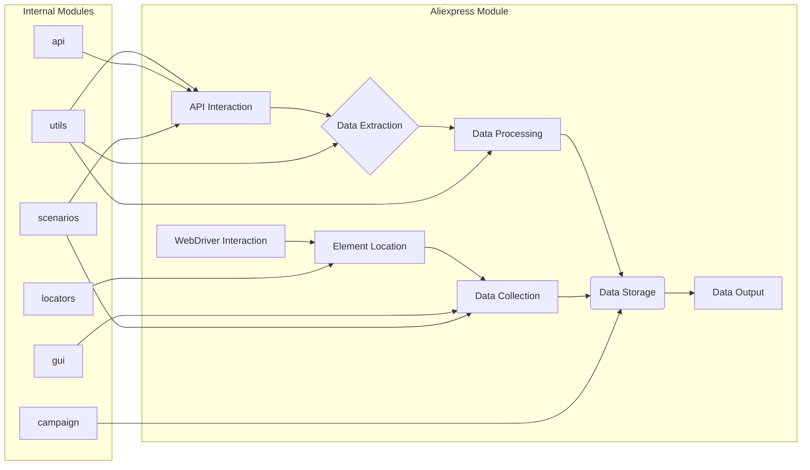

```MD
# Анализ кода модуля aliexpress

## <input code>

```
# Aliexpress  
## Module for interactions with the supplier `aliexpress.com`

This module provides access to supplier data via the `HTTPS` (webdriver) and `API` protocols.

**webdriver**
- Direct access to the product's `html` pages via `Driver`. It allows executing data collection scripts, including navigating through categories.

**api**
- Used to obtain `affiliate links` and brief product descriptions.

## Internal Modules:
### `utils`  
Contains helper functions and utility classes for performing common operations in the AliExpress integration. It likely includes tools for data formatting, error handling, logging, and other tasks that simplify interaction with the AliExpress ecosystem.

---

### `api`  
Provides methods and classes for direct interaction with the AliExpress API. Likely includes functionality for sending requests, processing responses, and managing authentication, simplifying interaction with the API for retrieving or sending data.

---

### `campaign`  
Designed for managing marketing campaigns on AliExpress. It likely includes tools for creating, updating, and tracking campaigns, as well as methods for analyzing their effectiveness and optimizing based on provided metrics.

---

### `gui`  
Provides graphical user interface elements for interacting with AliExpress functionality. It likely includes implementations of forms, dialogs, and other visual components that allow users to more intuitively manage AliExpress operations.

---

### `locators`  
Contains definitions for locating elements on AliExpress web pages. These locators are used in conjunction with WebDriver tools to perform automated interactions, such as data collection or executing actions on the AliExpress platform.

---

### `scenarios`  
Defines complex scenarios or sequences of actions for interacting with AliExpress. It likely includes combinations of tasks (e.g., API requests, GUI interactions, and data processing) as part of larger operations, such as product synchronization, order management, or campaign execution.
```

## <algorithm>

К сожалению, предоставленный код — это не код, а описание модуля.  Блок-схема невозможна.  Мы можем только представить, как могли бы выглядеть алгоритмы внутри модулей. Например, алгоритм получения данных с API мог бы выглядеть так:

1. **Получение запроса:** Функция получает данные из внешних источников (например, пользовательский ввод или конфигурационные файлы).
2. **Формирование запроса:** На основе полученных данных формируется запрос к API AliExpress.
3. **Отправка запроса:** Отправляется запрос к API.
4. **Обработка ответа:**  Полученный ответ обрабатывается (разбор JSON, проверка ошибок).
5. **Обработка данных:** Из ответа извлекаются необходимые данные.
6. **Возврат данных:** Результат (извлеченные данные) возвращается вызывающей функции.

Пример алгоритма взаимодействия с веб-драйвером:
1. **Инициализация драйвера:**  Создается экземпляр WebDriver.
2. **Навигация по сайту:**  Драйвер использует locators для перехода на нужные страницы.
3. **Сбор данных:**  Драйвер взаимодействует с элементами страницы для сбора данных.
4. **Запись данных:**  Собранные данные сохраняются.
5. **Закрытие драйвера:** Закрытие соединения с браузером.


## <mermaid>



## <explanation>

**Импорты:**

В данном случае нет импорта кода, а лишь описание модуля.  Без кода невозможно проанализировать импорты и их зависимость от других пакетов.

**Классы:**

Описание содержит описание *потенциальных* классов, но без кода невозможно точно определить их структуру, атрибуты и методы.

**Функции:**

Аналогично классам, функциональность функций описана концептуально.  Например, функции для работы с API или веб-драйвером описаны на высоком уровне.

**Переменные:**

Описание переменных отсутствует, так как это описание, а не код.

**Возможные ошибки и улучшения:**

- Отсутствует код, поэтому невозможно выявить ошибки или предложить улучшения.
- Необходимо более конкретное описание функциональности для каждого модуля, в том числе API-взаимодействия, стратегий обработки ошибок и вариантов возврата данных.


**Взаимосвязи с другими частями проекта:**

Из описания ясно, что модуль `aliexpress` взаимодействует с модулями `utils`, `api`, `campaign`, `gui`, `locators` и `scenarios`.  Взаимодействие описано концептуально, но предполагает, что эти модули предоставляют необходимую функциональность для работы с поставщиком `aliexpress.com`.  Например, `utils` предоставляет общие функции, `api` – инструменты для работы с API, `campaign` – инструменты для работы с рекламными кампаниями и т. д.