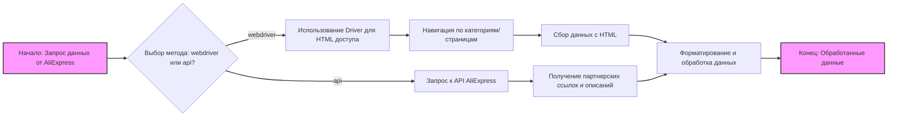
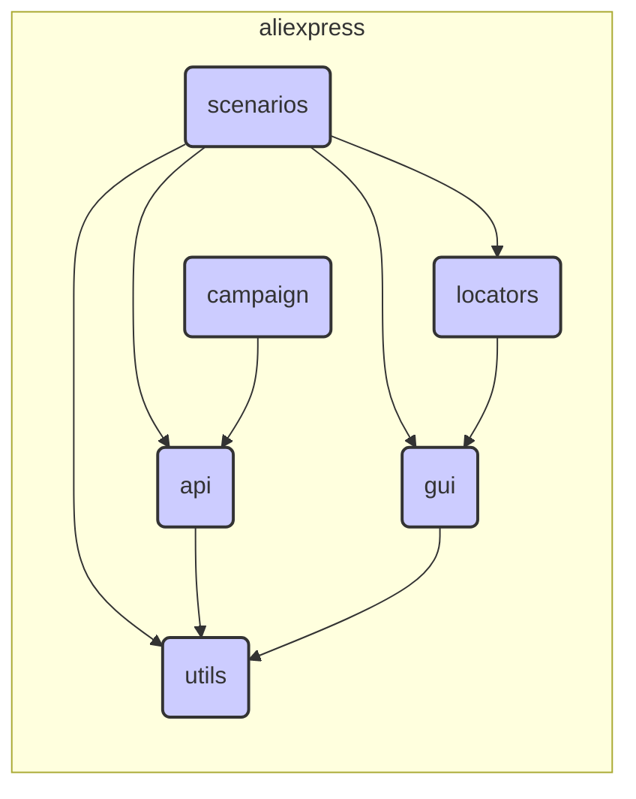

## Анализ модуля Aliexpress

### 1. <алгоритм>

**Описание:**

Модуль `aliexpress` предназначен для взаимодействия с поставщиком aliexpress.com. Он использует два основных подхода: через `webdriver` (прямой доступ к HTML-страницам) и через `API` (для получения партнерских ссылок и кратких описаний товаров). Внутри модуля используется ряд вспомогательных подмодулей.

**Блок-схема:**

**Примеры:**

*   **webdriver:** Пользователь хочет собрать данные о всех товарах в категории "электроника". Скрипт WebDriver открывает страницу категории, переходит по страницам пагинации и извлекает необходимую информацию (название, цена, описание, изображение) с каждого товара.
*   **api:** Пользователь хочет получить партнерскую ссылку на конкретный товар. Скрипт делает запрос к API AliExpress, передавая ID товара, и в ответ получает партнерскую ссылку и краткое описание.

### 2. <mermaid>

**Объяснение зависимостей:**

*   **scenarios** (сценарии) использует все остальные модули:
    *   `utils`: для вспомогательных операций, таких как форматирование данных, логирование, обработка ошибок.
    *   `api`: для взаимодействия с API AliExpress, например, отправки запросов и обработки ответов.
    *   `gui`: для взаимодействия с графическим интерфейсом, например, для автоматизации работы с веб-страницами.
    *   `locators`: для поиска элементов на веб-страницах AliExpress.
*   **api** (API) использует `utils` для обработки данных и ошибок.
*   **gui** (GUI) использует `utils` для взаимодействия с данными и `locators` для поиска веб-элементов.
*   **campaign** (кампании) использует `api` для работы с маркетинговыми кампаниями.
*   **locators** (локаторы) использует `gui` для доступа к веб-элементам.

### 3. <объяснение>

**Импорты:**

В предоставленном описании кода нет явных импортов, но из контекста можно предположить:

*   **`selenium`** или аналогичные библиотеки для `webdriver`: для взаимодействия с браузером и HTML-страницами.
*   **`requests`** или `httpx` для `api`: для отправки HTTP-запросов к API.
*   **`json`** для `api`: для работы с данными в формате JSON.
*   **`logging`**: для логирования событий и ошибок в подмодулях.
*   **`typing`**:  для работы с типами, в случае написания кода.

**Классы:**

*   **`Driver`** (в контексте `webdriver`): Возможно, это класс, который управляет браузером (например, `selenium.webdriver`), предоставляя методы для навигации по страницам и взаимодействия с элементами.
*   **Классы в `api`**: Могут быть классы для управления подключениями к API, отправки запросов и обработки ответов.
*   **Классы в `campaign`**: Классы, управляющие маркетинговыми кампаниями.

**Функции:**

*   **Функции `webdriver`:**  Могут включать функции для:
    *   Загрузки веб-страницы.
    *   Навигации по категориям.
    *   Поиска элементов по `locators`.
    *   Извлечения данных из HTML.
*   **Функции `api`**:  Могут включать функции для:
    *   Аутентификации в API.
    *   Отправки запросов к API.
    *   Парсинга ответов API.
    *   Генерации партнерских ссылок.
*   **Функции в `utils`**:  Общие функции для обработки данных, форматирования, работы с логами и обработки ошибок.
*   **Функции в `scenarios`**: Комбинации задач для автоматизации процессов.

**Переменные:**

*   `Driver` object (например, `webdriver.Chrome()`): для взаимодействия с браузером.
*   `url`: строка, представляющая URL-адрес страницы.
*   `locators`: структуры данных (например, словари или объекты) для хранения путей к элементам на веб-страницах (CSS селекторы, XPath).
*   `api_keys`, `api_secrets`: для аутентификации в API AliExpress.
*   `product_id`: идентификатор товара для API-запросов.

**Потенциальные ошибки и улучшения:**

*   **Обработка ошибок:** Необходимо тщательно продумать обработку ошибок при работе с веб-страницами (`webdriver`) и API, особенно в случаях, когда запросы могут завершиться неудачно или структура страницы изменится.
*   **Поддержка изменений:** Веб-страницы и API AliExpress могут меняться, поэтому необходимо отслеживать эти изменения и своевременно обновлять код.
*   **Масштабируемость:** При работе с большими объемами данных необходимо учитывать производительность и оптимизировать работу скриптов.
*   **Логирование:** Важно настроить подробное логирование всех действий и ошибок для упрощения отладки.
*   **Параметризация:** Код должен быть гибким и легко настраиваться через параметры конфигурации.

**Цепочка взаимосвязей с другими частями проекта:**

Модуль `aliexpress` является частью проекта, который, вероятно, предназначен для работы с данными от различных поставщиков. Он может взаимодействовать со следующими частями:

*   **`database`:**  Для хранения полученных данных (товары, цены, партнерские ссылки и т.д.).
*   **`product_management`:**  Для управления информацией о товарах, полученных от AliExpress.
*   **`analytics`:** Для анализа эффективности маркетинговых кампаний и других показателей.
*   **`user_interface`:** Для отображения данных и предоставления пользователю возможности управления операциями.

Взаимодействие с модулями может осуществляться через импорты, вызовы функций или использование общих классов.