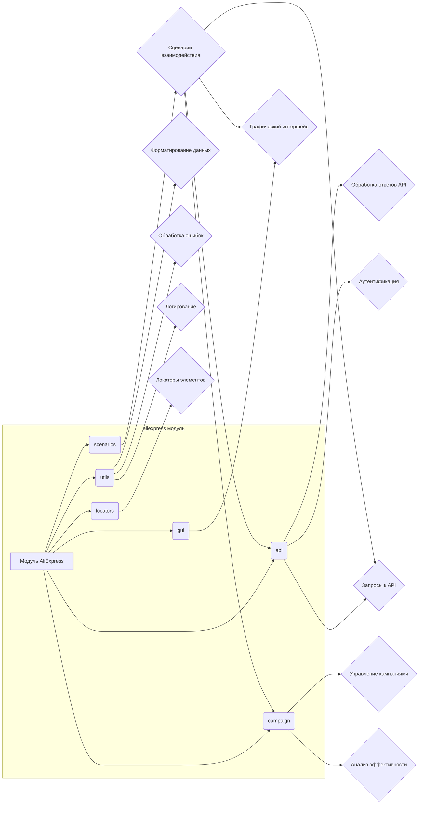

# Анализ кода модуля `aliexpress`

## <input code>

```
# Aliexpress
## Модуль для  интеракций с поставщиком `aliexpress.com`

Модуль педоставляет доступ к данным поставщика по протоколам `HTTPS` (webdriver) и `API`  

**webdriver**
 - Прямой доступ к `html` страницам  товара через `Driver` . Позволяет исполнять сценарии сбора информации включая
переход по категориям.

**api**
 - Используется для получения `affiliate link` и кратких характеристик товара. 


## Внутернние модули:
 ### `utils`   
содержит вспомогательные функции и утилитарные классы для выполнения общих операций в интеграции с AliExpress. Вероятно, включает инструменты для форматирования данных, обработки ошибок, логирования и других задач, которые упрощают взаимодействие с экосистемой AliExpress.

---

### `api`    
предоставляет методы и классы для прямого взаимодействия с API AliExpress. Вероятно, включает функциональность для отправки запросов, обработки ответов и управления аутентификацией, упрощая взаимодействие с API для получения или отправки данных.

---

### `campaign`    
предназначен для управления маркетинговыми кампаниями на AliExpress. Вероятно, включает инструменты для создания, обновления и отслеживания кампаний, а также методы для анализа их эффективности и оптимизации на основе предоставленных метрик.

---

### `gui`    
предоставляет графические элементы пользовательского интерфейса для взаимодействия с функциональностью AliExpress. Вероятно, включает реализации форм, диалогов и других визуальных компонентов, которые позволяют пользователям более интуитивно управлять операциями AliExpress.

---

### `locators`    
содержит определения для поиска элементов на веб-страницах AliExpress. Эти локаторы используются вместе с инструментами WebDriver для выполнения автоматизированных взаимодействий, таких как сбор данных или выполнение действий на платформе AliExpress.

---

### `scenarios`    
определяет сложные сценарии или последовательности действий для взаимодействия с AliExpress. Вероятно, включает комбинацию задач (например, API-запросов, взаимодействий с GUI и обработки данных) в рамках более крупных операций, таких как синхронизация товаров, управление заказами или выполнение кампаний.
```

## <algorithm>

К сожалению, предоставленный код не содержит реализации алгоритмов.  Он описывает структуру и функциональность модуля, но не содержит пошаговых инструкций по выполнению операций.  Для построения блок-схемы необходим код с конкретными функциями и методами.


## <mermaid>



**Описание диаграммы:**

Диаграмма показывает взаимосвязи между модулями `aliexpress` и его внутренними компонентами (utils, api, campaign, gui, locators, scenarios). Стрелки указывают на зависимости между элементами.  Необходимо отметить, что модули скорее всего взаимодействуют друг с другом, обмен данными идет между ними.


## <explanation>

**Импорты:**

Код не содержит импортов, т.к. это описание модуля, а не реализация.  В реальном коде здесь будут импорты необходимых библиотек для работы с `webdriver`, `API`, пользовательским интерфейсом и т. д.

**Классы:**

Описание предполагает наличие классов внутри модулей (`utils`, `api`, `campaign`, `gui`, `locators`, `scenarios`).  Реальные классы будут содержать атрибуты (данные) и методы (действия).

**Функции:**

Описание предполагает наличие функций, которые реализуют операции, описанные в каждом модуле.  Примеры: функции для отправки запросов к API, функций для управления кампаниями, функций для работы с графическим интерфейсом.

**Переменные:**

Переменные будут использоваться для хранения данных, параметров, результатов выполнения операций.  Примеры: переменные для хранения токенов авторизации, переменные для хранения информации о товарах, переменные для хранения параметров кампаний.

**Возможные ошибки и улучшения:**

* **Недостаток конкретики:** Описание слишком общее, без деталей реализации. Необходимо конкретизировать функциональность каждого модуля и представить примеры кода.
* **Отсутствие реализации:**  Отсутствует сама реализация, что делает анализ неполным.
* **Неопределенные зависимости:**  Непонятно, какие библиотеки и фреймворки используются.  Например, какой фреймворк для автоматизации тестирования используется для webdriver.


**Взаимосвязь с другими частями проекта:**

Модуль `aliexpress` скорее всего взаимодействует с другими частями проекта, такими как модули для обработки данных, хранения результатов, модули для отображения информации.  Укажите, какие именно данные передаются и в какой форме.  Более подробное описание проекта позволит установить более точные взаимосвязи.

**Важно:** Для более глубокого анализа необходимо предоставить код реальной реализации модуля `aliexpress`.