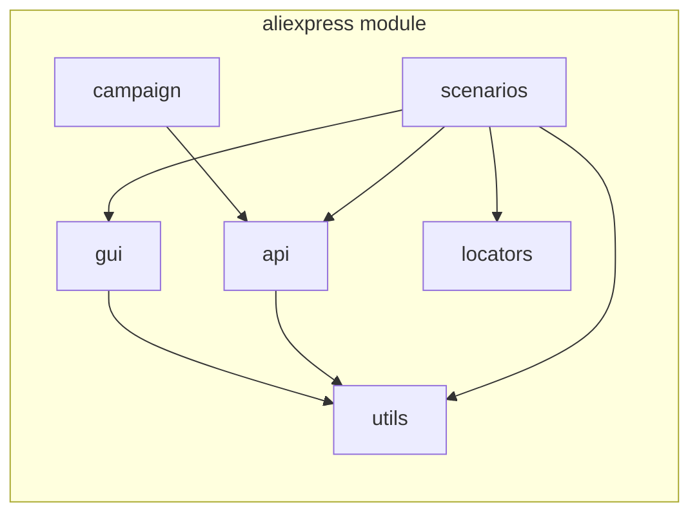

# Анализ модуля `aliexpress`

## <алгоритм>
Модуль `aliexpress` предназначен для взаимодействия с поставщиком aliexpress.com. Работа модуля основана на двух основных подходах:
1.  **Вебдрайвер (webdriver)**: Используется для прямого доступа к HTML-страницам товаров через браузер. Позволяет имитировать действия пользователя на сайте, собирать данные и переходить по категориям.
2.  **API**: Применяется для получения партнерских ссылок и кратких характеристик товаров.

**Блок-схема взаимодействия:**

```mermaid
graph LR
    A[Начало] --> B(Выбор метода взаимодействия: webdriver или API);
    B -- webdriver --> C{Инициализация WebDriver};
    C --> D[Переход на страницу товара];
    D --> E[Извлечение данных (html)];
    E --> F[Обработка данных];
    F --> G[Завершение];
    B -- API --> H{Отправка запроса к API};
    H --> I[Получение ответа от API];
    I --> J[Извлечение данных (JSON)];
    J --> F;
    G --> K[Конец];
    K -- Конец выполнения --> A;
    
    subgraph webdriver
      C
      D
      E
    end
    
    subgraph api
      H
      I
      J
    end
    
    style webdriver fill:#f9f,stroke:#333,stroke-width:2px
    style api fill:#ccf,stroke:#333,stroke-width:2px
```

**Примеры для каждого блока:**

*   **A: Начало** - Запуск программы.
*   **B: Выбор метода взаимодействия** - Пользователь выбирает, как взаимодействовать с Aliexpress: через вебдрайвер или API. Например, для сбора большого объема данных через категории используется вебдрайвер, а для получения быстрых данных и партнерских ссылок - API.
*   **C: Инициализация WebDriver** - Запускается браузер в управляемом режиме. Например: `driver = webdriver.Chrome()`.
*   **D: Переход на страницу товара** - Браузер переходит на конкретную страницу товара: `driver.get("https://aliexpress.com/item/123456.html")`.
*   **E: Извлечение данных (html)** - Извлекается HTML-код страницы: `page_source = driver.page_source`.
*   **H: Отправка запроса к API** - Отправляется запрос на получение партнерской ссылки: `response = requests.get(api_url, params={'item_id': 123456})`.
*   **I: Получение ответа от API** - Получается ответ в формате JSON: `json_data = response.json()`.
*   **J: Извлечение данных (JSON)** - Из JSON ответа извлекаются нужные данные: `affiliate_link = json_data['affiliate_link']`.
*   **F: Обработка данных** - Данные, полученные любым из способов, обрабатываются и форматируются.
*   **G: Завершение** - WebDriver закрывает браузер.
*   **K: Конец** - Завершение работы программы.

## <mermaid>

**Объяснение диаграммы `mermaid`**:

*   `aliexpress module`:  Представляет собой весь модуль `aliexpress`, который включает в себя несколько подмодулей (классов).
*   `utils`: Модуль утилит, который предоставляет вспомогательные функции и классы.
*   `api`: Модуль для взаимодействия с API AliExpress.
*    `campaign`: Модуль для управления маркетинговыми кампаниями.
*   `gui`: Модуль для создания графического интерфейса пользователя.
*    `locators`: Модуль для хранения локаторов элементов веб-страниц.
*   `scenarios`: Модуль для определения последовательности действий и сценариев.

**Зависимости:**
*   `scenarios` зависит от `utils`, `api`, `gui`, и `locators` (использует их для выполнения своих задач).
*   `api` зависит от `utils` (использует утилиты для работы).
*    `campaign` зависит от `api` (использует API для работы с кампаниями).
*   `gui` зависит от `utils` (использует утилиты для работы).

## <объяснение>

### Импорты
Модуль `aliexpress` не содержит явных импортов в предоставленном коде, но подразумевается использование импортов внутри его подмодулей. Исходя из описания, можно предположить следующие импорты:
*   В модуле `utils`: Могут быть импорты для работы с `json`, `datetime`, `logging` и других стандартных библиотек Python, а также библиотек для работы с данными (например, `pandas`).
*   В модуле `api`: Библиотеки для отправки HTTP-запросов (`requests`) и работы с `JSON` (`json`).
*   В модуле `gui`: Библиотеки для создания графического интерфейса (`tkinter`, `PyQt` и др.).
*   В модуле `locators`: Библиотеки для работы с веб-элементами (`selenium` или `beautifulsoup4`).
*  В модуле `scenarios`: Зависит от импортов, которые требуются для его функций.

### Классы
В предоставленном тексте нет определений конкретных классов, но подразумевается, что они есть в следующих подмодулях:

*   **`utils`**:  Может содержать классы для:
    *   **Логирования**: Упрощение логирования событий.
    *   **Форматирования данных**: Для преобразования данных из API или веб-страниц в нужный формат.
    *   **Обработки ошибок**: Для централизованной обработки исключений.
*   **`api`**:  Может содержать классы:
    *   **APIClient**: Для отправки запросов и обработки ответов от API AliExpress.
    *   **AffiliateLink**: Для управления партнерскими ссылками.
*   **`campaign`**: Может содержать классы:
    *   **CampaignManager**: Для управления маркетинговыми кампаниями.
    *   **CampaignReport**: Для генерации отчетов по кампаниям.
*   **`gui`**: Может содержать классы:
    *   **MainWindow**: Основное окно приложения.
    *   **ProductForm**: Форма для отображения и редактирования товаров.
    *   **SettingsDialog**: Диалог настроек.
*   **`locators`**: Может содержать классы:
    *  **Locator**: абстрактный класс для хранения локаторов.
    *  **CategoryLocator**: для хранения локаторов страниц категорий
    *  **ProductLocator**: для хранения локаторов страниц продуктов
*   **`scenarios`**: Может содержать классы:
    *   **DataSyncScenario**: Сценарий для синхронизации данных о товарах.
    *   **CampaignAutomationScenario**: Сценарий для автоматизации маркетинговых кампаний.

### Функции
В модуле `aliexpress` могут быть следующие функции:

*   В `utils`:
    *   `log_event(message, level)`: Функция для записи сообщений в лог.
    *   `format_data(data)`: Функция для форматирования данных.
    *   `handle_error(exception)`: Функция для обработки ошибок.
*   В `api`:
    *   `get_affiliate_link(item_id)`: Функция для получения партнерской ссылки на товар.
    *   `get_product_info(item_id)`: Функция для получения краткой информации о товаре.
    *    `send_api_request(url, params)`: Функция для отправки запроса к API.
*   В `campaign`:
    *   `create_campaign(campaign_data)`: Функция для создания новой кампании.
    *   `update_campaign(campaign_id, campaign_data)`: Функция для обновления существующей кампании.
    *   `get_campaign_report(campaign_id)`: Функция для получения отчета по кампании.
*  В `gui`:
    *  `create_main_window()`: Функция для создания главного окна приложения.
    *  `display_product_data(product_data)`: Функция для отображения данных о товаре в интерфейсе.
*  В `locators`:
    *  `get_category_locator(locator_name)`: Функция для получения локатора элемента на странице категории.
    *  `get_product_locator(locator_name)`: Функция для получения локатора элемента на странице товара.
*  В `scenarios`:
    *  `run_data_sync_scenario()`: Функция для запуска сценария синхронизации данных.
    *  `run_campaign_automation_scenario()`: Функция для запуска сценария автоматизации кампаний.

### Переменные
*   **В `utils`**:
    *   `LOG_FILE`: Путь к файлу логов.
    *   `ERROR_MESSAGES`: Словарь с сообщениями об ошибках.
*   **В `api`**:
    *   `API_URL`: URL для запросов к API AliExpress.
    *   `API_KEY`: Ключ API.
*   **В `gui`**:
    *   `MAIN_WINDOW_TITLE`: Заголовок главного окна.
*    **В `locators`**:
    * `CATEGORY_LOCATORS`: словарь с локаторами для категорий.
    * `PRODUCT_LOCATORS`: словарь с локаторами для страниц товаров.

### Потенциальные ошибки и улучшения:

1.  **Отсутствие обработки ошибок**: Недостаточное внимание к обработке ошибок может привести к сбоям в работе.
2.  **Слабая структура**: Недостаточная структурированность классов и функций может усложнить поддержку и масштабирование.
3.  **Отсутствие документации**: Нет подробной документации о функциональности каждого модуля, класса и функции.
4.  **Негибкость**: Локаторы могут быть жестко прописаны, что затруднит адаптацию к изменениям на сайте AliExpress.
5.  **Зависимости**: Зависимости от внешних библиотек и API могут стать точками отказа.
6. **Тестирование**: Отсутствует подробное описание, как проводилось тестирование модуля.
7. **Безопасность**: Нет упоминания о мерах безопасности при хранении API ключей.

### Взаимосвязи с другими частями проекта
Этот модуль, как правило, является частью более крупной системы, например, для анализа данных, управления маркетинговыми кампаниями или интеграции с другими поставщиками.
*   **Взаимодействие с модулями анализа данных**: Собранные данные могут использоваться для анализа цен, ассортимента и конкуренции.
*   **Взаимодействие с модулями управления заказами**: Модуль может использоваться для интеграции с системами управления заказами.
*   **Взаимодействие с модулями CRM**: Для интеграции с системами управления клиентами.

Этот анализ предоставляет исчерпывающее представление о функциональности модуля `aliexpress`, включая его структуру, компоненты и потенциальные улучшения.