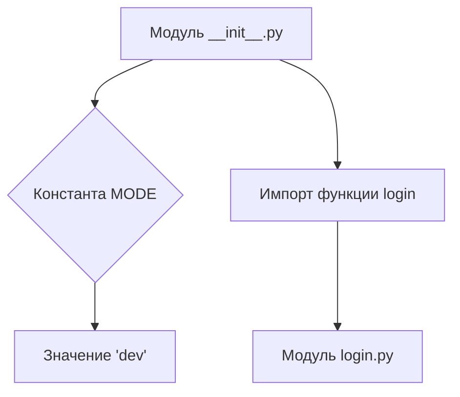
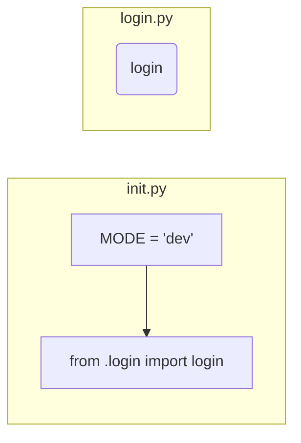

# <input code>

```python
## \file hypotez/src/suppliers/aliexpress/scenarios/__init__.py
# -*- coding: utf-8 -*-\
#! venv/Scripts/python.exe
#! venv/bin/python/python3.12

"""
.. module: src.suppliers.aliexpress.scenarios 
	:platform: Windows, Unix
	:synopsis: Сценарии для алиэкспресс

"""
MODE = 'dev'


from .login import login
```

# <algorithm>

Этот код представляет собой инициализационный модуль для сценариев, связанных с сайтом AliExpress.  Он не содержит сложной логики выполнения, а скорее определяет константу `MODE` и импортирует функцию `login` из подмодуля `login.py` внутри той же директории.

**Блок-схема:**



**Пример:**

Когда скрипт, использующий этот модуль, будет работать, константа `MODE` будет доступна.  Импорт `login` подразумевает, что в `login.py` определена соответствующая функция.  Сам этот импорт не вызывает выполнения функции `login`.  Это произойдет только тогда, когда функция `login` будет явно вызвана из другого модуля.


# <mermaid>



# <explanation>

* **Импорты:**
    * `from .login import login`: Этот импорт подключает функцию `login` из модуля `login.py`, который находится в той же директории (`./login.py`). Символ `.` указывает на текущий пакет (`aliexpress/scenarios`).  Это типичная структура модулей в Python для организации кода.

* **Классы:**  В данном файле нет определений классов.

* **Функции:**
    * `login`:  Функция `login` (из `login.py`) предназначена для логина на AliExpress.  На уровне `__init__.py` мы просто импортируем ее, а не определяем.  Реализация самой функции не приведена в данном файле, и она, скорее всего, содержит логику для авторизации пользователя.  Подробности реализации находятся в `login.py`.

* **Переменные:**
    * `MODE = 'dev'`:  Эта строковая константа, вероятно, используется для определения режима работы программы (например, 'dev' – для разработки, 'prod' – для производства).  Константы обычно записывают с использованием `UPPER_CASE` для улучшения читаемости.

* **Возможные ошибки/улучшения:**

    * Нет никакой проверки импорта. Если `login.py` не существует, то программа выдаст ошибку.


**Цепочка взаимосвязей:**

Этот `__init__.py` модуль является частью иерархии пакетов Python, связанных со сценариями для AliExpress.  Он связывает сценарии с модулями аутентификации.  Для выполнения `login` необходим доступ к данным, которые, вероятно, обрабатываются в других частях проекта.  Возможно, существуют модули для управления данными входа или настройки.  Без доступа к остальному проекту  невозможно определить точную взаимосвязь.