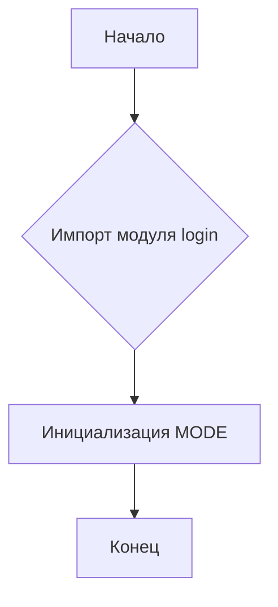
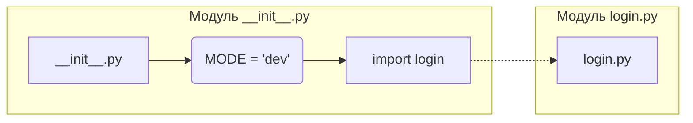

# <input code>

```python
## \file hypotez/src/suppliers/aliexpress/scenarios/__init__.py
# -*- coding: utf-8 -*-\
#! venv/Scripts/python.exe
#! venv/bin/python/python3.12

"""
.. module: src.suppliers.aliexpress.scenarios 
	:platform: Windows, Unix
	:synopsis: Сценарии для алиэкспресс

"""
MODE = 'dev'


from .login import login
```

# <algorithm>



**Пример:**

1. Начало выполнения скрипта.
2. Модуль `login` из подкаталога `login` импортируется в текущий модуль.
3. Переменная `MODE` устанавливается в значение 'dev'.
4. Выполнение скрипта завершается.


# <mermaid>



# <explanation>

**Импорты:**

- `from .login import login`:  Импортирует функцию `login` из модуля `login.py`, который находится в той же директории, что и текущий файл (`__init__.py`).  Это стандартный способ импорта модулей внутри одного пакета.  Символ `.` указывает на поиск файла `login.py` в текущей директории (пакете `scenarios`).


**Классы:**

В данном файле нет определений классов.

**Функции:**

- Нет функций, определенных напрямую в этом файле. Функция `login` импортируется из другого файла (`login.py`) и, по всей видимости, содержит реализацию логина на Алиэкспресс.

**Переменные:**

- `MODE = 'dev'`:  Строковая переменная, которая, скорее всего, используется для определения режима работы (например, 'dev' - режим разработки, 'prod' - режим производства).  Это позволит менять логику в дальнейшем без перекомпиляции всего кода.


**Возможные ошибки или области для улучшений:**

- **Документация:**  Документирование переменной `MODE` и более подробное описание функциональности  модуля, а также функции `login`  было бы полезным. 
- **Типизация:**  Добавление аннотаций типов для переменных улучшит читаемость и позволит использовать статическую проверку типов.
- **Конкретный способ использования MODE:**  Непонятно, как переменная `MODE` используется в проекте. Описание того, как она влияет на работу кода, будет полезным дополнением.


**Цепочка взаимосвязей:**

Файл `__init__.py` в папке `scenarios` является начальной точкой доступа к сценариям, связанным с сайтом AliExpress.  Он импортирует функцию `login` из модуля `login.py`, которая, вероятно, реализует процесс входа в систему на сайте AliExpress.  Далее, эта функция может использоваться другими скриптами или модулями для выполнения операций, связанных с покупками или другими действиями на сайте.