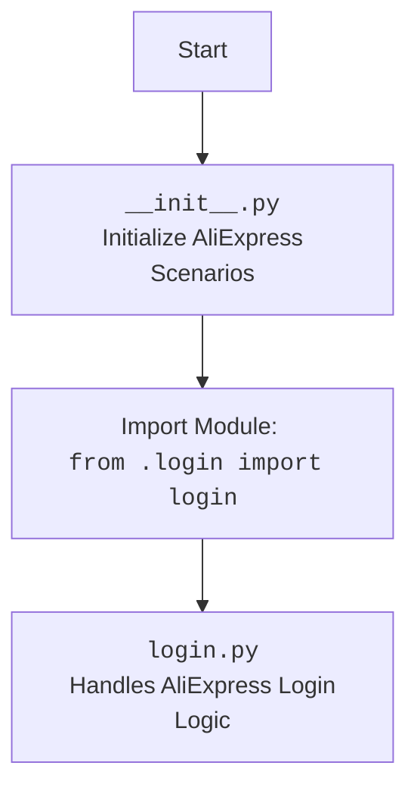

## АНАЛИЗ КОДА: `hypotez/src/suppliers/aliexpress/scenarios/__init__.py`

### <алгоритм>

1.  **Импорт модуля `login`**:
    -   Импортируется модуль `login` из текущей директории.
    -   Пример: После импорта, функции и классы, определенные в `login.py`, становятся доступны в контексте `__init__.py` (например, `login.login_aliexpress()`).

### <mermaid>

### <объяснение>

**Импорты:**

-   `from .login import login`: Этот импорт включает модуль `login` из текущей директории (`.`).  Это означает, что в директории `hypotez/src/suppliers/aliexpress/scenarios/` должен быть файл `login.py` (или директория `login` с файлом `__init__.py` внутри).  Этот импорт позволяет использовать функции и классы, определенные в модуле `login`, в других модулях или скриптах, импортирующих данный `__init__.py`.

**Файл `__init__.py`:**

-   Файл `__init__.py` используется для обозначения директории `scenarios` как пакета Python.
-   Он позволяет модулям в других директориях импортировать содержимое пакета `scenarios` и подпакетов, например: `from src.suppliers.aliexpress.scenarios import login`.
-   В данном случае, он импортирует модуль `login`, делая его частью пакета `scenarios`.
-   Файл `__init__.py` может быть пустым, но в этом примере, он используется для импорта модуля `login`, что делает его доступным в рамках пакета `scenarios`.

**Цепочка взаимосвязей:**

1.  Модуль `src.suppliers.aliexpress.scenarios` является частью более широкого пакета `src`.
2.  Он предназначен для работы со сценариями, специфичными для поставщика AliExpress.
3.  Импорт `login` предполагает наличие файла `login.py` (или пакета `login`) в той же директории, который реализует логику входа в AliExpress.
4.  Другие модули проекта могут импортировать `src.suppliers.aliexpress.scenarios` и использовать модуль `login`.
5.  Например, модуль, отвечающий за сбор данных с AliExpress, может использовать функции входа для авторизации перед сбором.
6.  Этот подход создает модульную архитектуру, где каждый поставщик и его сценарии инкапсулированы.

**Потенциальные области для улучшения:**

-   Может потребоваться более сложная структура пакета, если сценариев для AliExpress станет много.
-   Добавление других модулей в пакет `scenarios` (например, `search.py`, `order.py`) сделало бы его более универсальным.
-   Для более сложного приложения может потребоваться абстракция для работы со сценариями в целом, чтобы упростить код для других поставщиков.