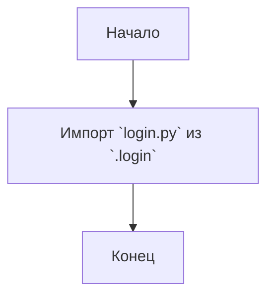

## АНАЛИЗ КОДА: `src/suppliers/aliexpress/scenarios/__init__.py`

### <алгоритм>
1. **Импорт модуля:** Происходит импорт модуля `login` из текущего пакета `scenarios`. 
   - Пример: `from .login import login` импортирует модуль `login.py` и делает его содержимое доступным через имя `login`.
2. **Экспорт:**  Модуль `login` становится частью пакета `scenarios` и может быть импортирован в другие модули, использующие этот пакет.
    - Пример: После импорта, можно использовать `from src.suppliers.aliexpress.scenarios import login`

### <mermaid>

### <объяснение>
- **Импорты:**
    - `from .login import login`:
        - `.` (точка) указывает на то, что модуль `login` находится в текущей директории (в том же пакете `scenarios`).
        - `login` - это имя импортируемого модуля. Если бы в `login.py` был класс `Login`, то можно было бы импортировать его как `from .login import Login`, а в данном случае предполагается, что импортируется весь модуль.
        - **Назначение:** Этот импорт делает функциональность, определенную в `login.py`, доступной для использования в других частях проекта, где импортируется пакет `scenarios`.

- **Роль файла:**
    - Файл `__init__.py` в пакете `scenarios` делает директорию `scenarios` пакетом в Python.
    - Импортируя `login` в `__init__.py`, мы делаем этот модуль частью пакета `scenarios`, позволяя другим модулям импортировать его напрямую из пакета: `from src.suppliers.aliexpress.scenarios import login`.

- **Потенциальные области для улучшения:**
  - В файле нет комментариев, объясняющих роль импортируемого модуля `login`. Было бы полезно добавить краткое описание для ясности.
  -  В случае, если `login.py` содержит несколько функций, то их можно было бы импортировать по отдельности, чтобы сделать код более явным.

- **Взаимосвязи с другими частями проекта:**
  - Предполагается, что другие модули в проекте, например,  `src.suppliers.aliexpress`, импортируют и используют пакет `scenarios`, чтобы выполнять операции в контексте AliExpress, такие как вход в систему (`login`).