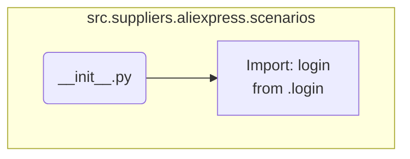

## АНАЛИЗ КОДА: `src/suppliers/aliexpress/scenarios/__init__.py`

### <алгоритм>

1. **Импорт модуля `login`:**
    - Импортируется модуль `login` из текущего пакета `src.suppliers.aliexpress.scenarios`.
    - Пример: `from .login import login` означает, что в текущем `__init__.py` файле будет доступен модуль `login`, который, вероятно, содержит функционал для авторизации на AliExpress.

### <mermaid>

**Объяснение:**

*   `Start(__init__.py)`: Начало работы, представляющее собой файл `__init__.py`.
*   `Import_Login`: Импорт модуля `login` из файла `login.py`, расположенного в том же пакете.

### <объяснение>

**Импорты:**

*   `from .login import login`: 
    *   Этот импорт означает, что из файла `login.py`, находящегося в той же директории, что и `__init__.py`, импортируется модуль или переменная с именем `login`. Скорее всего, `login.py` содержит класс или функции, отвечающие за процесс авторизации на сайте AliExpress.

**Роль файла `__init__.py`:**

*   Файл `__init__.py` в Python используется для обозначения директории как пакета. Он может быть пустым, но в данном случае он также импортирует модуль `login`.
*   Импортируя `login` в `__init__.py`, мы делаем Модуль доступным для импорта при обращении к пакету `src.suppliers.aliexpress.scenarios`.

**Переменные:**
*   В данном коде явных переменных нет, однако импорт модуля `login` создает связь с файлом `login.py`, где могут быть переменные.

**Области для улучшения:**

*   Код сейчас очень прост. Можно было бы добавить другие сценарии, которые бы также импортировались в `__init__.py`.

**Цепочка взаимосвязей:**
* `__init__.py`  в пакете `src.suppliers.aliexpress.scenarios` связывает модуль `login.py`, который содержит реализацию сценария авторизации на AliExpress. Это позволяет пользователю взаимодействовать с пакетом, не зная деталей имплементации авторизации.
* Данный файл служит входной точкой в сценарии, необходимые для работы с AliExpress.
*  Из `__init__.py` модули становятся доступны для импорта в других частях проекта.