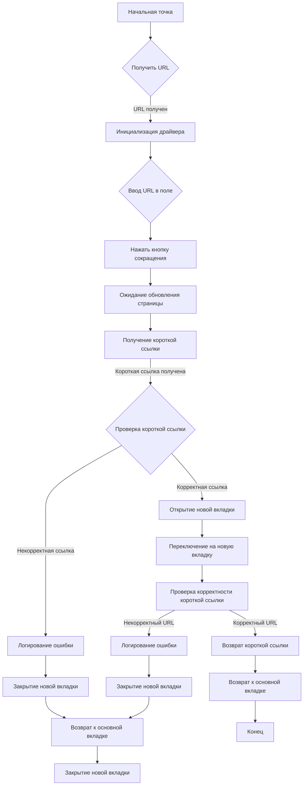
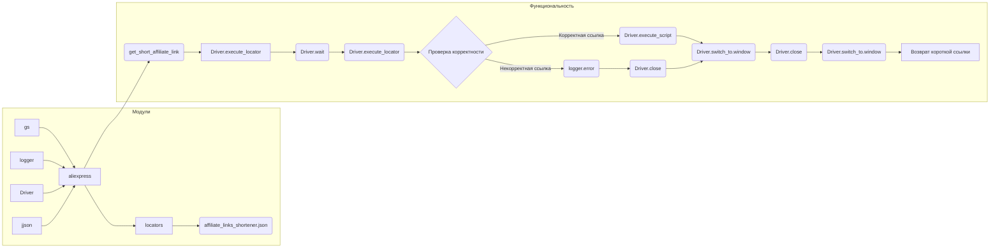

# <input code>

```python
## \file hypotez/src/suppliers/aliexpress/scenarios/affiliate_links_shortener_scenario.py
# -*- coding: utf-8 -*-
#! venv/Scripts/python.exe
#! venv/bin/python/python3.12

"""
.. module: src.suppliers.aliexpress.scenarios 
	:platform: Windows, Unix
	:synopsis: Сокращатель ссылок через веббраузер

"""
MODE = 'dev'

from pathlib import Path
from typing import List, Union
from types import SimpleNamespace
import time
from src import gs
from src.utils.jjson import j_loads_ns, j_loads_ns
from src.logger import logger
from src.webdriver.driver import Driver

# Загрузка локаторов из JSON-файла
locator = j_loads_ns(Path(gs.path.src, 'suppliers', 'aliexpress', 'locators', 'affiliate_links_shortener.json'))

def get_short_affiliate_link(d:Driver, url: str) -> str:
    """ Script for generating a shortened affiliate link
    @param url `str`: Full URL
    @returns `str`: Shortened URL
    """
    # Выполните сценарий для получения короткой ссылки
    d.execute_locator(locator.textarea_target_url, url)  # Введите URL в поле для ввода
    d.execute_locator(locator.button_get_tracking_link)  # Нажмите кнопку для получения короткой ссылки
    d.wait(1)  # Подождите 1 секунду, чтобы страница обновилась
    short_url = d.execute_locator(locator.textarea_short_link)[0]  # Получите короткую ссылку из элемента на странице
    main_tab = d.current_window_handle  # Сохраните идентификатор основной вкладки

    if len(short_url) < 1:
        logger.error(f"Не удалось получить короткий URL от {url}")  # Логирование ошибки, если короткий URL не получен
        #raise ValueError(f"Не удалось получить короткий URL от {url}")  # Генерация исключения для остановки выполнения
    
    # Откройте новый таб с коротким URL
    d.execute_script(f"window.open(\'{short_url}\');")
    
    # Переключитесь на новый таб
    d.switch_to.window(d.window_handles[-1])
    
    # Проверьте, что короткий URL начинается с ожидаемой части
    if d.current_url.startswith('https://error.taobao.com'):
        logger.error(f"Неправильный URL: {d.current_url}")  # Логирование ошибки, если короткий URL некорректен
        d.close()  # Закройте вкладку с неправильным URL
        d.switch_to.window(main_tab)  # Переключитесь обратно на основную вкладку
        #raise ValueError(f"Неправильный URL: {d.current_url}")  # Генерация исключения для остановки выполнения
    
    # Закройте новый таб и вернитесь к основной вкладке
    d.close()  # Закрываем новую вкладку
    d.switch_to.window(main_tab)  # Переключаемся обратно на основную вкладку
    
    return short_url  # Верните короткий URL
```

# <algorithm>

**Блок-схема алгоритма:**



**Примеры:**

* **Входные данные:** `url = "https://www.example.com"`
* **Шаги:**
    1. Функция получает входной URL.
    2. Функция взаимодействует с веб-драйвером (Driver) для ввода URL.
    3. Функция нажимает кнопку сокращения.
    4. Функция ждет обновления страницы.
    5. Функция получает короткий URL.
    6. Функция проверяет, начинается ли короткий URL с ожидаемой строки.
    7. Если короткий URL корректен, функция открывает новую вкладку с ним.
    8. Функция переключается на новую вкладку.
    9. Если короткий URL некорректен, функция логгирует ошибку и закрывает новую вкладку, возвращаясь к основной.
    10. Функция возвращает короткий URL.


# <mermaid>



# <explanation>

**Импорты:**

* `from pathlib import Path`: Импортирует класс `Path` для работы с путями к файлам.
* `from typing import List, Union`: Импортирует типы данных для работы с коллекциями и объединением типов.
* `from types import SimpleNamespace`: Импортирует класс `SimpleNamespace` для создания объекта, похожим на словарь, но с атрибутами.
* `import time`: Импортирует модуль `time` для работы со временем.
* `from src import gs`: Импортирует модуль `gs`, скорее всего, содержащий конфигурацию (global settings).  Связь с другими частями проекта неясна без контекста `gs`.
* `from src.utils.jjson import j_loads_ns`: Импортирует функцию `j_loads_ns` для загрузки данных из JSON-файла, находящегося в `src/utils/jjson.py`.
* `from src.logger import logger`: Импортирует объект логгера, находящегося в `src/logger.py`, для записи сообщений об ошибках и других событий.
* `from src.webdriver.driver import Driver`: Импортирует класс `Driver`, скорее всего, представляющий драйвер веб-драйвера (Selenium, Playwright), предоставляющий методы для взаимодействия с веб-страницей.

**Классы:**

* `Driver`: Класс, представляющий веб-драйвер.  Не показан в этом фрагменте кода, но предполагается, что он имеет методы для взаимодействия с веб-страницей (например, `execute_locator`, `wait`, `switch_to.window`, `current_url`, `current_window_handle`, `close`).
* `SimpleNamespace` - это специальный объект, который позволяет обращаться к полям как к атрибутам. В данном случае он используется для локаторов, загруженных из json.

**Функции:**

* `get_short_affiliate_link(d: Driver, url: str) -> str`: Функция для получения короткой ссылки.
    * `d: Driver`: Объект веб-драйвера.
    * `url: str`: Исходный URL, который нужно сократить.
    * Возвращает `str`: Короткая ссылка.
    * Логирует ошибки, если сокращение не выполнено успешно.
    * Использует методы `execute_locator`, `wait`, `execute_script`, `switch_to.window`, `current_url`, `close` для взаимодействия с веб-страницей.

**Переменные:**

* `locator`: Объект, содержащий локаторы для элементов на веб-странице, загруженный из `affiliate_links_shortener.json`.
* `short_url`: Содержит короткую ссылку, полученную после сокращения.
* `main_tab`: Хранит идентификатор текущей вкладки.


**Возможные ошибки и улучшения:**

* **Обработка исключений:** В коде есть комментарии о возможности обработки исключений (ValueError), но они не реализованы. Нужно добавить более полную обработку возможных ошибок (например, ошибки при взаимодействии с веб-драйвером или неудачном сокращении URL).
* **Управление временем ожидания:**  `d.wait(1)` — фиксированное время ожидания.  Можно добавить более гибкое управление временем ожидания или использовать более сложные механизмы ожидания, например,  появление определённых элементов на странице.
* **Передача данных:** Непосредственно из данного фрагмента трудно определить, как данные передаются между модулями и классами. Необходим контекст для понимания взаимосвязи.  Например, откуда функция `get_short_affiliate_link` получает объект `Driver` (`d`).


**Взаимосвязь с другими частями проекта:**

* `gs`: вероятно содержит глобальные настройки.
* `logger`: Модуль для записи сообщений об ошибках или других событий.
* `src.webdriver.driver`: Модуль, предоставляющий интерфейс взаимодействия с браузером (например, Selenium).
* `src.utils.jjson`: Модуль для обработки JSON-файлов.


В целом, код достаточно понятен, но для его более глубокого анализа необходима информация о методах класса `Driver` и конфигурации `gs`.