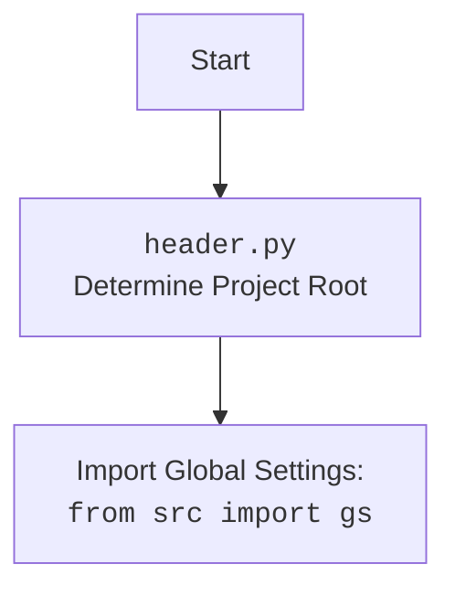

## АНАЛИЗ КОДА: `hypotez/src/suppliers/aliexpress/scenarios/login.py`

### 1. `<алгоритм>`

**Блок-схема:**

```mermaid
flowchart TD
    Start[Начало] --> LoginFunc[Вызов функции `login(s)`];
    LoginFunc --> DebugReturn{`return True` (debug)};
     DebugReturn -- True --> End[Конец];
   
     LoginFunc --> GetDriver[`_d = s.driver`] ;
    GetDriver --> GetLocators[ `_l = s.locators['login']`] ;
    GetLocators --> OpenURL[ `_d.get_url('https://www.aliexpress.com')` ] ;
    OpenURL --> AcceptCookies[ `_d.execute_locator(_l['cookies_accept'])`];
    AcceptCookies --> Wait1[ `_d.wait(.7)`];
    Wait1 --> OpenLogin[ `_d.execute_locator(_l['open_login'])`];
    OpenLogin --> Wait2[ `_d.wait(2)`];
    Wait2 --> CheckEmail[ `_d.execute_locator(_l['email_locator'])`];
    CheckEmail -- False --> HandleEmailError[ `... # TODO логика обработки False`] ;
    HandleEmailError --> Wait3[ `_d.wait(.7)`];
    CheckEmail -- True --> Wait3;
    Wait3 --> CheckPassword[ `_d.execute_locator(_l['password_locator'])`];
    CheckPassword -- False --> HandlePasswordError[ `... # TODO логика обработки False`];
    HandlePasswordError --> Wait4[ `_d.wait(.7)`];
    CheckPassword -- True --> Wait4;
     Wait4 --> CheckLoginButton[ `_d.execute_locator(_l['loginbutton_locator'])`];
    CheckLoginButton -- False --> HandleLoginButtonError[ `... # TODO логика обработки False`];
    CheckLoginButton -- True --> End;
    HandleLoginButtonError --> End
   
    End[Конец]
   
    style DebugReturn fill:#f9f,stroke:#333,stroke-width:2px
    style HandleEmailError fill:#f9f,stroke:#333,stroke-width:2px
    style HandlePasswordError fill:#f9f,stroke:#333,stroke-width:2px
    style HandleLoginButtonError fill:#f9f,stroke:#333,stroke-width:2px
    
```

**Примеры:**

1.  **Начало:** Функция `login(s)` вызывается с объектом поставщика `s`.
2.  **`return True` (debug):** При отладке функция не выполняет действия связанные с WebDriver и возвращает `True`.
3.  **`_d = s.driver`:** Извлекается объект веб-драйвера из объекта поставщика `s` и присваивается переменной `_d`.
4.  **`_l = s.locators['login']`:** Извлекаются локаторы элементов для входа из объекта поставщика `s` и присваивается переменной `_l`.
5.  **`_d.get_url('https://www.aliexpress.com')`**: WebDriver открывает страницу AliExpress.
6. **`_d.execute_locator(_l['cookies_accept'])`**: Нажимается кнопка подтверждения принятия куки.
7.  **`_d.wait(.7)`:** Ожидание в 0.7 секунд.
8.  **`_d.execute_locator(_l['open_login'])`**: Нажимается кнопка открытия формы входа.
9.  **`_d.wait(2)`:** Ожидание в 2 секунды.
10. **`_d.execute_locator(_l['email_locator'])`**: Происходит попытка ввести email. Если элемент не найден, выполняется блок `TODO логика обработки False`, иначе - продолжает выполнение.
11. **`_d.execute_locator(_l['password_locator'])`**: Происходит попытка ввести пароль. Если элемент не найден, выполняется блок `TODO логика обработки False`, иначе - продолжает выполнение.
12. **`_d.execute_locator(_l['loginbutton_locator'])`**: Нажимается кнопка входа. Если элемент не найден, выполняется блок `TODO логика обработки False`.

### 2. `<mermaid>`

```mermaid
flowchart TD
    Start[Start: `login.py`] --> ImportModules[Import modules];
    ImportModules --> ImportRequests["import requests"];
    ImportModules --> ImportPickle["import pickle"];
    ImportModules --> ImportWebDriver["import selenium.webdriver as WebDriver"];
    ImportModules --> ImportPath["from pathlib import Path"];
    ImportModules --> ImportGS["from src import gs"];
    ImportModules --> ImportLogger["from src.logger.logger import logger"];

    ImportGS --> GS[<code>gs</code>: Global Settings];
    ImportLogger --> Logger[<code>logger</code>: Logging Module];

    ImportModules --> LoginFunc[Function: `login(s)`]
    LoginFunc --> WebDriverInstance[Webdriver Instance: `s.driver`];
    LoginFunc --> Locators[Locators: `s.locators['login']`]

    WebDriverInstance --> WebDriver[<code>WebDriver</code>];
    Locators --> LocatorData[Locator Data: dict];
   
    LoginFunc --> End[End];
```

**Объяснение зависимостей `mermaid`:**

*   **`requests`**: Используется для отправки HTTP-запросов, но в данном конкретном коде не используется. Импорт может быть для будущих целей, связанных с HTTP-запросами.
*   **`pickle`**: Используется для сериализации и десериализации объектов Python. В данном коде не используется. Возможно используется в других частях проекта.
*   **`selenium.webdriver as WebDriver`**:  Используется для автоматизации браузера. Класс `WebDriver` используется для создания экземпляра браузера и управления им.
*   **`pathlib.Path`**:  Используется для работы с путями к файлам и директориям. В данном коде не используется.
*    **`from src import gs`**: Импортирует глобальные настройки проекта из модуля `src.gs`. Глобальные настройки используются для конфигурации приложения.
*   **`from src.logger.logger import logger`**: Импортирует модуль логирования. Используется для записи сообщений в логи.

**mermaid `header.py`**



### 3. `<объяснение>`

**Импорты:**

*   **`import requests`**: Импортирует библиотеку `requests` для выполнения HTTP-запросов. В данном коде не используется, но может быть необходима для других сценариев.
*   **`import pickle`**: Импортирует библиотеку `pickle` для сериализации объектов Python. Не используется в данном коде.
*   **`import selenium.webdriver as WebDriver`**: Импортирует модуль `webdriver` из библиотеки `selenium` для управления браузером. Используется для автоматизации действий в браузере.
*    **`from pathlib import Path`**: Импортирует класс `Path` из модуля `pathlib` для работы с путями к файлам и директориям. Не используется в данном коде.
*   **`from src import gs`**: Импортирует глобальные настройки проекта из модуля `src.gs`.
*   **`from src.logger.logger import logger`**: Импортирует объект `logger` из модуля `src.logger.logger` для ведения логов.

**Классы:**

*   В коде явно не используются классы, но импортируется `selenium.webdriver`, который является классом для управления браузером.
*  **`Supplier`** - класс поставщика, который не описан в данном коде. Однако, в функцию `login` передается объект данного класса, из которого извлекается экземпляр `webdriver` и локаторы.

**Функции:**

*   **`login(s)`**:
    *   **Аргументы**:
        *   `s`: Объект поставщика (экземпляр класса `Supplier`). Ожидается, что объект имеет атрибуты `driver` (экземпляр `WebDriver`) и `locators` (словарь с локаторами элементов).
    *   **Возвращаемое значение**:
        *   `bool`: Возвращает `True` при успешном завершении. В текущей версии функция всегда возвращает `True` из-за строки `# return True <- debug`.
    *   **Назначение**: Функция выполняет вход на сайт AliExpress с помощью веб-драйвера.
    *   **Примеры**:
        *   `login(supplier_instance)`: Вызов функции с объектом поставщика.
        *   Функция ищет элементы на странице, такие как куки, кнопка открытия входа, поля email, пароля и кнопку входа, используя локаторы из объекта `s.locators['login']`.
        *   Функция использует `_d.wait()` для ожидания загрузки элементов.
        *   Если хотя бы один из локаторов не найден, то в текущем исполнении функция продолжает работу, так как обработка ошибок описана как `... # TODO логика обработки False`.

**Переменные:**

*   **`_d`**: Объект веб-драйвера (`WebDriver`).
*   **`_l`**: Словарь с локаторами элементов для входа.

**Потенциальные ошибки и области для улучшения:**

1.  **Обработка ошибок:** В коде есть несколько мест (`TODO логика обработки False`), где не обрабатываются ошибки, возникающие при поиске элементов. Необходимо реализовать полноценную обработку ошибок, чтобы корректно реагировать на ситуации, когда элемент не найден.
2.  **Отладка:** Сейчас функция всегда возвращает `True` из-за `# <- debug`. Необходимо удалить эту строку и правильно реализовать логику входа.
3.  **Явные ожидания:** Использовать явные ожидания вместо `_d.wait()` для более надежной работы с веб-элементами. Это позволит дожидаться появления элемента на странице перед тем, как с ним взаимодействовать, вместо фиксированной задержки.
4.  **Логирование**: Использование `logger` для логирования событий, например, при успешном входе или при возникновении ошибок.

**Взаимосвязь с другими частями проекта:**

*   Данный модуль зависит от `src.gs` для получения глобальных настроек.
*   Он также зависит от `src.logger.logger` для ведения логов.
*   Функция `login` ожидает получить экземпляр класса `Supplier`, что означает, что этот модуль является частью большего фреймворка.
*   Локаторы (`_l`) берутся из объекта поставщика, это означает, что для каждого поставщика могут быть свои локаторы.
*   Используется `selenium.webdriver`, что указывает на зависимость от Selenium.
*   Для настройки и работы с веб-драйвером, скорее всего, есть вспомогательные методы, которые объявлены в других частях проекта.

Этот анализ обеспечивает всесторонний и структурированный обзор кода.