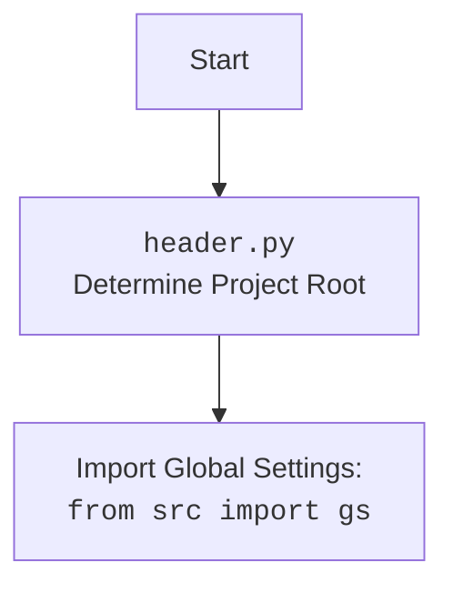

## Анализ кода `hypotez/src/suppliers/aliexpress/scenarios/login.py`

### 1. **<алгоритм>**

**Начало**

1.  **`login(s)`**: Функция `login` принимает объект `Supplier` (`s`) в качестве аргумента.
    *   Пример: `login(aliexpress_supplier_instance)`
    *   Поток данных: Объект `Supplier` передаётся в функцию `login`.

2.  **`_d:WebDriver = s.driver`**: Извлекает экземпляр `WebDriver` из объекта `Supplier` и присваивает его переменной `_d`.
    *   Пример: `_d` будет экземпляром `selenium.webdriver.Chrome` или подобным.
    *   Поток данных: `Supplier.driver` -> `_d`

3.  **`_l : dict = s.locators['login']`**: Извлекает словарь локаторов для логина из объекта `Supplier` и присваивает его переменной `_l`.
    *   Пример: `_l = {'cookies_accept': {'by': '...', 'value': '...'}, 'open_login': {'by': '...', 'value': '...'}, ...}`
    *   Поток данных: `Supplier.locators['login']` -> `_l`

4.  **`_d.get_url('https://www.aliexpress.com')`**: Открывает URL в браузере, управляемом `WebDriver`.
    *   Пример: Браузер переходит на `https://www.aliexpress.com`.
    *   Поток данных: `_d` -> Браузер.

5.  **`_d.execute_locator(_l['cookies_accept'])`**: Нажимает кнопку "принять куки" используя локатор.
    *   Пример: Нажатие кнопки "Принять" на баннере с куками.
    *   Поток данных: `_d`, `_l['cookies_accept']` -> `_d` (браузер)

6.  **`_d.wait(.7)`**: Ожидает 0.7 секунды.
    *   Пример: Задержка перед следующим действием.
    *   Поток данных: Пауза.

7.  **`_d.execute_locator(_l['open_login'])`**: Нажимает кнопку "открыть окно логина", используя локатор.
    *   Пример: Нажатие кнопки "Войти" или "Регистрация".
    *   Поток данных: `_d`, `_l['open_login']` -> `_d` (браузер)

8.  **`_d.wait(2)`**: Ожидает 2 секунды.
    *   Пример: Задержка перед следующим действием.
    *   Поток данных: Пауза.

9.  **`if not _d.execute_locator(_l['email_locator']): ...`**: Проверяет, удалось ли найти и заполнить поле ввода email. Если не удалось - выполняется TODO.
     *   Пример: Ввод электронной почты.
     *   Поток данных: `_d`, `_l['email_locator']` -> `_d` (браузер)

10. **`_d.wait(.7)`**: Ожидает 0.7 секунды.
    *   Пример: Задержка перед следующим действием.
    *    Поток данных: Пауза.

11. **`if not _d.execute_locator(_l['password_locator']): ...`**: Проверяет, удалось ли найти и заполнить поле ввода пароля. Если не удалось - выполняется TODO.
     *   Пример: Ввод пароля.
     *   Поток данных: `_d`, `_l['password_locator']` -> `_d` (браузер)
12. **`_d.wait(.7)`**: Ожидает 0.7 секунды.
    *   Пример: Задержка перед следующим действием.
    *    Поток данных: Пауза.

13. **`if not _d.execute_locator(_l['loginbutton_locator']): ...`**: Проверяет, удалось ли найти и нажать кнопку "Войти". Если не удалось - выполняется TODO.
    *   Пример: Нажатие кнопки "Войти" после ввода логина и пароля.
    *   Поток данных: `_d`, `_l['loginbutton_locator']` -> `_d` (браузер)

14. **`return True`**: Возвращает `True`, что означает успешный логин (В текущей версии всегда возвращает `True` из-за debug).
    *   Поток данных: Функция `login` возвращает `True`.

**Конец**

### 2. **<mermaid>**

```mermaid
flowchart TD
    Start(Начало) --> LoginFunction[<code>login(s)</code><br> Принимает Supplier s];
    LoginFunction --> GetWebDriver[_d:WebDriver = s.driver<br>Получение драйвера];
    GetWebDriver --> GetLocators[_l:dict = s.locators['login']<br>Получение локаторов];
    GetLocators --> OpenURL[_d.get_url('https://www.aliexpress.com')<br> Открытие страницы];
    OpenURL --> AcceptCookies[_d.execute_locator(_l['cookies_accept'])<br> Принятие куки];
    AcceptCookies --> WaitAfterCookies[_d.wait(.7)<br> Ожидание 0.7 сек];
    WaitAfterCookies --> OpenLoginForm[_d.execute_locator(_l['open_login'])<br> Открытие формы логина];
    OpenLoginForm --> WaitAfterLoginForm[_d.wait(2)<br> Ожидание 2 сек];
    WaitAfterLoginForm --> FillEmail{if not _d.execute_locator(_l['email_locator'])<br>Заполнение email};
    FillEmail -- False --> TODO_email[... # TODO логика обработки False<br>Не удалось ввести email]
    FillEmail -- True --> WaitAfterEmail[_d.wait(.7)<br> Ожидание 0.7 сек];    
    WaitAfterEmail --> FillPassword{if not _d.execute_locator(_l['password_locator'])<br>Заполнение пароля};
    FillPassword -- False --> TODO_password[... # TODO логика обработки False<br>Не удалось ввести пароль]
    FillPassword -- True --> WaitAfterPassword[_d.wait(.7)<br> Ожидание 0.7 сек];    
    WaitAfterPassword --> ClickLoginButton{if not _d.execute_locator(_l['loginbutton_locator'])<br>Нажатие кнопки входа};
    ClickLoginButton -- False --> TODO_login[... # TODO логика обработки False<br>Не удалось войти];
    ClickLoginButton -- True --> ReturnTrue[return True<br>Успешный вход (debug)];
    TODO_email --> End(Конец);
    TODO_password --> End(Конец);
    TODO_login --> End(Конец);
    ReturnTrue --> End(Конец);
```
**Зависимости:**

*   `selenium.webdriver`:  Используется для управления браузером.
*   `pathlib.Path`: Используется для работы с путями к файлам (хотя в данном коде не используется).
*   `src`: Содержит `gs` (global settings) и `logger`.



### 3. **<объяснение>**

**Импорты:**

*   `requests`: Импортирован, но не используется в текущей версии кода. Вероятно, предназначен для будущей функциональности HTTP-запросов, но сейчас неактуален.
*   `pickle`: Импортирован, но не используется в текущей версии кода. Возможно, предназначен для сериализации данных, но сейчас неактуален.
*   `selenium.webdriver as WebDriver`: Используется для управления браузером, автоматизации действий в браузере.
*   `pathlib.Path`: Импортирован, но не используется в текущей версии кода. Может предназначаться для работы с файловой системой.
*   `from src import gs`: Импортирует глобальные настройки (global settings) из пакета `src`. Это позволяет коду использовать общие конфигурации и переменные проекта.
*   `from src.logger.logger import logger`: Импортирует объект `logger` для логирования действий. Этот модуль используется для записи событий и отладочной информации, что помогает в мониторинге и отладке приложения.

**Функции:**

*   `login(s: Supplier) -> bool`:
    *   **Аргументы:**
        *   `s`: Объект класса `Supplier`, содержащий информацию о поставщике, включая драйвер `WebDriver` и локаторы элементов страницы.
    *   **Возвращаемое значение:**
        *   `True` (в текущей версии всегда `True` из-за `return True` в начале функции).  Предполагается, что функция должна возвращать `True` при успешном логине и `False` в противном случае.
    *   **Назначение:** Выполняет процедуру логина на сайте Aliexpress.
    *   **Примеры:** `login(aliexpress_supplier)` где `aliexpress_supplier` - это экземпляр класса `Supplier`.
    *   **Функциональность:** Функция получает драйвер браузера и локаторы, открывает страницу Aliexpress, принимает куки, открывает окно логина, вводит email, пароль и нажимает кнопку входа. В текущей реализации, функционал ввода данных и нажатия на кнопку "Войти" не реализован.
    *   **Цепочка взаимосвязей:**
        *   Использует `s.driver` для управления браузером.
        *   Использует `s.locators['login']` для определения элементов на странице.

**Переменные:**

*   `_d: WebDriver`: Экземпляр `WebDriver`, используемый для управления браузером.
*   `_l : dict`: Словарь локаторов для элементов страницы логина.
*   `s`: Экземпляр класса `Supplier`.

**Объяснения:**

1.  **Логика работы:**
    *   Функция `login` автоматизирует процесс входа на сайт Aliexpress с использованием `selenium.webdriver`.
    *   Сначала функция получает драйвер и локаторы, необходимые для взаимодействия с элементами страницы.
    *   Затем открывается страница Aliexpress, принимаются куки, открывается форма логина, вводятся данные и нажимается кнопка входа.
    *   В текущей реализации, часть ввода данных и нажатия на кнопку входа обходит выполнение и возвращается `True`. Это значит, что функционал входа не работает, и является плейсхолдером.

2.  **`TODO`:** В коде есть комментарии `# TODO логика обработки False`, которые обозначают места, где необходимо добавить логику обработки ошибок, если не удалось найти и кликнуть на элементы. В текущей версии этот функционал не реализован.

3.  **Потенциальные ошибки и улучшения:**
    *   **Отсутствует обработка ошибок**: Функция не обрабатывает случаи, когда не удалось найти какой-либо элемент на странице, не получилось ввести данные в форму или нажать на кнопку входа. Необходимо добавить логику обработки ошибок, чтобы функция могла корректно реагировать на эти ситуации.
    *  **Жестко заданные задержки:** Использование `_d.wait()` может быть неэффективным в реальных условиях из-за возможных задержек при загрузке страницы. Лучше использовать более гибкие стратегии ожидания, например, ожидания появления элемента.
    *  **Неполная функциональность:** В текущей реализации, функция не выполняет реальный вход, а возвращает `True` как placeholder. Необходимо дописать логику для ввода данных и нажатия кнопки "Войти".
    * **Не используется `pathlib.Path`, `pickle`, `requests`**: Импортированные, но неиспользуемые библиотеки, стоит убрать из кода, чтобы он был чище и более эффективным.
    * **Отсутствует настройка языка и валюты:** В закомментированной строке `set_language_currency_shipto(s,True)` подразумевается настройка языка, валюты и региона доставки. Эта функциональность отсутствует.

4.  **Связь с другими частями проекта:**
    *   Функция `login` является частью сценариев для работы с Aliexpress и зависит от класса `Supplier`, который, вероятно, определяет настройки драйвера и локаторы элементов.
    *   Использует глобальные настройки (`gs`) из `src` и логирование из `src.logger.logger`, что позволяет интегрировать этот сценарий с остальным проектом.
    *   Функция предназначена для использования совместно с другими сценариями, где требуется вход на сайт Aliexpress.