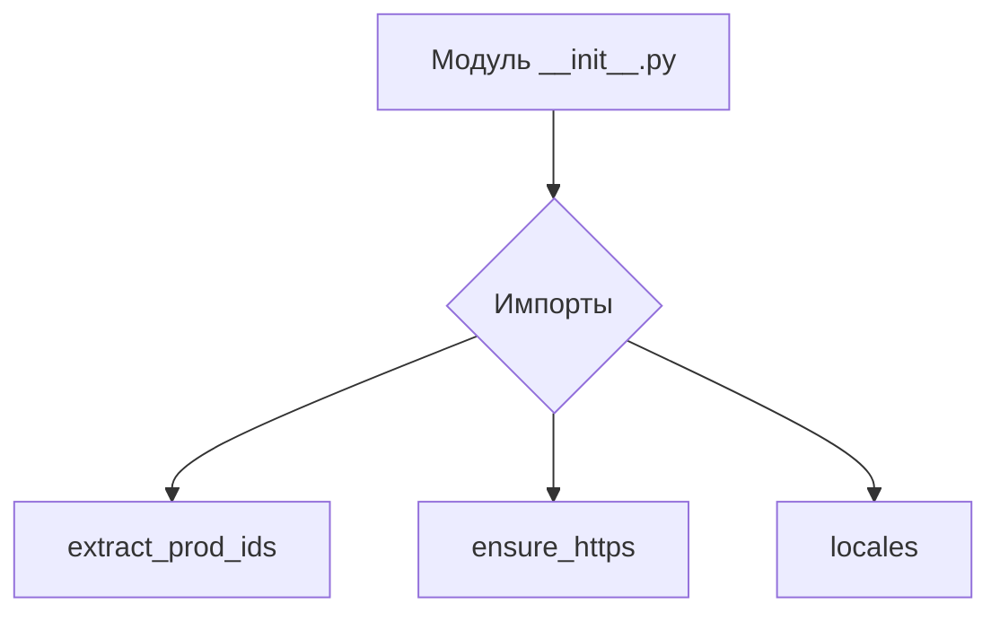
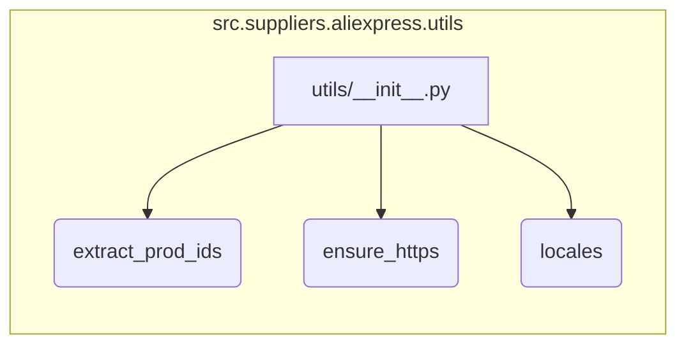

# <input code>

```python
## \file hypotez/src/suppliers/aliexpress/utils/__init__.py
# -*- coding: utf-8 -*-
#! venv/Scripts/python.exe
#! venv/bin/python/python3.12

"""
.. module: src.suppliers.aliexpress.utils 
	:platform: Windows, Unix
	:synopsis:

"""
MODE = 'dev'

from .extract_product_id import extract_prod_ids
from .ensure_https import ensure_https
from .locales import locales
```

# <algorithm>

Этот код определяет модуль `utils` для поставщика AliExpress.  Он содержит импорты функций из других файлов в подпапке `utils`.

**Блок-схема:**



В этом случае нет вычислений,  это просто импорты.


# <mermaid>



Диаграмма показывает, как модуль `utils/__init__.py` импортирует функции `extract_prod_ids`, `ensure_https` и `locales`.


# <explanation>

**1. Импорты:**

- `from .extract_product_id import extract_prod_ids`: Импортирует функцию `extract_prod_ids` из модуля `extract_product_id.py` в текущем подкаталоге (`./extract_product_id.py`).  Эта функция, вероятно, отвечает за извлечение идентификаторов продуктов из данных AliExpress.
- `from .ensure_https import ensure_https`: Импортирует функцию `ensure_https` из модуля `ensure_https.py` в текущем подкаталоге.  Вероятно, эта функция проверяет и, если нужно, перенаправляет URL-адреса на HTTPS.
- `from .locales import locales`: Импортирует переменную или функцию `locales` из модуля `locales.py`. Вероятно, эта переменная содержит или предоставляет доступ к локальным настройкам (например, языки, валюты).


**2. Классы:**

В этом файле нет определений классов.


**3. Функции:**

- Не определены собственные функции в `__init__.py`.  Вместо этого он импортирует готовые функции из других модулей.

**4. Переменные:**

- `MODE = 'dev'`:  Глобальная переменная, вероятно, используется для определения режима работы (например, "dev" для разработки, "prod" для производства).


**5. Возможные ошибки или области для улучшений:**

- **Отсутствие документации:** Хотя есть docstring,  он достаточно прост.  Для улучшения стоит добавить более подробную документацию к функциям `extract_prod_ids`, `ensure_https` и `locales` (например, аргументы, возвращаемые значения, описания поведения).
- **Неясная взаимосвязь с другими частями проекта:** Код не содержит контекста, не ясно, где и как эти функции используются.


**Цепочка взаимосвязей с другими частями проекта:**

Функции из этого модуля вероятно используются в других модулях,  где обрабатываются данные AliExpress (например, в скриптах сбора данных или в системах обработки заказов).  Непосредственные взаимосвязи видны только из импорта, но по косвенным ссылкам можно предположить, что этот код предоставляет вспомогательные функции для работы с данными AliExpress.  Чтобы проследить цепочку, нужно проанализировать вызывающие функции или классы.